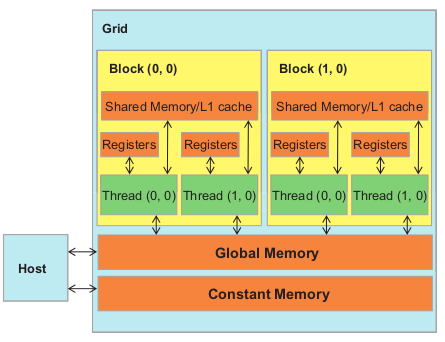
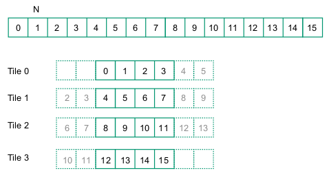
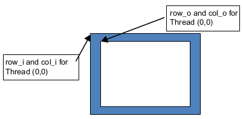
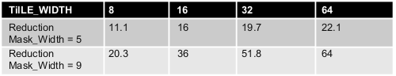

# 7. Parallel Patterns: Convolution - An Introduction to Stencil Computation

*We will study convolution, which is a popular array operation that is used in various forms in signal processing, digital recording, image processing, video processing, and computer vision. In these application areas, convolution is often performed as a filter that transforms signals and pixels into more desirable values.*

*In high-performance computing, the convolution pattern is often referred to as stencil computation. Convolution typically involves a significant number of arithmetic operations on each data element. Each output data element can be calculated independently of each other, a desirable trait for parallel computing. On the other hand, there is substantial level of input data sharing among output data elements with somewhat challenging boundary conditions. This makes convolution an important use case of sophisticated tiling methods and input data staging methods.*

---

## 7.1 Background

Convolution is an array operation where each output data element is a weighted sum of a collection of neighboring input elements. The weights used in the weighted sum calculation are defined by an input mask array, commonly referred to as the convolution kernel. We will refer to these mask arrays as convolution masks. The same convolution mask is typically used for all elements of the array.

Below is shown a convolution example for 1D data where a 5-element convolution mask array M is applied to a 7-element input array N.


The fact that we use a 5-element mask M means that each P element is generated by a weighted sum of the N element at the corresponding position, two N elements to the left and two N elements to the right.

For example, the value of $P[2]$ is generated as the weighted sum of $N[0]$ through $N[4]$:

$P[2] = N[0]*M[0] + N[1]*M[1] + N[2]*M[2] + N[3]*M[3] + N[4]*M[4]$

$= 1*3 + 2*4 + 3*5 + 4*4 + 5*3$

$= 57$

Because convolution is defined in terms of neighboring elements, boundary conditions naturally arise for output elements that are close to the ends of an array. As shown below, when we calculate $P[1]$, there is only one N element to the left of $N[1]$. That is, there are not enough N elements to calculate $P[1]$ according to our definition of convolution. A typical approach to handling such boundary condition is to define a default value to these missing N elements. For most applications, the default value is 0.


In this case, the calculation of $P[1]$ is as follows:

$P[1] = 0 * M[0] + N[0]*M[1] + N[1]*M[2] + N[2]*M[3] + N[3]*M[4]$

$= 0 * 3 + 1*4 + 2*5 + 3*4 + 4*3$

$= 38$

The missing elements are typically referred to as “ghost cells” or “halo cells” in literature. There are also other types of ghost cells due to the use of tiling in parallel computation. These ghost cells can have significant impact on the effectiveness and/or efficiency of tiling.

---

For image processing and computer vision, input data are typically two-dimensional arrays, with pixels in an x-y space. Image convolutions are therefore 2D convolutions. The mask does not have to be a square array.


To generate an output element, we take the subarray whose center is at the corresponding location in the input array N. We then perform pairwise multiplication between elements of the mask array and those of the image array. Like 1D convolution, 2D convolution must also deal with boundary conditions.

---

## 7.2 1D Parallel Convolution - A Basic Algorithm

Computing all output elements in a convolution problem can be done in parallel and thus it makes it an ideal application for parallel computing.

We will start with a 1D convolution kernel.

The kernel will receive five arguments:

- Pointer to the input array (N)
- Pointer to the input mask (M)
- Pointer to the output array (P)
- Size of the mask (mask_size)
- Size of the input array (width)

```C
__global__ void convolution_1D_basic_kernel(float *N, float *M, float *P, int Mask_Width, int Width) {
   // kernel body
}
```

For 1D convolution we will use 1D thread blocks and 1D block grid.

The mapping to the output element is the same as the vector addition example.

```C
int i = blockIdx.x * blockDim.x + threadIdx.x;
```

Once we determined the output element index, we can access the input N elements and the mask M elements using offsets to the output element index. For simplicity, we assume that *mask_width* is an odd number and the convolution is symmetric, i.e., *mask_width* is $2*n + 1$ where $n$ is an integer. The calculation of $P[i]$ will use

$N[i-n], N[i-n+1],..., N[i-1], N[i], N[i+1], ..., N[i+n-1], N[i+n]$. 

We can use a simple loop to do this calculation in the kernel:

```C
__global__ void convolution_1D_basic_kernel(float *N, float *M, float *P, int Mask_Width, int Width) {

int i = blockIdx.x * blockDim.x + threadIdx.x;

float Pvalue = 0;
int N_start_point = i - (mask_width / 2);
for (int j = 0; j < mask_width; j++) {
    if (N_start_point + j >= 0 && N_start_point + j < width) {
        Pvalue += N[N_start_point + j] * M[j];
    }
}
P[i] = Pvalue;
```

The variable Pvalue will allow all intermediate results to be accumulated in a register to save DRAM bandwidth.

The *for-loop* will iterate over the N and M elements to calculate $P[i]$. The *if* statement is used to handle the boundary conditions. The *if* statement will check if the N element is within the boundary of the input array. If it is not, the *if* statement will skip the calculation for that N element since we assume that 0 values will be used for ghost cells.

After the end of the *for-loop*, the result $Pvalue$ will be stored in the output array P.

We can observe two things in the kernel:

- The threads calculating the leftmost and rightmost $(int)(mask\_width / 2)$ elements will have to handle ghost cells thus having control divergence. The cost of control divergence depends on the *width* (size of input array N) and *mask_width*(mask array M). The cost of control divergence can be significant if *width* is large and *mask_width* is small.

- A more serious problem is memory bandwidth. Again (as seen in the matrix multiplication kernel), the ratio offloating-point arithmetic calculation to global memory accesses is only about 1.0 in the kernel.

---

## 7.3 Constant Memory And Caching

Three interesting properties arise from the use of mask arrays in conolution kernels:

- First, the size of a mask array is typically small. Most convolution masks have less than 10 elements in each dimension. Even for three dimensions this results in less than 1000 elements.

- Second, the elements of the mask array are constant.

- Third, all threads need access to the mask elements and in the same order.

---



The CUDA programming model allows programmers to declare variables in the constant memory. Constant memory variables are visible to all thread blocks and the variables cannot be changed by threads during kernel execution. Furthermore, the size of the constant memory is currently 64 KB.

To declare an M array in constant memory, the host code declares it as a global variable.

```C
#define MAX_MASK_WIDTH 10
__constant__ float M[MAX_MASK_WIDTH];
```

This is a global variable declaration and should be outside any function in the source file.

Assume that the host code has already allocated and initialized the mask in a mask M_h array in the host memory with Mask_Width elements. The contents of the M_h can be transferred to M in the device constant memory as follows:

```C
cudaMemcpyToSymbol(M, M_h, Mask_Width*sizeof(float));
```

In general, the use of [cudaMemcpyToSymble()](https://docs.nvidia.com/cuda/cuda-runtime-api/group__CUDART__MEMORY.html#group__CUDART__MEMORY_1g9bcf02b53644eee2bef9983d807084c7) function is as follows:

```C
cudaMemcpyToSymbol(dest, src, size);
```

Kernel functions access constant memory variables as global variables. Thus, we do not need to pass their pointers as parameters to the kernel. The kernel function can access the constant memory variable M directly.

```C
__global__ void convolution_1D_basic_kernel(float *N, float *P, int Mask_Width, int Width) {
    
    int i = blockIdx.x * blockDim.x + threadIdx.x;

    float Pvalue = 0;
    int N_start_point = i - (Mask_Width / 2);
    for (int j = 0; j < Mask_Width; j++) {
        if (N_start_point + j >= 0 && N_start_point + j < Width) {
            Pvalue += N[N_start_point + j] * M[j];
        }
    }
    P[i] = Pvalue;
}
```

Like global memory variables, constant memory variables are also located in DRAM. However, because the CUDA runtime knows that constant memory variables are not modified during kernel execution, it directs the hardware to aggressively cache the constant memory variables during kernel execution.

---

## 7.4 Tiled 1D Convolution With Halo Cells

We will discuss two input data tiling strategies for reducing the total number of global memory accesses. 

The first one is the most intuitive and involves loading all input data elements needed for calculating all output elements of a thread block into the shared memory. The number of input elements to be loaded depends on the size of the mask. For simplicity, we will continue to assume that the mask size is an odd number equal to 2*n+1.

Assume that the array is of size 16, the mask size is 5 and the block size is 4. 



<br>

Block 0 will calculate elements $P[0]$ through $P[3]$. This will require loading $N[0]$ throught $N[5]$ into the shared memory. The mask of size 5 requires $5/2 = 2$ elements additionally on each side of the inputs elements. We have no elements before $N[0]$ but we need to load $N[4]$ and $N[5]$. Note that the calculation requires to ghost cell elements on the left end. 

Block 1 will calculate elements $P[4]$ through $P[7]$. This will require loading $N[2]$ through $N[9]$ for the same reason and so on...

Note that Block 0 requires elements belonging in Block 1 ($N[4]$ and $N[5]$) and Block 1 requires elements belonging in Block 0 ($N[2]$ and $N[3]$) and Block 2 ($N[8]$ and $N[9]$).

Since the contents of shared memory of a block are only visible to the threads of the block, these elements need to be loaded into the respective shared memories for all involved threads to access them. 

- The elements that are involved in multiple tiles and loaded by multiple blocks are commonly referred to as *halo cells or skirt cells* since they “hang” from the side of the part that is used solely by a single block. 

- We will refer to the center part of an input tile that is used solely by a single block the *internal cells* of that input tile. 

- Tile 1 and Tile 2 are commonly referred to as *internal tiles* since they do not involve any ghost elements at our outside the boundaries of the input array N.

The kernel function for the tiled 1D convolution is as follows:

```C

__global__ void convolution_1D_tiled_kernel(float *N, float *P, int mask_width, int width) {

    int i = blockIdx.x * blockDim.x + threadIdx.x;
    
    __shared__ float N_ds[TILE_SIZE + MAX_MASK_WIDTH - 1];
    
    int n = mask_width / 2;

    int halo_index_left = (blockIdx.x - 1) * blockDim.x + threadIdx.x;
    int halo_index_right = (blockIdx.x + 1) * blockDim.x + threadIdx.x;

    // Load left halo cells
    if (threadIdx.x >= blockDim.x - n) {
        N_ds[threadIdx.x - (blockDim.x - n)] = (halo_index_left >= 0) ? N[halo_index_left] : 0;
    }

    // Load internal cells
    N_ds[threadIdx.x + n] = N[i];

    // Load right halo cells
    if (threadIdx.x < n) {
        N_ds[threadIdx.x + blockDim.x + n] = (halo_index_right < Width) ? N[halo_index_right] : 0;
    }

    // Synchronize to make sure the tiles are loaded
    __syncthreads();

    // Calculate the convolution
    float Pvalue = 0;
    for (int j = 0; j < mask_width; j++) {
        Pvalue += N_ds[threadIdx.x + j] * M[j];
    }
    P[i] = Pvalue;
}
```

The kernel function first calculates the indices of the left and right halo cells. It essentially maps the threads of this block to the elements of the previous and next blocks respectively. 

It then uses the last n threads of the block to load the last n elements from the previous tile/block into the shared memory. Because the last n elements might be ghost cells (outside of the input array), the kernel checks if the index is within the boundaries of the input array and loads 0 if it is not.

Then all threads load the in the internal cells of the tile into the shared memory. 

Finally, the first n threads of the block load the first n elements from the next tile/block into the shared memory. Again, the kernel checks if the index is within the boundaries of the input array and loads 0 if it is not.

After loading all the elements for the current tile into shared memory, the kernel synchronizes all threads to make sure that all threads have loaded the elements before calculating the convolution.

The kernel function then calculates the convolution for the current tile using *mask_width* elements.

---

The goal of this kernel is to reduce the amount of global memory accesses.

In the simple kernel there are two cases.

- The threads that do not access ghost cells. The number of elements that those thread access is mask_width. The total elements/global memory accesses is *blockDim.x \* mask_width = blockDim.x \* (2n + 1)*.

- For the first and last blocks, the threads do not need to load ghost cells. This reduces the global memory accesses. Using the simple example from above, having *mask_width = (2n + 1) = 5*, the first thread will have 2 less global memory accesses and the second thread will have 1 less global memory access. This is a simple series with sum *n(n+1)/2*, which is the total number of accesses that were avoided due to ghost cells. The same is true for the last block.

---

We now calculate the total number of global memory accesses for the tiled kernel.

- The blocks that do not access ghost cells will collaboratively load blockDim.x elements. But those blocks will need to load additional elements for the halo cells. Those elements are n for each side. The total number of elements loaded by those blocks is *blockDim.x + 2n*.

- The first and last blocks will only load halo cells for only one side. The total number of elements loaded by those blocks is *blockDim.x + n*.

---

We now calculate the ratio of reduced global memory accesses between the basic and the tile 1D convolution kernel.

Internal blocks:

$(blockDim.x * (2n + 1)) / (blockDim.x + 2n)$

Boundary blocks:

$(blockDim.x * (2n + 1) - n(n + 1) / 2 ) / (blockDim.x + n)$

For most cases *blockDim.x* is much larger than *n*. This allows us to simplify the ratio to:

$(blockDim.x * (2n + 1)/ blockDim.x = 2n + 1 = mask\_width$

However, the effect of smaller terms can be significant for smaller blocks or bigger masks. 

For example if *blockDim.x* is 128 and *n* is 5 the ratio for the internal blocks is:

$(128 * (2 * 5 + 1)) / (128 + 2 * 5) = 1408 / 138 = 10.20$

For another example if *blockDim.x* is 32 and *n* is 5 the ratio for the internal blocks is:

$(32 * (2 * 5 + 1)) / (32 + 2 * 5) = 352 / 42 = 8.38$


---

## 7.5 A Simpler Tiled 1D Convolution - General Caching

In the tiled 1D convolution kernel, much of the complexity has to do with loading the left and right halo cells. 

In recent GPUs, general L1 and L2 caches are available. L1 is private to each SM and L2 is shared between all SMs. This leads to an opportunity for the blocks to take advantage of the fact that their halo cells may be available in the L2 cache.

Halo cells of a block are internal cells of the previous or the next block. There is a significant propability that the halo cells of a block are already in the L2 cache. That is, we can access the halo cells of a block from the L2 cache without causing extra trafic to the global memory. That is, we can leave the accesses to these halo cells in the original N elements rather than loading them into the *N_ds*.

```C
__global__ void convolution_1D__simpler_tiled_kernel(float *N, float *P, int mask_width, int width) {

    int i = blockIdx.x * blockDim.x + threadIdx.x;
    
    __shared__ float N_ds[TILE_SIZE];

    // Load internal cells
    N_ds[threadIdx.x] = N[i];

    // Synchronize to make sure the tiles are loaded
    __syncthreads();
    
    // Calculate the convolution
    int N_start_point = i - (mask_width / 2);
    int this_tile_start_point = blockIdx.x * blockDim.x;
    int next_tile_start_point = (blockIdx.x + 1) * blockDim.x;
    float Pvalue = 0;
    for(int j = 0; j < mask_width; ++j) {
        int N_index = N_start_point + j;
        if (N_index >= 0 && N_index < width) {
            if (N_index >= this_tile_start_point && N_index < next_tile_start_point) {
                Pvalue += N_ds[threadIdx.x + j - (mask_width / 2)] * M[j];
            } else {
                Pvalue += N[N_index] * M[j];
            }
        }
    }
    P[i] = Pvalue;
}
```

The first if handles the cases that the kernel tries to calculate ghost cells.

*this_tile_start_point* and *next_tile_start_point* hold the
starting position index of the tile processed by the current block and that of the tile processed by the next in the next block. If the element to be loaded are within those boundaries then the element is loaded from the shared memory. Otherwise, the element is loaded from the global memory (hopefully from the L2 cache).

---

## 7.6 Tiled 2D Convolution With Halo Cells

The 2D convolution kernel is a straightforward extension of the 1D convolution kernel. 



<br>

Below is the first part of the kernel.

```C
__global__ void convolution_2D_tiled_kernel(float *P, float *N, int height, int width, 
                                            int pitch, int channels, int mask_width, 
                                            const float __restrict__ *M) {

    int tx = threadIdx.x;
    int ty = threadIdx.y;
    int row_o = blockIdx.y * O_TILE_WIDTH + ty;
    int col_o = blockIdx.x * O_TILE_WIDTH + tx;

    int row_i = row_o - (mask_width / 2);
    int col_i = col_o - (mask_width / 2);
```

*O_TILE_WIDTH* is the size of the tile in each dimension.

The thread blocks are square with dimensions *O_TILE_WIDTH + mask_width - 1*.

*row_o* and *col_o* range:
```
block 0: [0,                O_TILE_WIDTH + mask_width - 1]

block 1: [O_TILE_WIDTH, 2 * O_TILE_WIDTH + mask_width - 1]

and so on...
```
*row_i* and *col_i* range:
```
block 0: [-mask_width / 2,                   O_TILE_WIDTH + mask_width / 2 - 1] 

block 1: [O_TILE_WIDTH - mask_width / 2, 2 * O_TILE_WIDTH + mask_width / 2 - 1]

and so on...
```

The second part of the code loads the elements into shared memory.

```C
    __shared__ float N_ds[TILE_SIZE + MAX_MASK_WIDTH - 1][TILE_SIZE + MAX_MASK_WIDTH - 1];

    if((row_i >= 0) && (row_i < height) && 
       (col_i >= 0) && (col_i < width)) {
        N_ds[ty][tx] = N[row_i * pitch + col_i];
    } else {
        N_ds[ty][tx] = 0;
    }

    __syncthreads();
```

The size of the shared memory is *TILE_SIZE + MAX_MASK_WIDTH - 1* in each dimension to hold the internal cells and the halo cells.

The kernel needs to check if the cell to be loaded is within the input array boundaries. If it is, the cell is loaded from the global memory. Otherwise, the cell is set to zero.

The last part of the kernel calculates the convolution and assigns the result to the output array.

```C
    float Pvalue = 0;
    if(ty < O_TILE_WIDTH && tx < O_TILE_WIDTH) {
        for(int i = 0; j < mask_width; ++i) {
            for(int j = 0; i < mask_width; ++j) {
                Pvalue += N_ds[ty + i][tx + j] * M[i * mask_width + j];
            }
        }
    }

    if(row_o < height && col_o < width) {
        P[row_o * width + col_o] = Pvalue;
    }

}
```

The last part of the kernel first checks if the thread is within the output array boundaries. If it is, the convolution is calculated. Then the kernel checks if the thread is within the output array boundaries. If it is, the result is assigned to the output array.

---

To assess the benefit of the 2D tiled kernel over a basic kernel, we can also extend the analysis from 1D convolution. In a basic kernel, every thread in a thread block will perform *mask\_width<sup>2</sup>* accesses to the image array. Thus, each thread block performs a total of *mask_width<sup>2</sup> \* O_TILE_WIDTH<sup>2</sup>* accesses to the image array.

In the tiled kernel, all threads in a thread block collectively load one input tile. Therefore, the total number of accesses by a thread block to the image array is *(O_TILE_WIDTH + mask_width - 1)<sup>2</sup>*. That is, the ratio of image array accesses between the basic and the tiled 2D convolution kernel is:

$mask\_width^2 * O\_TILE\_WIDTH^2 / (O\_TILE\_WIDTH + mask\_width - 1)^2$

As *O_TILE_WIDTH* becomes very large, the size of the mask becomes negligible compared to tile size. Thus, each input element loaded will be used about *mask_width<sup>2</sup>* times.

The table below shows the reduction of global memory accesses for different tile sizes and mask sizes.



---