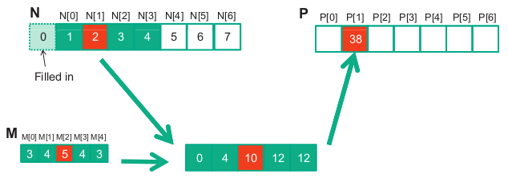

*1. Calculate the P[0] value below:*



<br>

```
P[0] = 0 * M[0] + 0 * M[1] + N[0] * M[2] + N[1] * M[3] + N[2] * M[4]
     = 0 * 3 + 0 * 4 + 1 * 5 + 2 * 4 + 3 * 3 
     = 22
```

---

*2. Consider performing a 1D convolution on array N = {4,1,3,2,3} with mask M = {2,1,4}. What is the resulting output array?*

```
P[0] = 0 * M[0] + N[0] * M[1] + N[1] * M[2]
     = 0 * 2 + 4 * 1 + 1 * 4
     = 8

P[1] = N[0] * M[0] + N[1] * M[1] + N[2] * M[2]
     = 4 * 2 + 1 * 1 + 3 * 4
     = 21

P[2] = N[1] * M[0] + N[2] * M[1] + N[3] * M[2]
     = 1 * 2 + 3 * 1 + 2 * 4
     = 13

P[3] = N[2] * M[0] + N[3] * M[1] + N[4] * M[2]
     = 3 * 2 + 2 * 1 + 3 * 4
     = 20

P[4] = N[3] * M[0] + N[4] * M[1] + 0 * M[2]
     = 2 * 2 + 3 * 1 + 0 * 4
     = 7

P = {8, 21, 13, 20, 7}
```

---

*3. What do you think the following 1D convolution masks are doing?*
- a. [0 1 0]
- b. [0 0 1]
- c. [1 0 0]
- d. [-1/2 0 1/2]
- e. [1/3 1/3 1/3]

```
a. Leaves the input array unchanged
b. Shifts the input array to the left by 1
c. Shifts the input array to the right by 1
d. Approximates the derivative of the input array
e. Smoothes the input array by averaging the values
```

---

*4. Consider performing a 1D convolution on an array of size $n$ with a mask of size $m$:*
- a. How many halo cells are there in total?
- b. How many multiplications are performed if halo cells are treated as multiplications (by 0)?
- c. How many multiplications are performed if halo cells are not treated as multiplications.

```
a. m - 1
b. n * m
c. h = floor(m / 2)
   n * m - h * (h + 1)
```

---

*5. Consider performing a 2D convolution on a square matrix of size $n*n$ with a square mask of size $m*m$:*
- a. How many halo cells are there in total?
- b. How many multiplications are performed if halo cells are treated as multiplications (by 0)?
- c. How many multiplications are performed if halo cells are not treated as multiplications.

```
a. (n + (m - 1))^2 - n^2
b. n^2 * m^2
c. h = floor(m / 2)
   n^2 * m^2 - (n - h)^2 * m^2
```

---

*6. Consider performing a 2D convolution on a rectangular matrix of size $n_1*n_2$ with a rectangular mask of size $m_1*m_2$:*
- a. How many halo cells are there in total?
- b. How many multiplications are performed if halo cells are treated as multiplications (by 0)?
- c. How many multiplications are performed if halo cells are not treated as multiplications.

```
a. (n1 + (m1 - 1)) * (n2 + (m2 - 1)) - n1 * n2
b.
```

---

*7. Consider performing a 1D tiled convolution with the kernel shown in Fig. 7.11 on an array of size n with a mask of size m using a tiles of size t:*
- a. How many blocks are needed?
- b. How many threads per block are needed?
- c. How much shared memory is needed in total?
- d. Repeat te same questions if you were using the kernel in Fig. 7.13.

---

*8. Revise the 1D kernel below to perform 2D convolution. Add more width parameters to the kernel declaration as needed.*

```C
__global__ void convolution_1D_basic_kernel(float *N, float *M, float *P, int Mask_Width, int Width) {

    int i = blockIdx.x*blockDim.x + threadIdx.x;
    
    float Pvalue = 0;
    int N_start_point = i - (Mask_Width/2);
    for (int j = 0; j < Mask_Width; j++) {
        if (N_start_point + j >= 0 && N_start_point + j < Width) {
            Pvalue += N[N_start_point + j]*M[j];
        }
    }
    P[i] = Pvalue;
}
```

---

*Revise the tiled 1D kernel below to perform 2D convolution. Keep in mind that the host code also needs to be changed to declare a 2D M array in the constant memory. Pay special attention to the increased usage of shared memory. Also, the N_ds needs to be declared as a 2D shared memory array.*

```C
__global__ void convolution_1D_basic_kernel(float *N, float *P, int Mask_Width, int Width) {

    int i = blockIdx.x*blockDim.x + threadIdx.x;

    float Pvalue = 0;
    int N_start_point = i - (Mask_Width/2);
    for (int j = 0; j < Mask_Width; j++) {
        if (N start_ point + j >= 0 && N_ start_ point + j < Width) {
            Pvalue += N[N_start_point + j]*M[j];
        }
    }
    P[i] = Pvalue;
}
```

---

*10. Revise the tiled 1D kernel below to perform 2D convolution. Keep in mind that the host code also needs to be changed to declare a 2D M array in the constant memory. Pay special attention to the increased usage of shared memory. Also, the N_ds needs to be declared as a 2D shared memory array.*

```C
__global__ void convolution_1D_tiled_kernel(float *N, float *P, int Mask_Width, int Width) {

    int i = blockIdx.x*blockDim.x + threadIdx.x;
    
    __shared__ float N_ds[TILE_SIZE + MAX_MASK_WIDTH - 1];
    
    int n = Mask_Width/2;
    
    int halo_index_left = (blockIdx.x - 1)*blockDim.x + threadIdx.x;
    if (threadIdx.x >= blockDim.x - n) {
        N_ds[threadIdx.x - (blockDim.x - n)] = (halo_index_left < 0) ? 0 : N[halo_index_left];
    }
    
    N_ds[n + threadIdx.x] = N[blockIdx.x*blockDim.x + threadIdx.x];

    int halo_index_right = (blockIdx.x + 1)*blockDim.x + threadIdx.x;
    if (threadIdx.x < n) {
        N_ds[n + blockDim.x + threadIdx.x] = (halo_index_right >= Width) ? 0 : N[halo_index_right];
    }

    __syncthreads();

    float Pvalue = 0;
    for(int j = 0; j < Mask_Width; j++) {
        Pvalue += N_ds[threadIdx.x + j]*M[j];
    }
    P[i] = Pvalue;
}
```

---