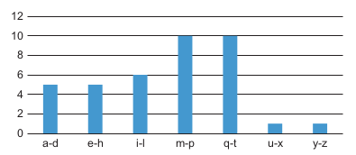
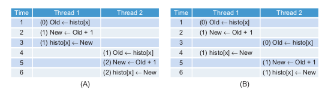
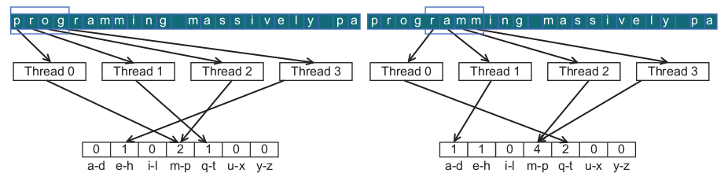
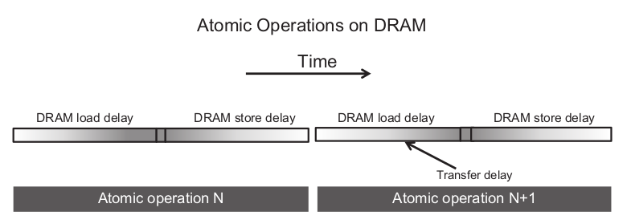

# 9. Parallel Patterns - Parallel Histogram Computation - An Introduction To Atomic Operations And Privatization

*The parallel computation patterns that we have presented so far all allow the task of computing each output element to be assigned to a thread. Therefore, these patterns are amenable to the owner-computes rule, where every thread can write into their designated output element(s) without concern about interference from other threads. This chapter introduces the parallel [histogram](https://en.wikipedia.org/wiki/Histogram) computation pattern, a frequently encountered application computing pattern where each output element can potentially be updated by all threads. As such, one must take care to coordinate among threads as they update output elements and avoid any interference that corrupts the final results.*

---

## 9.1 Background

A histogram is a display of the frequency of data items in successive numerical intervals. In the most common form of histogram, the value intervals are plotted along the horizontal axis and the frequency of data items in each interval is represented as the height of a rectangle, or bar, rising from the horizontal axis.

A histogram example for the phrase: "programming massively parallel processors"



The intervals are shown below the x axis for every bar.

Histograms provide useful summaries of data sets. In our example, we can see that the phrase being represented consists of letters that are heavily concentrated in the middle intervals of the alphabet and very light in the later intervals. Such shape of the histogram is sometimes referred to as a feature of the data set, and provides a quick way to determine if there are significant phenomena in the data set.

Histograms can be easily computed in a sequential manner as shown below.

```C
sequential_histogram(char *data, int length, int *histo) {
    for (int i = 0; i < length; i++) {
        int alphabet_position = data[i] – 'a';
        if (alphabet_position >= 0 && alphabet_position < 26) {
            histo[alphabet_position / 4]++
        }
    }
}
```

The index is calculated by subtracting the character 'a' by the current character. This is done to normalize the characters to the range 0-25 (for [ASCII](https://en.wikipedia.org/wiki/ASCII) code representation). Then the index is divided by 4 to get the index of the corresponding interval.

The code computes the histogram only for lowercase characters. This is done by using the *if* statement inside the *for-loop*.

The C code is quite simple and efficient. The data array elements are accessed sequentially in the for loop so the CPU cache lines are well used whenever they are fetched from the system DRAM. The *histo[]* array is so small that it fits well in the level-one (L1) data cache of the CPU, which ensures very fast updates to the *histo[]* elements. For most modern CPUs, one can expect execution speed of this code to be memory bound, i.e., limited by the rate at which the *data[]* elements can be brought from DRAM into the CPU cache.

---

## 9.2 Use Of Atomic Operations

A straightforward strategy for parallel histogram computation is dividing the input array into sections and having each thread process one of the sections. if we use $P$ threads, each thread will do approximately $1 / P$ of the original work. Using this strategy, we should be able to expect a speedup close to P.


An increment to an interval counter in the histo[] array is an update, or read-modify-write, operation on a memory location. The operation involves reading the memory location (read), adding one to the  read content (modify), and writing the new value back to the memory location (write).

With this strategy more than one threads may try to update a value in the *histo[]* array simultaneously. This can lead to race conditions between threads.



As shown above in (B) *Thread 2* reads the value from *histo[x]* before *Thread 1* writes the updated value back to *histo[x]*. This means that *Thread 2* will read the old value from *histo[x]* and will increment it. This will lead *histo[x]* to be incremented only once.

To overcome this defect we can use atomic operations. An atomic operation on a memory location is an operation that performs a read-modify-write sequence on the memory location in such a way that no other read-modify-write sequence can overlap it.

It is important to remember that atomic operations do not force particular thread execution orderings. The threads may begin their sequence in any order. 

In our example we will use an atomic operation named atomic add. Other types of atomic operations include subtraction, increment, decrement, minimum, maximum, logical and, logical or, etc.

```C
int atomicAdd(int* address, int val);
```

The code is shown below: 

```C
__global__ void histo_kernel(unsigned char *buffer, long size, unsigned int *histo)
{
    int i = threadIdx.x + blockIdx.x * blockDim.x;
    int section_size = (size - 1) / (blockDim.x * gridDim.x) + 1;
    int start = i * section_size;

    // All threads handle blockDim.x * gridDim.x
    // consecutive elements
    for (k = 0; k < section_size; k++) {
        if (start + k < size) {
            int alphabet_position = buffer[start + k] – 'a';
            if (alphabet_position >= 0 && alpha_position < 26) 
                atomicAdd(&(histo[alphabet_position / 4]), 1);
        }
    }
}
```

The kernel first computes the *section_size* and the starting position of each block.

The *for-loop* then iterates through all elements of its thread block's section.

The *if* statement ensures that the computed index is within the array bounds and then the histogram index is computed in the same way as the sequential code.

---

## 9.3 Block Versus Interleaved Partitioning

The first strategy that we used is using block partitioning to assign elements to threads. Partitioning data in such a way is probably the best strategy when it comes to CPU threads because the sequential accessing of elements makes good use of cache lines.

However, for a GPU there are too many threads that interfere into an SM and one cannot expect a data in a cache line to remain available for all the sequential accesses.

Below is shown a more desirable strategy using memory coalescing.



The kernel is shown below.

```C
__global__ void histo_kernel(unsigned char *buffer, long size, unsigned int *histo)
{

    unsigned int tid = threadIdx.x + blockIdx.x * blockDim.x;
    
    // All threads handle blockDim.x * gridDim.x consecutive elements in each iteration
    for (unsigned int i = tid; i < size; i += blockDim.x * gridDim.x) {
        int alphabet_position = buffer[i] – 'a';
        if (alphabet_position >= 0 && alpha_position < 26)
            atomicAdd(&(histo[alphabet_position / 4]), 1);
    }
}
```

This kernel is using interleaved partioting to compute the histogram.

The starting position is the thread id and each thread then jumps *gridDim.x \* blockDim.x* elements in each iteration. This will allow consecutive threads to access consecutive elements while coalescing the accesses.

---

## 9.4 Latency Versus Throughput Of Atomic Operations

The atomic operation used in the previous kernels ensures the correctness of updates by serializing any simultaneous updates to a location. As we all know, serializing any portion of a massively parallel program can drastically increase the execution time and reduce the execution speed of the program. Therefore, it is important that such serialized operations account for as little execution time as possible.

DRAM accesses can take hundreds of clock cycles. As we learned in [Chapter 3](../chapter03/README.md#37-thread-scheduling-and-latency-tolerance) GPUs use zero-cycle context switching to tolerate such latency. As long as we have many threads whose memory accesses overlap with each other he execution speed is limited by the throughput of the memory system. Thus it is important that GPUs make full use of DRAM bursts, banks, and channels to achieve very high memory access throughput.

Unfortunately, this assumption breaks down when many atomic operations update the same memory location. In this case, the read-modify-write sequence of a trailing thread cannot start until the read-modify-write sequence of a leading thread is complete.



The length of these time sections of each read-modify-write operation, usually hundreds of clock cycles, defines the minimal amount time that must be dedicated to servicing each atomic operation and thus limits the throughput, or the rate at which atomic operations can be performed.

---

## 9.5 Atomic Operation In Cache Memory

A key insight from the previous section is that long latency of memory access translates into low throughput in executing atomic operations on heavily contended locations.

Recent GPUs allow atomic operation to be performed in the last level cache, which is shared among all SMs. Since the variables updated by atomic operations tend to be heavily accessed by many threads, these variables tend to remain in the cache once they are brought in from DRAM. Since the access time to the last level cache is in tens of cycles rather than hundreds of cycles, the throughput of atomic operations is improved by at least an order of magnitude by just allowing them to be performed in the last level cache.

---

## 9.6 Privatization

The latency for accessing memory can be dramatically reduced by placing data in the shared memory.

```C
__global__ void histogram_privatized_kernel(unsigned char* input, unsigned int* bins,
                                            unsigned int num_elements, unsigned int num_bins) {

    unsigned int tid = blockIdx.x * blockDim.x + threadIdx.x;

    // Privatized bins
    extern __shared__ unsigned int histo_s[];


    for(unsigned int binIdx = threadIdx.x; binIdx < num_bins; binIdx += blockDim.x) {
        histo_s[binIdx] = 0u;
    }
    __syncthreads();

    // Histogram
    for (unsigned int i = tid; i < num_elements; i += blockDim.x * gridDim.x) {
        int alphabet_position = buffer[i] – 'a';
        if (alphabet_position >= 0 && alpha_position < 26) 
            atomicAdd(&(histo_s[alphabet_position / 4]), 1);
    }
    __syncthreads();

    // Commit to global memory
    for(unsigned int binIdx = threadIdx.x; binIdx < num_bins; binIdx += blockDim.x) {
        atomicAdd(&(histo[binIdx]), histo_s[binIdx]);
    }
}
```

Each block will allocate shared memory to compute its private histogram. This will allow the kernel to reduce the access latency even more. The only downside is that the kernel needs to merge all private histograms of each block into one at the end of the computation.

In the kernel above each block allocates a private histogram and initializes the values to 0. Then the threads in each block will update their private histogram using interleaved partioning. Finally all thread blocks will update the global histogram with its values.

---

## 9.7 Aggregation

Some data sets have a large concentration of identical data values in localized areas. For example, in pictures of the sky, there can be large patches of pixels of identical value. Such high concentration of identical values causes heavy contention and reduced throughput of parallel histogram computation.

A way to exploit this is by accumulating identical values to a local variable and update the local histogram whenever a different value is presented.

```C
__global__ void histogram_privatized_kernel(unsigned char* input, unsigned int* bins,
                                            unsigned int num_elements, unsigned int num_bins) {

    unsigned int tid = blockIdx.x*blockDim.x + threadIdx.x;
    
    // Privatized bins
    extern __shared__ unsigned int histo_s[];

    for(unsigned int binIdx = threadIdx.x; binIdx < num_bins; binIdx += blockDim.x) {
        histo_s[binIdx] = 0u;
    }
    __syncthreads();

    unsigned int prev_index = -1;
    unsigned int accumulator = 0;
    int alphabet_position;
    for(unsigned int i = tid; i < num_elements; i += blockDim.x * gridDim.x) {
        alphabet_position = buffer[i] – 'a';
        if (alphabet_position >= 0 && alpha_position < 26) {
            unsigned int curr_index = alphabet_position / 4;
            if (curr_index != prev_index) {
                if (accumulator >= 0) 
                    atomicAdd(&(histo_s[alphabet_position / 4]), accumulator);
                accumulator = 1;
                prev_index = curr_index;
            }
            else {
                accumulator++;
            }
        }
    }
    atomicAdd(&(histo_s[alphabet_position / 4]), accumulator)
    __syncthreads();
    
    // Commit to global memory
    for(unsigned int binIdx = threadIdx.x; binIdx < num_bins; binIdx += blockDim.x) {
        atomicAdd(&(histo[binIdx]), histo_s[binIdx]);
    }
}
```

The first and the last part of the kernel is the same as before.

The kernel uses *prev_index* to remember the last position that the value corresponded to, *curr_index* to compute the index of the current value and accumulator to accumulate the amount of consecutive identical values.

If the *curr_index* is not equal to the *prev_index* the kernel updates the private histogram of its block with the value of accumulator and then sets the accumulator back to 1. If *curr_index* is equal to *prev_index* then it just increments the accumulator by 1.

At the end of the *for-loop* we need to add to the private histogram the last value that we saw.

One thing to keep in mind is that the aggregated kernel requires more statements and variables. Thus, if the contention rate is low, an aggregated kernel may execute at lower speed than the simple kernel. However, if the data distribution leads to heavy contention in atomic operation execution, aggregation results in significant performance gains.

---