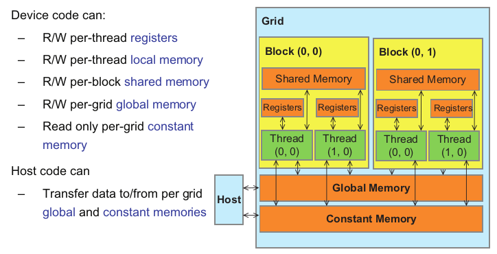
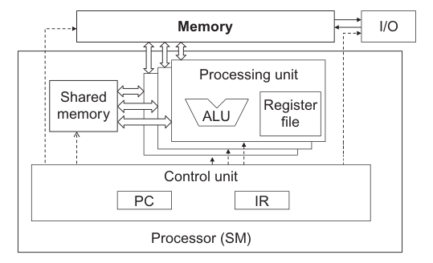
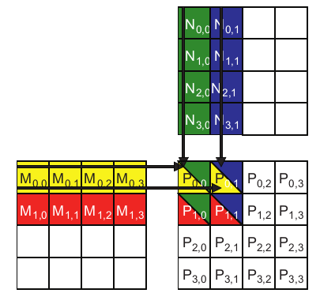
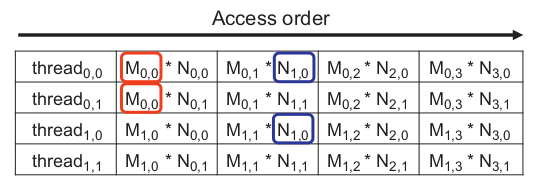
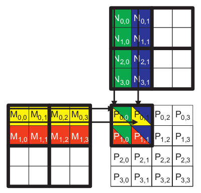
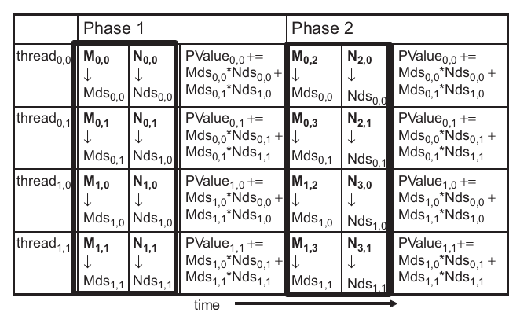
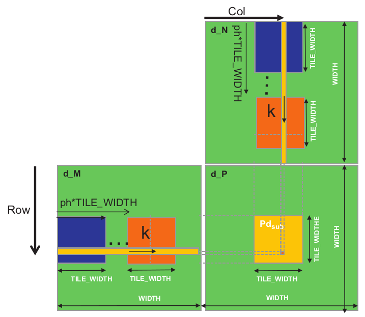
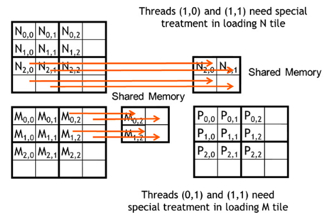

# 4. Memory and Data Locality

*In this chapter, we will study how one can organize and position the data for efficient access by a massive number of threads.*

*Although the scope we have covered is a very good start, the CUDA kernels that we have learned thus far will likely achieve only a tiny fraction of the potential speed of the underlying hardware. The poor performance is attributable to the long access latencies (hundreds of clock cycles) and finite access bandwidth of global memory, which is typically implemented with Dynamic Random Access Memory (DRAM).*

*In this chapter we will learn to use different memory types to boost the execution efficiency of CUDA kernels.*

---

## 4.1 Importance of Memory Access Efficiency

The most important part of the kernel in the bluring example (seen in the previous chapter - chapter 3) in terms of execution time is the nested *for-loop* that perfors pixel value accumulation with the blurring patch as seen below.


```C
for(int blurRow = -BLUR_SIZE; blurRow < BLUR_SIZE + 1; ++blurRow) {
    for(int blurCol = -BLUR_SIZE; blurCol < BLUR_SIZE + 1; ++blurCol) {

        int curRow = Row + blurRow;
        int curCol = Col + blurCol;

        // Verify we have a valid image pixpixelel
        if(curRow > -1 && curRow < h && curCol > 1 && curCol < w) {
            pixVal += in[curRow * w + curCol];
            ++pixels; // Keep track of the number of pixels in the avg
        }
    }
}
```

In every iteration of the inner loop, one global memory access for one floating-point addition. The global memory access fetches the value of the *in[]* array element and accumulates the value into the *pixVal*.

Thus, the ratio of floating-point calculation to global memory access operation is 1 to 1, or 1.0. This ratio is referred as *compute-to-global-memory-access ratio*, defined as the number of floating-point operations per global memory access within a region of a program.

The compute-to-global-memory-access ratio has major implications on the performance of a CUDA kernel. In a high-end device today the global memory bandwidth is around 1000 GB/s. With four bytes in each single-precision floating-point value, no more than 1000 / 4 = 250 GB/s can be expected to load.

While 250 GFLOPS is a respectable number, it is only a fraction (2%) of the peak single-precision performance of 12 TFLOPS or higher for these high-end devices. This programs are referred as memory-bound programs.

In order to achieve higher performance for a kernel, we need to reduce the number of global memory accesses ratio.

---

## 4.2 Matrix Multiplication

[Matrix–matrix multiplication](https://en.wikipedia.org/wiki/Matrix_multiplication) between an i × j (i rows by j columns) matrix M and a j × k matrix N produces an i × k matrix P. Matrix multiplication presents opportunities for reduction of global memory accesses that can be captured with relatively simple techniques. The execution speed of matrix multiplication functions can vary by orders of magnitude, depending on the level of reduction of global memory accesses. Therefore, matrix multiplication provides an excellent initial example for such techniques.

When performing a matrix multiplication, each element of the output matrix P is an inner product of a row of M and a column of N. As shown below, P<sub>Row,Col</sub> (the small square in P) is the inner product of the vector formed from the Row<sup>th</sup> row of M (shown as a horizontal strip in M) and the vector formed from the Col<sup>th</sup> column of N (shown as a vertical strip in N)


In our initial matrix multiplication implementation, we map threads to elements of P with the same approach that we used for *colorToGreyscaleConversion*; i.e., each thread is responsible for calculating one P element. The row and column indexes for the P element to be calculated by each thread are as follows:

$Row=blockIdx.y*blockDim.y+threadIdx.y$

and

$Col=blockIdx.x*blockDim.x+threadIdx.x$

With this one-to-one mapping, the Row and Col thread indexes are also the row and column indexes for output array. Below is the source code of the kernel based on this thread-to-data mapping.

```C
// Assuming square matrices of size Width x Width
__global__ 
void MatrixMulKernel(float* M, float* N, float* P, int Width) {
    // Calculate the row index of the P element and M
    int Row = blockIdx.y*blockDim.y+threadIdx.y;
    // Calculate the column index of P and N
    int Col = blockIdx.x*blockDim.x+threadIdx.x;

    if ((Row >= Width) || (Col >= Width)) return;

    float Pvalue = 0;
    // each thread computes one element of the block sub-matrix
    for (int k = 0; k < Width; ++k)
        Pvalue += M[Row*Width+k]*N[k*Width+Col];

    P[Row*Width+Col] = Pvalue;
}
```

Before entering the loop, we initialize a local variable *Pvalue* to 0. Each iteration of the loop accesses an element from the Row<sup>th</sup> row of M and one from the Col<sup>th</sup> column of N, multiplies the two elements together, and accumulates the product into *Pvalue*.

Within the *for-loop* the M and N matrices are accessed.

- The M matrix is linearized into an equivalent 1D array where the rows of M are placed one after another in the memory space, starting with the 0<sup>th</sup> row. In general, the Row<sup>th</sup> row of M is *M[Row\*Width]* and the k<sup>th</sup> element in the Row<sup>th</sup> row is at *M[Row\*Width+k]*.

- In the N matrix the beginning element of the Col<sup>th</sup> column is the Col<sup>th</sup> element of the 0<sup>th</sup> row, which is *N[Col]*. Accessing each additional element in Col<sup>th</sup> column requires skipping over entire rows. Therefore, the k<sup>th</sup> element of the Col<sup>th</sup> column is *N[k\*Width+Col]*.

After the execution exits the *for-loop*, all threads have their *P* element values in the *Pvalue* variables. Each thread then uses the one-dimensional equivalent index expression *Row*Width+Col* to write its *P* element. Again, this index pattern is similar to that used in the *colorToGreyscaleConversion* kernel.

We can estimate the effect of memory access efficiency by calculating the expected performance level of the matrix multiplication kernel code. The dominating part of the kernel in terms of execution time is the *for-loop* that performs inner product calculation:

```C
for(int k = 0;k < Width; ++k)
Pvalue += M[Row * Width + k] * N[k * Width + Col];
```

One global memory access fetches an *M* element, and the other fetches an *N* element. One floating-point operation multiplies the *M* and *N* elements fetched, and the other accumulates the product into *Pvalue*. Thus, the compute-to-global-memory-access ratio of the loop is 1.0.

This ratio will likely result in less than 2% utilization of the peak execution speed of the modern GPUs. We need to increase the ratio by at least an order of magnitude for the computation throughput of modern devices to achieve good utilization.

---

## 4.3 CUDA Memory Types

A CUDA device contains several types of memory that can help programmers improve compute-to-global-memory-access ratio and thus achieve high execution speed. Below are the types of CUDA device memories.



Global memory and constant memory appear at the bottom of the picture. These types of memory can be written (W) and read (R) by the host by calling API functions. The global memory can be written and read by the device. The constant memory supports short-latency, high-bandwidth read-only access by the device.

Registers and shared memory are on-chip memories. Variables that reside in these types of memory can be accessed in very high-speed in a highly parallel manner.

- Registers are allocated to individual threads; each thread can only access its own registers.

- Shared memory is allocated to thread blocks; all threads in a block can access shared memory variables allocated to the block. Shared memory is an efficient means for threads to cooperate by sharing their input data and intermediate results.

By declaring a CUDA variable in one of the CUDA memory types, a CUDA programmer dictates the visibility and access speed of the varible.

This architecture is based on the [Von Neumann](https://en.wikipedia.org/wiki/Von_Neumann_architecture) model.

A subtler point is that each access to registers involves fewer instructions than an access to the global memory. Arithmetic instructions in most modern processors have “built-in” register operands. 

- When an operand of an arithmetic instruction is in a register, no additional instruction is required to make the operand value available to the arithmetic and logic unit ([ALU](https://en.wikipedia.org/wiki/Arithmetic_logic_unit)), where the arithmetic calculation is performed.

- Meanwhile, if an operand value is in the global memory, the processor needs to perform a memory load operation to make the operand value available to the ALU. Since the processor can only fetch and execute a limited number of instructions per clock cycle, the version with an additional load will likely take more time to process than the one without an additional load.

Thus, placing the operands in registers can improve execution speed.

Below a SM is illustrated showing the shared memory and registers in a CUDA device.



Shared memory is designed as part of the memory space that resides on the processor chip. When the processor accesses data that reside in the shared memory, it needs to perform a memory load operation, similar to accessing data in the global memory. However, because shared memory resides on-chip, it can be accessed with much lower latency and much higher throughput than the global memory. Shared memory has longer latency and lower bandwidth than registers because of the need to perform a load operation.

Shared memory is accessible by all threads in a thread block, whereas register data are private to a thread.

The table below shows the memory types of a CUDA device.


---

## 4.4 Tiling for Reduced Memory Traffic

- The global memory is large but slow.
- The shared memory is small but fast.

A common strategy is to partition the data into subsets called tiles so that each tile fits into the shared memory. An important criterion is that kernel computation on these tiles can be performed independently of each other. 

The concept of tiling can be illustrated using the matrix multiplication example as shown below.



The picture below showcases the access order in global memory by the threads in time.



Each thread accesses four elements of M and four elements of N during execution. Among the four threads highlighted, a significant overlap occurs in the M and N elements they access. For instance, both thread<sub>0,0</sub> and thread<sub>0,1</sub> access M<sub>0,0</sub> and the rest of row 0 of M. Similarly, both thread<sub>0,1</sub> and thread<sub>1,1</sub> access N<sub>0,1</sub> and the rest of column 1 of N.

If thread<sub>0,0</sub> and thread<sub>0,1</sub> can be made to collaborate so that these M elements are only loaded from the global memory once, the total number of accesses to the global memory can be reduced by half. Every M and N element is accessed exactly twice during the execution of block<sub>0,0</sub>. Therefore, if all four threads can be made to collaborate in their accesses to global memory, traffic to the global memory can be reduced by half.

When the rate of DRAM requests exceeds the provisioned access bandwidth of the DRAM system, traffic congestion arises and the arithmetic units become idle. If multiple threads access data from the same DRAM location, they can potentially form a “carpool” and combine their accesses into one DRAM request. However, this process requires a similar execution schedule for the threads so that their data accesses can be combined.


---

In the context of parallel computing, tiling is a program transformation technique that localizes the memory locations accessed among threads and the timing of their accesses. It divides the long access sequences of each thread into phases and uses barrier synchronization to keep the timing of accesses to each section at close intervals. This technique controls the amount of on-chip memory required by localizing the accesses both in time and in space. In terms of our carpool analogy, we force the threads that form the “carpool” group to follow approximately the same execution timing.

We now present a tiled matrix multiplication algorithm. The basic idea is for the threads to collaboratively load subsets of the M and N elements into the shared memory before they individually use these elements in their dot product calculation. The size of the shared memory is quite small, and the capacity of the shared memory should not be exceeded when these M and N elements are loaded into the shared memory. This condition can be satisfied by dividing the M and N matrices into smaller tiles so that they can fit into the shared memory. In the simplest form, the tile dimensions equal those of the block, as illustrated below.



<br>

The execution phases are:



We can see that in the first phase the four threads will load the M and N elements that are needed to partially accumulate the value of the dot product. When all phases are completed the *PValue* will eventually hold the dot product of the two matrices.

Note that the calculation happens in two phases when we use two 4x4 matrices and 2x2 tiles. In general the number of phases is equal to *MATRIX_WIDTH / TILE_WIDTH*.

---

## 4.5 A Tiled Matrix Multiplication Kernel

Α tiled matrix multiplication kernel is shown below.

```C
__global__ 
void MatrixMulKernel(float* d_M, float* d_N, float* d_P, int Width) {

    __shared__ float Mds[TILE_WIDTH][TILE_WIDTH];
    __shared__ float Nds[TILE_WIDTH][TILE_WIDTH];

    int bx = blockIdx.x; int by = blockIdx.y;
    int tx = threadIdx.x; int ty = threadIdx.y;
    
    // Identify the row and column of the d_P element to work on
    int Row = by * TILE_WIDTH + ty;
    int Col = bx * TILE_WIDTH + tx;
    
    float Pvalue = 0;
    // Loop over the d_M and d_N tiles required to compute d_P element
    for (int ph = 0; ph < Width/TILE_WIDTH; ++ph) {
        
        // Collaborative loading of d_M and d_N tiles into shared memory
        Mds[ty][tx] = d_M[Row*Width + ph*TILE_WIDTH + tx];
        Nds[ty][tx] = d_N[(ph*TILE_WIDTH + ty)*Width + Col];
        __syncthreads();


        for (int k = 0; k < TILE_WIDTH; ++k)
            Pvalue += Mds[ty][k] * Nds[k][tx];
        __syncthreads();
    }

    d_P[Row*Width + Col] = Pvalue;
}

```

Recall that the scope of shared memory variables is a block. Thus, one pair of *Mds* and *Nds* will be created for each block, and all threads of a block can access the same *Mds* and *Nds*. This is important since all threads in a block must have access to the M and N elements loaded into *Mds* and *Nds* by their peers so that they can use these values to satisfy their input needs.

The *threadIdx* and *blockIdx* values are saved into automatic variables and thus into registers for fast access. Their scope is in each individual thread. They are initialized with the *threadIdx* and *blockIdx* values and used many times during the lifetime of the thread.

The code assumes that each thread is responsible for calculating one P element. The horizontal (x) position, or the column index of the P element to be produced by a thread, can be calculated as *bx\*TILE_WIDTH+tx* because each block covers *TILE_WIDTH* elements in the horizontal dimension. A thread in block *bx* would have *bx* blocks of threads, or (*bx\*TILE_WIDTH*) threads, before it; they cover *bx\*TILE_WIDTH* elements of P. Another *tx* threads within the same block would cover another *tx* elements. Thus, the thread with *bx* and *tx* should be responsible for calculating the P element whose x index is *bx\*TILE_WIDTH+tx*. Similarly, the horizontal index is saved in the variable Col for the thread.



We initialize the *Pvalue* variable to 0.0 and iterate through the phases of the calculation. As noted before the number of phases is equal to *MATRIX_WIDTH / TILE_WIDTH*.

In each iteration the threads collaboratively load the M and N elements that are needed. *d_M* and *d_N* are sirialized, therefore the indexing is done as follows.

- For *d_M* we skip *Row\*Width* elements to get to Row<sup>th</sup> row of the M matrix. Then the current element would have *ph\*TILE_WIDTH* elements before it because we are in the *ph* phase. Finally each thread will load the element that corresponds to itself, that is, after another *tx* elements.

- Similarly, for *d_N* we skip *(ph\*TILE_WIDTH+ty)\*Width* elements, because we are in the *ph* phase and the *ty* thread will load elements from the (ph\*TILE_WIDTH+ty)<sup>th</sup> row of the N matrix. Another *Col* elements are skipped because the thread is responsible for the *Col* element.

After loading the elements we need to sychronize the threads using *__synchthreads()* so all the elements will be loaded in the shared memory before any calculations start.

In the nested *for-loop* each thread partially accumulates the dot product of the M and N elements that is responsible for, using the elements previously loaded in the shared memory.

Another *__synchthreads()* is used to ensure that the calculations are done before any other thread tries to load the next elements in the shared memory (in the next iteration).

Finally, when the loop ends the *Pvalue* is assigned to the *d_P* element that corresponds to the thread.

The tiled algorithm provides a substantial benefit. For matrix multiplication, the global memory accesses are reduced by a factor of TILE_WIDTH. If one uses 16 × 16 tiles, we can reduce the global memory accesses by a factor of 16. This increases the compute-to-global-memory-access ratio from 1 to 16. This improvement allows the memory bandwidth of a CUDA device to support a computation rate close to its peak performance; e.g. a device with 150 GB/s global memory bandwidth can approach ((150/4)*16) = 600 GFLOPS!

While the performance improvement of the tiled matrix multiplication kernel is impressive, it includes a few simplifying assumptions. First, the width of the matrices is assumed to be a multiple of the width of the thread blocks. This assumption prevents the kernel from correctly processing arbitrary-sized matrices. The second assumption is that the matrices are square matrices, which is not always true in real-life settings.

---

## 4.6 Boundary Checks

With the previous kernel code, matrices with arbitary sizes cannot be handled. Assuming that we have two 3x3 M and N matrices and *TILE_WIDTH = 2*, the kernel would try to access elements either outside of the matrix (as shown for the M matrix) or the wrong index will be calculated for the linearized memory (as shown for the N matrix).



Note that these problematic accesses cannot be prevented by excluding the threads that do not calculate valid P elements. Those threads are still needed to cooperative load the M and N elements for the calculation.

A solution is to check the boundaries in each load operation. If the index is within the boundaries the thread will load the element. Otherwise, the thread will load a number that will not corrupt the result and that is, 0.0.

Finally, a thread should only store its final inner product value if it is responsible for calculating a valid P element.

The kernel code with the additional boundary condition checks is shown below.

```C

// Loop over the M and N tiles required to compute P element
for (int ph = 0; ph < ceil(Width/(float)TILE_WIDTH); ++ph) {

    // Collaborative loading of M and N tiles into shared memory
    if ((Row < Width) && (ph*TILE_WIDTH+tx) < Width)
        Mds[ty][tx] = M[Row*Width + ph*TILE_WIDTH + tx];
    if ((ph*TILE_WIDTH+ty) < Width && Col < Width)
        Nds[ty][tx] = N[(ph*TILE_WIDTH + ty)*Width + Col];
    __syncthreads();

    for (int k = 0; k < TILE_WIDTH; ++k)
        Pvalue += Mds[ty][k] * Nds[k][tx];
    __syncthreads();
}
if ((Row<Width) && (Col<Width))
    P[Row*Width + Col] = Pvalue;
```

With the boundary condition checks, the tile matrix multiplication kernel is just one more step away from being a general matrix multiplication kernel. In general, matrix multiplication is defined for rectangular matrices: a *j×k* M matrix mUltiplied by a *k×l* N matrix results in a *j×l* P matrix. Currently, our kernel can only handle square matrices.

Fortunately, our kernel can be easily extended to a general matrix multiplication kernel by replacing the *Width* variable with the indended widths and heights of the input matrices (an example can be seen in [tiled_matrix_mul_shared_mem](https://github.com/R100001/Programming-Massively-Parallel-Processors/tree/master/chapter04/labs/tiled_matrix_mul_shared_mem)).

---

## 4.7 Memory as a Limiting Factor to Parallelism

While CUDA registers and shared memory can be extremely effective in reducing the number of accesses to global memory, one must be careful to stay within the capacity of these memories. These memories are forms of resources necessary for thread execution. Each CUDA device offers limited resources, thereby limiting the number of threads that can simultaneously reside in the SM for a given application. In general, the more resources each thread requires, the fewer the threads that can reside in each SM, and likewise, the fewer the threads that can run in parallel in the entire device.

The number of registers available to each SM varies from one device to another. An application can dynamically determine the number of registers available in each SM of the device used and choose a version of the kernel that uses the number of registers appropriate for the device. The number of registers can be determined by calling the *cudaGetDeviceProperties* function. Assume that the variable *&dev_prop* is passed to the function for the device property and the field *dev_prop.regsPerBlock* generates the number of registers available in each SM. The application can then divide this number by the targeted number of threads to reside in each SM to determine the number of registers that can be used in the kernel.

The size of shared memory in each SM can also vary depending on the device. Each generation or model of device can have different amounts of shared memory in each SM. It is often desirable for a kernel to be able to use different amount of shared memory according to the amount available in the hardware. We may want a host code to dynamically determine the size of the shared memory and adjust the amount of shared memory used by a kernel, which can be done by calling the *cudaGetDeviceProperties* function. We make the assumption that variable *&dev_prop* is passed to the function and that field *dev_prop.sharedMemPerBlock* gives the number of registers available in each SM. The programmer can then determine the amount of shared memory that should be used by each block.

---
