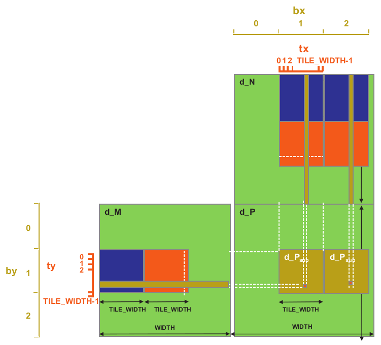

# 5. Performance Considerations

*The execution speed of a parallel program can vary greatly depending on the resource constraints of the computing hardware. In different applications, different constraints may dominate and become the limiting factors, commonly referred to as bottlenecks. One can often dramatically improve the performance of an application on a particular CUDA device by trading one resource usage for another. This strategy works well if the resource constraint thus alleviated was actually the dominating constraint before the strategy was applied, and the one thus exacerbated does not have negative effects on parallel execution.*

---

## 5.1 Global Memory Bandwidth

One of the most important factors of CUDA kernel performance is accessing data in the global memory. CUDA applications exploit massive data parallelism. Naturally, CUDA applications tend to process a massive amount of data from the global memory within a short period of time. Memory coalescing techniques are often used in conjunction with tiling techniques to allow CUDA devices to reach their performance potential by more efficiently utilizing the global memory bandwidth.

In order to understand how to effectively use the coalescing hardware, we need to review how the memory addresses are formed in accessing C multidimensional array elements. Multidimensional array elements in C and CUDA are placed into the linearly addressed memory space according to the row-major convention as shown below.


For the [simple matrix multiplication kernel](../chapter04/labs/basic_matrix_mul), each thread accesses a row of the M array and a column of the N array as shown below.


In order to understand why the pattern in (B) is more favorable than that in (A), we need to review how these matrix elements are accessed.

---

Let us assume that M and N are 4x4 matrices.

The access pattern to N is generated by the following code.

```C
for(int k = 0; k < numNRows; ++k)
    ... = ... * N[k * Width + Col];
```

In each iteration *k* and *Width* are the same in every thread. The *Col* variable is initialized to:

```C
Col = blockIdx.x * blockDim.x + threadIdx.x;
```

Since the value of *blockIdx.x* and *blockDim.x* are of the same value for all threads in the same block, the only part of *k\*Width+Col* that varies across a thread block is *threadIdx.x*. Since adjacent threads have consecutive *threadIdx.x* values, their accessed elements will have consecutive addresses.


<br>

The access pattern to M is generated by the following code.

```C
for(int k = 0; k < numMCols; ++k)
    ... = M[Row * Width + k] * ...;
```

In each iteration *k* and *Width* are the same in every thread. The *Row* variable is initialized to:

```C
Col = blockIdx.y * blockDim.y + threadIdx.y;
```

Since the value of *blockIdx.y* and *blockDim.y* are of the same value for all threads in the same block, the only part of *Row* that varies across a thread block is *threadIdx.y*. Since adjacent threads have consecutive *threadIdx.y* values, their accessed elements will **not** have consecutive addresses (the *Row* value is multiplied with *Width* which is equal to 4).


As a result, when a kernel loop iterates through a row, the accesses to global memory are much less efficient than the case where a kernel iterates through a column.

---

If an algorithm intrinsically requires a kernel code to iterate through data along the row direction, one can use the shared memory to enable memory coalescing. The technique, called corner turning, is illustrated below for matrix multiplication.


Once the data is in shared memory, they can be accessed either on a row basis or a column basis with much less performance variation because the shared memories are implemented as intrinsically high-speed on-chip memory that does not require coalescing to achieve high data access rate.

The kernel for copying the data from the global memory to the shared memory is shown below.

```C
__global__ void MatrixMulKernel(float* M, float* N, float* P, int Width)
{
    __shared__ float Mds[TILE_WIDTH][TILE_WIDTH];
    __shared__ float Nds[TILE_WIDTH][TILE_WIDTH];

    int bx = blockIdx.x; int by = blockIdx.y;
    int tx = threadIdx.x; int ty = threadIdx.y;
    
    // Identify the row and column of the P element to work on
    int Row = by * TILE_WIDTH + ty;
    int Col = bx * TILE_WIDTH + tx;
    
    float Pvalue = 0;
    // Loop over the M and N tiles required to compute the P element
    for (int ph = 0; ph < Width/TILE_WIDTH; ++ph) {
    
        // Collaborative loading of M and N tiles into shared memory
        Mds[ty][tx] = M[Row*Width + ph*TILE_WIDTH + tx];
        Nds[ty][tx] = N[(ph*TILE_WIDTH + ty)*Width + Col];
        __ syncthreads();

        for (int k = 0; k < TILE_WIDTH; ++k)
            Pvalue += Mds[ty][k] * Nds[k][tx];
        __syncthreads();

    }
    P[Row*Width + Col] = Pvalue;
}
```

The load operation for this kernel is performed with the first two lines inside the *for-loop*. 


In the case of M, the linearized index calculation is:

```C
Row*Width + ph*TILE_WIDTH + tx
```

Within each iteration ph, Width and TILE_WIDTH is the same. Row is calculated as:

```C
Row = by * TILE_WIDTH + ty;
```

Within a block only the ty variable changes. However, adjacent threads will have the same ty value and adjacents tx values.

Therefore the load operations will be coalesced.

In the case of M, the linearized index calculation is:

```C
(ph*TILE_WIDTH + ty)*Width + Col
```

Within a block only the ty variable changes.

The Col variable is initialized to:

```C
Col = bx * TILE_WIDTH + tx;
```

and tx will have adjacent values for adjacent threads.

Therefore the load operations will be coalesced.


On a current generation device, the tiled kernel can run more
than 30x faster than the simple kernel.

---

## 5.2 More On Memory Parallelism

DRAM bursting is a form of parallel organization: multiple locations around are accessed in the DRAM core array in parallel. However, bursting alone is not sufficient to realize the level of DRAM access bandwidth required by modern processors. DRAM systems typically employ two more forms of parallel organization – banks and channels. 

At the highest level, a processor contains one or more channels. Each channel is a memory controller with a bus that connects a set of DRAM banks to the processor. Below is illustrated a processor that contains four channels, each with a bus that connects four DRAM banks to the processor.


In real systems, a processor typically has one to eight channels and each channel is connected to a large number of banks. 

The data transfer bandwidth of a bus is defined by its width and clock frequency. Modern double data rate (DDR) busses perform two data transfers per clock cycle, one at the rising edge and one at the falling edge of each clock cycle. For example, a 64-bit DDR bus with a clock frequency of 1 GHz has a bandwidth of 8B*2*1 GHz = 16 GB/sec.

A modern CPU might require a memory bandwidth of at least 32 GB/s, whereas a modern GPU might require 128 GB/s. For this example, the CPU would require 2 channels and the GPU would require 8 channels.

For each channel, the number of banks connected to it is determined by the number of banks required to fully utilize the data transfer bandwidth of the bus.

Below the data transfer timing is illustrated when a single bank is connected to a channel (A). It shows the timing of two consecutive memory read accesses to the DRAM cells in the bank.


In reality, the access latency (light sections) is much longer than the data transfer time (dark section). It should be apparent that the access-transfer timing of a one-bank organization would grossly underutilize the data transfer bandwidth of the channel bus. This would be totally unacceptable. 

This problem is solved by connecting multiple banks to a channel bus. When two banks are connected to a channel bus, an access can be initiated in the second bank while the first bank is serving another access.

There is an important connection between the parallel execution of threads and the parallel organization of the DRAM system. In order to achieve the memory access bandwidth specified for device, there must be a sufficient number of threads making simultaneous memory accesses. Furthermore, these memory accesses must be evenly distributed to the channels and banks. Of course, each access to a bank must also be a coalesced access.

---

## 5.3 Warps and SIMD Hardware

The execution of warps is implemented by an SIMD hardware. This implementation technique helps to reduce hardware manufacturing cost, lower run-time operation electricity cost, and enable coalescing of memory accesses. In the foreseeable future, we expect that warp partitioning will remain as a popular implementation technique. However, the size of warps can easily vary from implementation to implementation. Up to this point in time, all CUDA devices have used similar warp configurations where each warp consists of 32 threads.

Thread blocks are partitioned into warps based on thread indices. If a thread block is organized into a one-dimensional array, i.e., only *threadIdx.x* is used, the partition is straightforward. *ThreadIdx.x* values within a warp are consecutive and increasing.

For blocks that consist of multiple dimensions of threads, the dimensions will be projected into a linearized row-major order before partitioning into warps. The linear order is determined by placing the rows with larger y and z coordinates after those with lower ones.


The pattern is the same with the row-major layout of two-dimensional arrays.

---

The SIMD hardware executes all threads of a warp as a bundle. An instruction is run for all threads in the same warp. It works well when all threads within a warp follow the same execution path, or more formally referred to as control flow, when working their data. For example, for an if-else construct, the execution works well when either all threads execute the if part or all execute the else part. When threads within a warp take different control flow paths, the SIMD hardware will take multiple passes through these divergent paths. One pass executes those threads that follow the if part and another pass executes those that follow the else part. During each pass, the threads that follow the other path are not allowed to take effect. These passes are sequential to each other, thus will add to the execution time.

The multipass approach to divergent warp execution extends the SIMD hardware’s ability to implement the full semantics of CUDA threads. While the hardware executes the same instruction for all threads in a warp, it selectively lets the threads take effect in only each pass, allowing every thread to take its own control flow path. This preserves the independence of threads while taking advantage of the reduced cost of SIMD hardware.

When threads in the same warp follow different execution paths, we say that these threads diverge in their execution. In the if-else example, divergence arises if some threads in a warp take the if path and some the else path. The cost of divergence is the extra pass the hardware needs to take in order to allow the threads in a warp to make their own decisions.

Divergence also can arise in other constructs, for example, if threads in a warp execute a for-loop which can iterate six, seven, or eight times for different threads. All threads will finish the first six iterations together. Two passes will be used to execute the 7th iteration, one for those that take the iteration and one for those that do not. Two passes will be used to execute the 8th iteration, one for those that take the iteration and one for those that do not.

Note that the performance impact of control divergence decreases with the size of the vectors being processed. For a vector length of 100, one of the four warps will have control divergence, which can have significant impact on performance. For a vector size of 1000, only one out of the 32 warps will have control divergence. That is, control divergence will affect only about 3% of the execution time. Even if it doubles the execution time of the warp, the net impact to the total execution time will be about 3%. Obviously, if the vector length is 10,000 or more, only one of the 313 warps will have control divergence. The impact of control divergence will be much less than 1%!

---

### [Reduction](https://developer.download.nvidia.com/assets/cuda/files/reduction.pdf)

Control divergence also naturally arises in some important parallel algorithms where the number of threads participating in the computation varies over time. We will use a reduction algorithm to illustrate such behavior.

A reduction algorithm derives a single value from an array of values. The single value could be the sum, the maximal value, the minimal value, etc., among all elements. All these types of reductions share the same computation structure. A reduction can be easily done by sequentially going through every element of the array. When an element is visited, the action to take depends on the type of reduction being performed, i.e., for a maximal reduction, the current value is compared to a running maximal value of all the elements visited so far. If the current value is larger than the running maximal, the current element value becomes the running maximal value. The sequential algorithm ends when all the elements are visited.

The sequential reduction algorithm is work efficient in that every element is only visited once and only a minimal amount of work is performed when each element is visited. Its execution time is proportional to the number of elements involved. That is, the computational complexity of the algorithm is O(N), where N is the number of elements involved in the reduction.

The time needed to visit all elements of a large array motivates parallel execution.A parallel reduction algorithm typically resembles the structure of a soccer tournament. During the first round, all pairs play in parallel. Winners of the first round advance to the second round, whose winners advance to the third round, etc. With 16 teams entering a tournament, eight winners will emerge from the first round, four from the second round, two from the third round, and one final winner from the fourth round.

Below is a kernel function for the parallel sum reduction algorithm.

```C
__shared__ float partialSum[SIZE];

partialSum[threadIdx.x] = X[blockIdx.x * blockDim.x + threadIdx.x];

unsigned int tx = threadIdx.x;
for (unsigned int stride = 1; stride < blockDim.x; stride *= 2)
{
    __syncthreads();
    if (tx % (2 * stride) == 0)
        partialSum[tx] += partialSum[tx + stride];
}
```

Each block loads a chunk of the array into shared memory for faster load operations.

The __syncthreads() statement in the for-loop ensures that all partial sums for the previous iteration have been generated and before any one of the threads is allowed to begin the current iteration. This way, all threads that enter the second iteration will be using the values produced in the first iteration. After the first round, the even elements will be replaced by the partial sums generated in the first round. After the second round, the elements whose indices are multiples of four will be replaced with the partial sums. After the final round, the total sum of the entire section will be in partialSum[0].

The execution of the kernel is illustrated below.


Let us analyze the total amount of work done by the kernel. Assume that the total number of elements to be reduced is N. The first round requires N/2 additions. The second round requires N/4 additions. The final round has only one addition. There are log2(N) rounds. The total number of additions performed by the kernel is

$N/2 + N/4+ N/8 + … + 1 = N−1$

Therefore, the computational complexity of the reduction algorithm is O(N). The algorithm is work efficient. However, we also need to make sure that the hardware is efficiently utilized while executing the kernel.

The above kernel clearly has thread divergence. During the first iteration of the loop, only those threads whose *threadIdx.x* are even will execute the add-statement. One pass will be needed to execute these threads and one additional pass will be needed to execute those that do not execute Line 7. In each successive iteration, fewer threads will execute Line 7 but two passes will be still needed to execute all the threads during each iteration. This divergence can be reduced with a slight change to the algorithm.

A modified kernel with a slightly different algorithm for sum reduction is shown below. Instead of adding neighbor elements in the first round, it adds elements that are half a section away from each other. It does so by initializing the stride to be half the size of the section. All pairs added during the first round are half the section size away from each other. After the first iteration, all the pair-wise sums are stored in the first half of the array, as shown in the picture below.

```C
__shared__ float partialSum[SIZE];

partialSum[threadIdx.x] = X[blockIdx.x * blockDim.x + threadIdx.x];

unsigned int t = threadIdx.x;
for (unsigned int stride = blockDim.x / 2; stride >= 1; stride = stride >> 1)
{
    __syncthreads();
    if (t < stride)
    partialSum[t] += partialSum[t + stride];
}
```


The loop divides the stride by 2 before entering the next iteration. Thus for the second iteration, the stride variable value is one-quarter of the section size. That is, the threads add elements that are quarter a section away from each other during the second iteration.

The kernel does not completely eliminate the divergence caused by the if-statement. Starting with the 5th iteration, the number of threads that execute the if-statement will fall below 32. That is, the final five iterations will have only 16, 8, 4, 2, and 1 thread(s) performing the addition. This means that the kernel execution will still have divergence in these iterations. However, the number of iterations of the loop that has divergence is reduced from ten to five.

The difference between the two kernels is small but has very significant performance impact. It requires someone with clear understanding of the execution of threads on the SIMD hardware of the device to be able to confidently make such adjustments.

---

## 5.4 Dynamic Partitioning of Resources

The execution resources in an SM include registers, shared memory, thread block slots, and thread slots.

Fermi generation devices have 1536 thread slots. These thread slotsare partitioned and assigned to thread blocks during runtime. If each thread block consists of 512 threads, the 1536 thread slots are partitioned and assigned to three blocks. In this case, each SM can accommodate up to three thread blocks due to limitations on thread slots.

The ability to dynamically partition the thread slots among thread blocks makes SMs versatile. They can either execute many thread blocks each having few threads, or execute few thread blocks each having many threads.

Dynamic partitioning of resources can lead to subtle interactions between resource limitations, which can cause underutilization of resources. Such interactions can occur between block slots and thread slots. For example, if each block has 128 threads, the 1536 thread slots can be partitioned and assigned to 12 blocks. However, since there are only 8 block slots in each SM, only 8 blocks will be allowed. This means that in the end, only 1024 of the thread slots will be utilized. Therefore, to fully utilize both the block slots and thread slots, one needs at least 256 threads in each block.

The automatic variables declared in a CUDA kernel are placed into registers. By dynamically partitioning the registers among blocks, the SM can accommodate more blocks if they require few registers, and fewer blocks if they require more registers. One does, however, need to be aware of potential interactions between register limitations and other resource limitations.

Shared memory is another resource that is dynamically partitioned at run-time. Tiled algorithms often require a large amount of shared memory to be effective. Unfortunately, large shared memory usage can reduce the number of thread blocks running on an SM. Reduced thread parallelism can negatively affect the utilization of the memory access bandwidth of the DRAM system. The reduced memory access throughput, in turn, can further reduce the thread execution throughput. This is a pitfall that can result in disappointing performance of tiled algorithms and should be carefully avoided.

It should be clear that the constraints of all the dynamically partitioned resources interact with each other in a complex manner. Accurate determination of the number of threads running in each SM can be difficult.

There is a [calculator](https://docs.nvidia.com/cuda/cuda-occupancy-calculator/index.html) to assist the programmer when assigning the number of resources to each SM.

---

## 5.5 Thread Granularity

An important algorithmic decision in performance tuning is the granularity of threads. It is sometimes advantageous to put more work into each thread and use fewer threads. Such advantage arises when some redundant work exists between threads. Every instruction consumes instruction processing bandwidth, whether it is a floating-point calculation instruction, a load instruction, or a branch instruction. Eliminating redundant work can ease the pressure on the instruction processing bandwidth and improve the overall execution speed of the kernel.

Such an opportunity is illustrated below in matrix multiplication. The tiled algorithm uses one thread to compute one element of the output P matrix. This requires a dot-product between one row of M and one column of N. With the original tiled algorithm, the same M row is redundantly loaded by the two blocks assigned to generate these two P tiles. One can eliminate this redundancy by merging the two thread blocks into one. Each thread in the new thread block now calculates two P elements.



The potential downside is that the new kernel now uses even more registers, shared memory and the number of blocks that can be running on each SM may decrease.

---