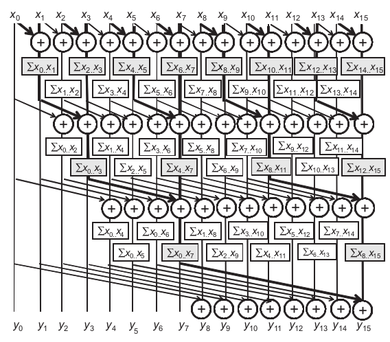
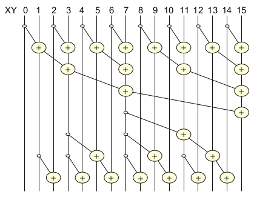
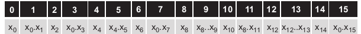
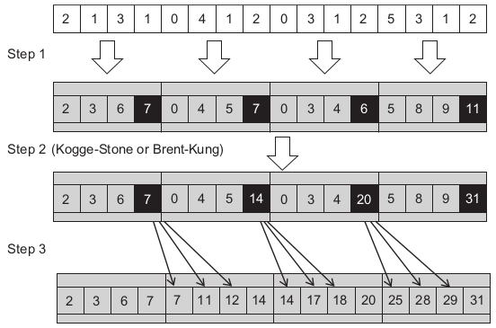
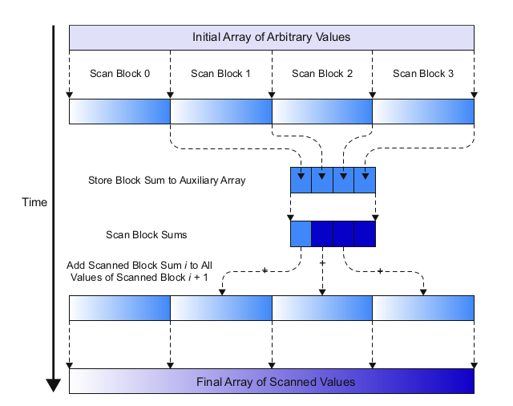
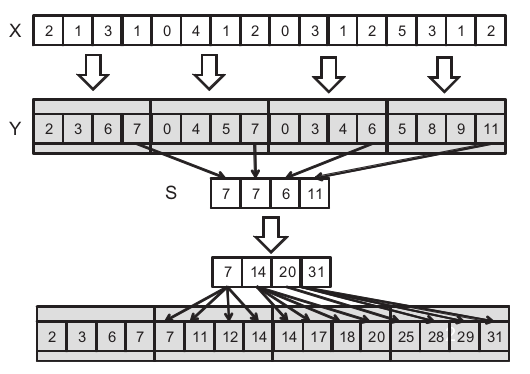

# 8. Parallel Patterns: prefix sum - An Introduction To Work Efficiency In Parallel Algorithms

*Our next parallel pattern is prefix sum, also commonly known as scan. Parallel scan plays a key role in massive parallel computing for a simple reason: any sequential section of an application can drastically limit the overall performance of the application. Many such sequential sections can be converted into parallel computing with parallel scans.*

---

## 8.1 Background

Mathematically, an *inclusive scan* operation takes a binary associative operator $⊕$ and an input array of $n$ elements $[x_0, x_1, …, x_{n−1}]$ and returns the following output array:

$[x_0, x_0 ⊕ x_1, x_0 ⊕ x_1 ⊕ x_2, …, x_0 ⊕ x_1 ⊕ … ⊕ x_{n−1}]$

To illustrate if $⊕$ is an addition operation then an *inclusive scan* operation on the input array:

$[3, 1, 7, 0, 4, 1, 6, 3]$ 

would return:

$[3, 4, 11, 11, 15, 16, 22, 25]$

An *exclusive scan* operation is similar to an inclusive scan, except that the former returns the following output array:

$[0, x_0, x_0 ⊕ x_1, x_0 ⊕ x_1 ⊕ x_2, …, x_0 ⊕ x_1 ⊕ … ⊕ x_{n−2}]$

The first output element is 0, whereas the last output element only reflects the contribution of up to $x_{n−2}$.

To illustrate if $⊕$ is an addition operation then an *exclusive scan* operation on the input array:

$[3, 1, 7, 0, 4, 1, 6, 3]$

would return:

$[0, 3, 4, 11, 11, 15, 16, 22]$

To convert from an *inclusive scan* to an *exclusive scan* we simply shift the output array to the right by one element and set the first element to 0. To convert from an *exclusive scan* to an *inclusive scan* we simply shift the output array to the left by one element and fill in the last element with the previous last element and the last input element.

*In practice, parallel scan is often used as a primitive operation in parallel algorithms that perform radix sort, quick sort, string comparison,  polynomial evaluation, solving recurrences, tree operations, stream compaction, and histograms.*

Below is presented a sequential implementation of an *inclusive scan* operation:

```C
void sequential_scan(float *x, float *y, int Max_i){
    int accumulator = x[0];
    y[0] = accumulator;
    for(int i = 1; i < Max_i; i++){
        accumulator += x[i];
        y[i] = accumulator;
    }
}
```

The algorithm is work-efficient, performing only a small amount of work for each input or output element. With a reasonably good compiler, only one addition, one memory load, and one memory store are used in processing each input x element.

This amount of work is pretty much the minimal that we will ever be able to do. As we will see, when the sequential algorithm of a computation is so “lean and mean,” it is extremely challenging to develop a parallel algorithm that will consistently beat the sequential algorithm when the data set size becomes large.

---

## 8.2 A Simple Parallel Scan - Kogge-Stone Algorithm

We start with a simple parallel inclusive scan algorithm by performing a reduction operation for each output element. The main objective is to create each element quickly by calculating a reduction tree of the relevant input elements for each output element.

The first method is based on Kogge-Stone algorithm.



The algorithm is an in-place scan algorithm, that operates on an array XY that originally contains input elements. Before the algorithm begins $XY[i]$ will contain the input element $x_i$. In each iteration the $XY[i]$ will contain the sum of at most $2^n$ previous elements with $n$ being the iteration number. For example at the end of the second iteration $XY[i]$ will contain $x_{i-3} + x_{i-2} + x_{i-1} + x_i$.

The algorithm is shown below:

```C
__global__ void Kogge_Stone_scan_kernel(float *X, float *Y, int input_size){

    __shared__ float XY[SECTION_SIZE];

    int i = blockIdx.x * blockDim.x + threadIdx.x;

    if(i < input_size){
        XY[threadIdx.x] = X[i];
    }

    for(unsigned int stride = 1; stride < blockDim.x; stride *= 2){
        __syncthreads();
        if(threadIdx.x >= stride) XY[threadIdx.x] += XY[threadIdx.x - stride];
    }

    if(i < input_size){
        Y[i] = XY[threadIdx.x];
    }
}
```

- X is the input array
- Y is the output array
- input_size is the size of the input array and output array

We assume that *SECTION_SIZE* is equal to *blockDim.x*. Each thread will calculate one output element.

First the input elements are loaded into the shared memory. Then the algorithm performs a *for-loop* to calculate the output elements. In each iteration $XY[i]$ will contain the sum of at most $2^n$ previous elements with $n$ being the iteration number. __syncthreads() is used to be sure that all threads have finished the previous iteration. The *if* statement is used to disable threads that the scan algorithm has finished calculating their output elements. Finally the output elements are stored in the output array.

---

## 8.3 Speed And Work Efficiency

Now we will analyze the speed and work efficiency of Kogge-Stone algorithm.

All threads will iterate $log_2N$ times, where $N$ is the SECTION_SIZE. In each iteration stride threads will be inactive. Therefore, the amount of work that the kernel does is:

$∑(N − stride),for strides1, 2, 4,… N/2$ (log2 N terms)

The two terms are independent. 

The first term is equal to:

$Nlog_2N$

The second term is a geometric series which is equal to:

$N - 1$

Therefore, the total amount of work is:

$Nlog_2N - (N - 1)$

The amount of work that the sequantial algorithm does is:

$N - 1$

The Kogge-Stone algorithm performs much more work than the sequential algorithm. In the case of $N = 1024$ elements the amount of work that each algorithm does is:

$1024log_2(1024) - (1024 - 1) = 10240 - 1023  = 9217$

$1024 - 1 = 1023$

The Kogge-Stone algorithm performs 9217 / 1027 = ~9 times more work than the sequential algorithm.

---

As for execution speed, the sequential algorithm performs $N$ iterations. The kernel code only performs $log_2N$ iterations. With unlimited execution resources, the speedup of the kernel code is:

$N / log_2N$

For N = 1024 the speedup is:

$1024 / log_2(1024) = 1024 / 10 = 102.4$

---

In a real GPU device, the amount of work done is closer to $Nlog_2N$. That is because some threads may not be participating in the execution of the *for-loop*. However, they still consume execution resources, until the block finishes execution.

As for execution speed, having P execution resources, the kernel will finish in $Nlog_2N / P$ time.

For example if $N = 1024$ and $P = 32$ the speedup is:

$1024 / (1024log_2(1024) / 32) = 1024 / (10240 / 32) = 1024 / 320 = 3.2$

However if $P = 4$ the speedup is:

$1024 / (1024log_2(1024) / 4) = 1024 / (10240 / 4) = 1024 / 2560 = 0.4$

We can see that if we do not have enough execution resources the Kogge-Stone algorithm is slower than the sequential algorithm.

---

## 8.4 A More Work-Efficient Parallel Scan - Brent-Kung Algorithm

The Kogge-Stone algorithm is not work-efficient. The intermediate results can be strategically shared between threads to reduce the amount of work that the kernel does.

An illustration of the Brent-Kung algorithm is shown below:



In the first part, for each iteration of the algorithm, threads with $id = 2^{i + 1} * n - 1$ will add to its value the value of the thread that is $2^i$ positions before, where $n$ is a positive integer and i is the iteration number (starting from 0).

After the first part of the algorithm, the intermediate results are:

<p align=center>
    
</p>

For the second part of the algorithm, a reverse tree is used to distribute the partial sums to the threads.

All threads can obtain their results by accumulating values that are no farther away than $SECTION\_SIZE / 4$ elements.

The algorithm is shown below:

```C
__global__ 
void Brent_Kung_scan_kernel(float *X, float *Y, int InputSize) {
    
    __shared__ float XY[SECTION_SIZE];
    
    int i = 2 * blockIdx.x * blockDim.x + threadIdx.x;

    if (i < InputSize) XY[threadIdx.x] = X[i];
    if (i + blockDim.x < InputSize) XY[threadIdx.x + blockDim.x] = X[i + blockDim.x];
    
    for (unsigned int stride = 1; stride <= blockDim.x; stride *= 2) {
        __syncthreads();
        
        int index = (threadIdx.x + 1) * 2 * stride - 1;
        if (index < SECTION_SIZE) {
            XY[index] += XY[index - stride];
        }
    }


    for (int stride = SECTION_SIZE / 4; stride > 0; stride /= 2) {
        __syncthreads();
        
        int index = (threadIdx.x + 1) * stride * 2 - 1;
        if(index + stride < SECTION_SIZE) {
            XY[index + stride] += XY[index];
        }
    }
    __syncthreads();
    
    if (i < InputSize) Y[i] = XY[threadIdx.x];
    if (i + blockDim.x < InputSize) Y[i + blockDim.x] = XY[threadIdx.x + blockDim.x];
}
```

In the kernel above we can observe a few things:

- The SECTION_SIZE should be twice the size of the block, as we saw in [Chapter 5 - Reduction](../chapter05/README.md#reductionhttpsdeveloperdownloadnvidiacomassetscudafilesreductionpdf).

- Each thread will load and calculate two elements.

- In both *for-loops* a variable *index* is calculated based on the *thread id* and *stride* to determine which elements will be added. This calculation will allow the kernel to use consecutive threads to calculate the intermediate results instead of using the threads corresponding to the output element which will be scattered.

The first *for-loop* is similar to the Kogge-Stone algorithm. The second *for-loop* implements the reverse tree.

---

We now turn our attention to the work done by the kernel. In the first *for-loop* the amount of work done is:

$(N / 2) + (N / 4) + (N / 8) + … + 1 = N - 1$

In the second *for-loop* the amount of work done is:

$(2 - 1) + (4 - 1) + (8 - 1) + … + (N / 2 - 1) = N - 1 - log_2N$

Therefore, the total amount of work done is:

$2N - 2 - log_2N$

While the Brent–Kung algorithm exhibits a considerably higher level of theoretical work-efficiency than the Kogge–Stone algorithm, its advantage in a CUDA kernel implementation is more limited. Recall that the Brent–Kung algorithm is using $N / 2$ threads. The major difference is that the number of active threads drops much faster through the reduction tree than the Kogge–Stone algorithm. However, the inactive threads continue to consume execution resources in a CUDA device.


Consequently, the amount of resources consumed by the Brent–Kung kernel is actually closer to $(N/2)*(2*log_2N−1)$. This finding makes the work-efficiency of the Brent–Kung algorithm similar to that of Kogge–Stone in a CUDA device. If we process $1024$ input elements with $32$ execution units, the Brent–Kung kernel is expected to take approximately $512 * (2 * 10 − 1) / 32 = 304$ time units. This results in a speedup of $1024/304 = 3.4$.

---

## 8.5 An Even More Work-Efficient Parallel Scan

We can design a parallel scan algorithm that achieves a higher work efficiency than does the Brent–Kung algorithm by adding a phase of fully independent scans on the subsections of the input.



At the beginning the algorithm partitions the input array into subsections of size $array\_size / blockDim.x$. Then the elements are loaded to the shared memory by using the *corner turning* tenchnique ([as shown in the 5th chapter](../chapter05/README.md#51-global-memory-bandwidth)) and its thread performs a scan operation to its elements. At the end of phase one the last element of each subsection will contain the sum of all elements in the subsection. 

During the second phase, all threads in each block collaborate and perform a scan operation on a logical array that consists of the last elements of all sections. This procedure can be performed using a Kogge–Stone or Brent–Kung algorithm since only a modest number (number of threads in a block) of elements are involved.

At step 3, the last element of each subsection is added to all elements minus the last one of the next subsection.

---

Using this technique, the kernel can process many more elements than the block size. The number of elements that can be processed are now limited by the size of shared memory. 

The major advantage of the three-phase  approach is its efficiency use of execution resources. Assume that we use the Kogge–Stone algorithm for phase 2. For an input list of $N$ elements, if we use $T$ threads, the amount of work done is $N − 1$ for phase 1, $Tlog_2T$ for phase 2, and $N − T$ for phase 3. If we use $P$ execution units, the execution can be expected to take $(N − 1+Tlog_2T + N − T) / P$ time units. 

To illustrate, if we use $64$ threads and $32$ execution units to process $1024$ elements, the algorithm should take approximately $(1024 − 1 + 64 * 6 + 1024 − 64) / 32 = 74$ time units. This number results in a speedup of $1024 / 74 = 13.8$.

---

## 8.6 Hierarchical Parallel Scan For Arbitrary-Length Inputs

The algorithm that was presented before cannot process arbitrary-length inputs because it is limited by the size of the shared memory. Furthermore, it uses only one thread block to process the input array.



Using a hierarchical approach, we can extend the kernel to process arrays of arbitrary length. For large datasets, we partition the input array into sections that can be processed by a single thread block and fit into the shared memory. For example, with the current generation of CUDA devices, using the Brent-Kung kernel we can process up to $2048$ elenebts in each section by using $1024$ threads per block. With up to $65536$ thread blocks in the x dimension of the grid we can process up to $65536 * 2048 = 134,217,728$ elements.

An example of the hierarchical approach is shown in the figure below.



The operation is divided into three stages.

In the first stage we launch a kernel for each subsection of $X$ using any of the three algorithms presented before to scan each subsection. At the end of this kernel we need to store the last element of each subsection in $Y$ into $S$. To do that the last thread of each block will store the output value of the last element of $XY$ into $S$:

```C
__syncthreads();
if (threadIdx.x == blockDim.x-1) {
    S[blockIdx.x] = XY[SECTION_SIZE – 1];
}
```

In the second stage we can simply use one of the three parallel scan kernels, which takes $S$ as input and stores the result in $S$.

The third kernel takes the $S$ and $Y$ arrays as inputs and writes its output back into $Y$. Assuming that we launch the kernel with SECTION_SIZE threads in each block, each thread adds one of the $S$ elements (selected by $blockIdx.x - 1$) to one $Y$ element:

```C
int i = blockIdx.x * blockDim.x + threadIdx.x;
Y[i] += S[blockIdx.x-1];
```

The threads in a block add the sum of the previous scan block to the elements of
their scan block.

---

## 8.7 Single-Pass Scan For Memory-Access Efficiency

In the hierarchical scan method mentioned in [section 8.6](#86-hierarchical-parallel-scan-for-arbitrary-length-inputs), the partially scanned results are stored and loaded from the global memory. These latencies do not overlap with the computation in the subsequent kernels.

A way to overcome this is by having the blocks passing the results of its subsections to one another in a stream-based manner. For example in the figure above *Block 0* can pass its partial sum value 7 to *Block 1* and then complete its job. *Block 1* receives the partial sum value 7 from *Block 0*, sums up with its local partial sum value 7 to get 14, passes its partial sum value 14 to *Block 2*, and then completes its final step.

In a stream-based scan, a single kernel can perform all three steps of the hierarchical scan algorithm. *Thread block i* will perform a scan on its block of elements and then will wait to receive the partial result from *thread block i - 1*. Once it receives the partial sum from the previous block will produce its sum value and pass it to the next block. Finally it will add the partial sum to all elements of its block.

To make the stream-based scan work, adjacent block sychronization is required. This can be achiever by using atomic operations.

```C
__shared__ float previous_sum;

if (threadIdx.x == 0){
    // Wait for previous flag
    while (atomicAdd(&flags[bid], 0) == 0){;}
    
    // Read previous partial sum
    previous_sum = scan_value[bid];
    
    // Propagate partial sum
    scan_value[bid + 1] = previous_sum + local_sum;
   
    // Memory fence
    __threadfence();
    
    // Set flag
    atomicAdd(&flags[bid + 1], 1);
  }
  __syncthreads();
```

This code is only executed by the leader thread of each block while the rest of the threads wait in *__syncthreads()*. The array *flags* is used to achieve sychronization between blocks and the array *scan_value* to read the values between blocks. 

First each block waits for the previous block to set its flag to 1. Then it reads the partial sum of the previous block and adds it to its local sum to get the partial sum of the elements till the end of the current block. *__threadfence()* is used to ensure that the write to *scan_value* is visible to all threads in the block. Finally, the leader thread sets the flag of the next block to 1 to indicate that it can start its computation.

Stream-based algorithms have a subtle issue. In GPUs, thread blocks may not always be scheduled linearly in accordance with their blockIdx values. This can lead to a deadlock if *block i* through *block i + N* are scheduled while *block i - 1* has not finished its computation.

To avoid this, we can dynamically assign block Ids to each block by using the following code.

```C
__shared__ int sbid;
if (threadIdx.x == 0)
    sbid = atomicAdd(DCounter, 1);
__syncthreads();
const int bid = sbid;
```

The leader thread of each block will get a unique block Id by using *atomicAdd()*.

---