# 10. Parallel Paterns: Sparse Matrix Computation - An Introduction To Data Compression And Regularization

*In a sparse matrix, the majority of the elements are zeros. Storing and processing these elements are wasteful in terms of memory capacity/bandwidth, time and energy. In this chapter we will introduce different sparse matrix storage formats and their corresponding processing methods. These approaches employ a compaction technique but introduce a certain degree of irregularity. Unfortunately, such irregularity can lead to underutilization of memory bandwidth, control flow divergence, and load imbalance in parallel computing. Striking a good balance between compaction and regularization is important.*

---

## 10.1 Background

Each row of the matrix represents one equation of the linear system. In various science and engineering problems, the large number of variables and equations involved are sparsely coupled; i.e., each equation involves only a small number of variables.

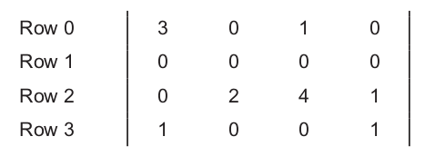

Sparse matrices are typically stored in a format, or a representation, that avoids storing zero elements. We will start with the Compressed Sparse Row (CSR) storage format, which is illustrated below.

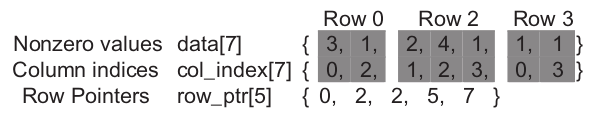

CSR stores only nonzero values in a one-dimensional data storage, shown as *data[]*. The column of which the variable belongs to is stored in *col_index[]* array. *row_ptr[]* array seperates the *data[]* array into rows. Each value corresponds to the index that the new row starts plus the last value that is stored for convenience for some algorithms. In the example above the elements of the first row are stored in *data[0:2]*, the second row in *data[2:2]* (means no elements are present in the second row), the third row in *data[2:5]* and the last in *data[5:7]*.

As discussed in [Chapter 6, Numerical Considerations](../chapter06/README.md#6-numerical-considerations), matrices are often used in solving a linear system of N equations of $N$ variables in the form $A * X + Y = 0$. To solve these linear systems inverse matrices are used theoretically. However, inverse matrices are often much larger that the original because the inversion process tends to generate a large number of additional nonzero elements called fillins. As a result, it is often impractical to compute and store the inversed matrix in solving real-world problems.

Iterative approaches are used to solve linear systems with sparse matrices. When the sparse matrix A is positive–-definite (i.e., x<sup>T</sup>Ax > 0 for all nonzero vectors x in R<sup>n</sup>), the conjugate gradient method can be used to iteratively solve the corresponding linear system with guaranteed convergence to  a solution. The conjugate gradient methods predicts a solution for X and performs $A * X + Y$. If the result is not close to a 0 vector, a gradient vector formula can
be used to refine the predicted $X$ and another iteration of $A * X + Y$ performed.

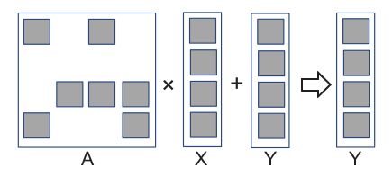

The dark squares represent non-zero elements.

A sequential loop to perform Sparse Matrix-Vector (SpMV) multiplication is shown below.

```C
for (int row = 0; row < num_rows; row++) {

    float dot = 0;
    int row_start = row_ptr[row];
    int row_end   = row_ptr[row + 1];
    for (int elem = row_start; elem < row_end; elem++) {
        dot += data[elem] * x[col_index[elem]];
    }
    y[row] += dot;
}
```

The code initializes a dot variable to 0 to accumulate the dot product of each row. Using the row_ptr array, the code can determine the start and end of each row in the *data[]* and *col_index[]* arrays. The code then iterates over the elements in *data[]* and *col_index* pointed by the elem value to compute the dot product of the row and the vector x. The result is accumulated in the y vector.

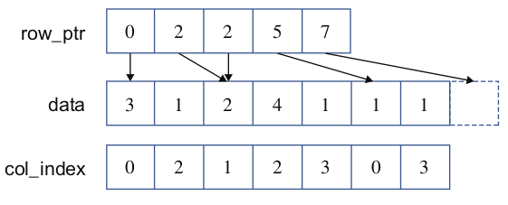 

CSR completely removes all zero elements from the storage. It incurs storage overhead by introducing the col_index and row_ptr arrays. In our example where the number of zero elements is not much larger than the number of nonzero elements, the storage overhead is greater than the space saved by not storing the zero elements.

However, for sparse matrices where the vast majority of elements are zeros, the overhead introduced is far smaller than the space saved by not storing zeros. For instance, in a sparse matrix where only 1% of the elements are nonzero values, the total storage for the CSR representation, including the overhead, would be around 2% of the space required to store both zero and nonzero elements.

Removing all zero elements from the storage also eliminates the need to fetch these zero elements from memory or to perform useless multiplication operations on these zero elements. This method can significantly reduce the consumption of memory bandwidth and computational resources.

---

## 10.2 Parallel SpMV Using CSR

The dot product calculation for each row of the sparse matrix is independent of the dot product for other rows; i.e., all iterations of the outer loop (Line 1) are logically independent of each other.

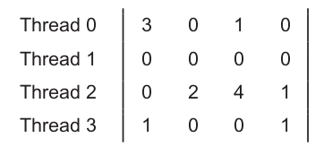

The code can be parallelized by mapping each thread to a row of the sparse matrix.

```C
__global__ void SpMV_CSR(int num_rows, float *data, int *col_index,
                         int *row_ptr, float *x, float *y) {

    int row = blockIdx.x * blockDim.x + threadIdx.x;
    
    if (row < num_rows) {

        float dot = 0;
        int row_start = row_ptr[row];
        int row_end =   row_ptr[row + 1];
        for (int elem = row_start; elem < row_end; elem++) {
            dot += data[elem] * x[col_index[elem]];
        }
        y[row] += dot;
    }
}
```

Despite its simplicity, the parallel SpMV/CSR kernel has two major shortcomings. 

- First the kernel does not make coalesced memory accesses. Adjacent threads will be making simultaneous nonadjacent memory accesses. In our example, threads 0, 1, 2, and 3 will access data[0], none, data[2], and data[5] in the first iteration of their dot product loop.

- The second shortcoming of the SpMV/CSR kernel is its potential to incur significant control flow divergence in all warps. The number of iterations performed by a thread in the dot product loop depends on the number of nonzero elements in the row assigned to the thread. Since the distribution of nonzero elements among rows can be random, adjacent rows can have varying numbers of nonzero elements.

---

## 10.3 Padding And Transposition

The problems of noncoalesced memory accesses and control divergence can be addressed by applying data padding and transposition on the sparse matrix data. These idea we used in the ELL storage format, whose name came from the sparse
matrix package in [ELLPACK](https://www.cs.purdue.edu/ellpack/).

From a CSR representation, we first determine the rows with the maximal number of nonzero elements. We then add dummy (zero) elements to all other rows after the nonzero elements for them to be of the same length as the maximal rows, thereby generating a rectangular matrix. Then the matrix is transposed to allow the kernel to perform coalesced memory accesses in each iteration.

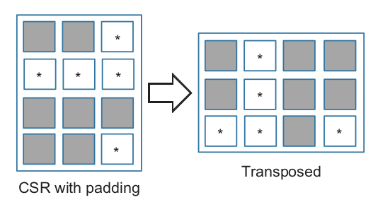

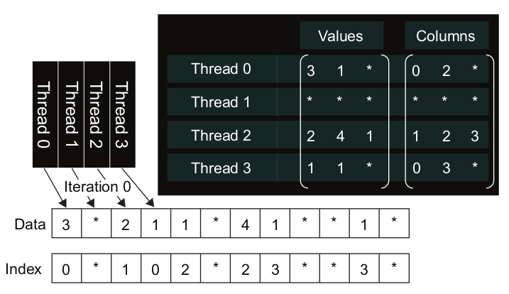

We no longer need row_ptr since the beginning of row i has been simplified to $data[i]$. With the padded elements, it is also very easy to move from the current element of row i to the next element by simply adding the number of rows in the original matrix to the index. To illustrate, the 0th element of row 2 is in $data[2]$, and the next element is in $data[2+4] = data[6]$, where 4 is the number of rows in the original matrix in our small example.

```C
__global__ void SpMV_ELL(int num_rows, float *data, int *col_index,
                         int num_elem, float *x, float *y) {
    
    int row = blockIdx.x * blockDim.x + threadIdx.x;

    if (row < num_rows) {
        float dot = 0;
        for (int i = 0; i < num_elem; i++) {
            dot += data[row + i * num_rows] * x[col_index[row + i * num_rows]];
        }
        y[row] += dot;
    }
}
```

The kernel code of SpMV/ELL kernel is simpler than that of SpMV/CSR. With padding, all rows are now of the same length. In the dot product loop all threads can simply loop through the number of elements given by num_elem. Consequently, control flow divergence no longer occurs in warps because padding has been applied. Additionally as mentioned above the kernel can access memory in a coalesced manner.

By eliminating control flow divergence and enabling memory coalescing, SpMV/ELL should run faster than SPMV/CSR. Furthermore, SpMV/ELL is simpler, making SpMV/ELL an all-around winning approach. Unfortunately, SpMV/ELL has a potential downside. In situations where one or a small number of rows have an exceedingly large number of nonzero elements, the ELL format will result in excessive number of padded elements. With numerous padded dummy elements, an SpMV/ELL kernel can run more slowly compared with an SpMV/CSR kernel.

---

## 10.4 Using A Hybrid Approach To Regulate Padding

The root of the problem with excessive padding in the ELL representation is that one or a small number of rows have an exceedingly large number of nonzero elements. If we have a mechanism to “take away” some elements from these rows, we can reduce the number of padded elements in ELL. The Coordinate (COO) format provides such a mechanism.

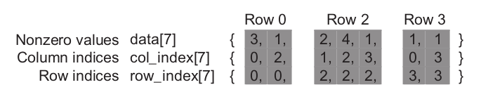

In the COO format we have both row and column index stored in arrays. Although the COO format involves additional storage cost for the row_index array, it has the additional benefit of flexibility. The elements in a COO format can be arbitrarily reordered without losing any information.

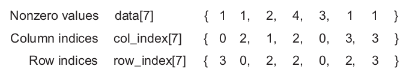

Why we would want to reorder these elements? Such reordering would disturb the locality and sequential patterns necessary for the efficient use of memory bandwidth. The answer lies in an important use case for the COO format. It can be used to curb the length of rows in the CSR format or the ELL format. First, we make an important observation. In the COO format, we can process the elements in any desired order. For each element in $data[i]$, we can simply perform a $y[row_index[i]] += data[i] * x[col_index[i]]$ operation.

---

Before converting a sparse matrix from the CSR format to the ELL format, we can remove some elements from rows with exceedingly large numbers of nonzero elements and place them into a separate COO storage. We can use SpMV/ELL on the remaining elements. With excess elements removed from the extra-long rows, the number of padded elements for other rows can be significantly reduced. We can then use a SpMV/COO to finish the job.

Using the example for before the hybrid approach is shown below.

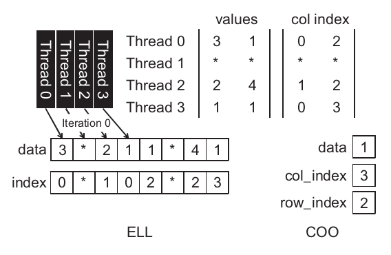

A typical way of using an ELL–COO hybrid method is for the host to convert the format from one similar to the CSR format into the ELL format. During conversion, the host removes some nonzero elements from the rows with exceedingly large number of nonzero elements. The host places these elements into a COO representation and then transfers the ELL representation of the data to a device. When the device completes the SpMV/ELL kernel, it transfers the resulting y  values back to the host. These values are missing the contributions from the elements in the COO representation. The host performs a sequential SpMV/COO kernel on the COO elements and finishes their contributions to the y element values.

The user may question whether the additional work performed by the host to separate COO elements from an ELL format could incur excessive overhead. In a number of real-work applications, the SpMV is performed on the same sparse kernel repeatedly in an iterative solver. In each iteration of the solver, the x and y vectors vary; however, the sparse matrix remains the same because its elements correspond to the coefficients of the linear system of equations being solved, and these coefficients remain the same from iteration to iteration. Thus, the work done to produce both the hybrid ELL and COO representations can be amortized across many iterations.

The code for the sequential SpMV/COO is shown below.

```C
for (int i = 0; i < num_elem; row++)
    y[row_index[i]] += data[i] * x[col_index[i]];
```

The loop is extremely simple. It iterates through all the data elements and performs the multiply-and-accumulate operation on the appropriate x and y elements by using the accompanying col_index and row_index elements.

---

## 10.5 Sorting And Partitioning For Regularization

The idea is to sort the rows according to their length as shown below.

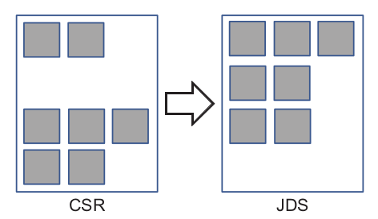

Since the sorted matrix looks largely like a triangular matrix, the format is often referred to as the Jagged Diagonal Storage (JDS) format. To sort the rows we keep a *jds_row_index* to preserve the original row order.

Once the matrix is sorted by row length we can divide the matrix into sections of similar lengths. This will allow us to use padding in each section. The sections will likely have limited padded (zero) elements due to the sorting. We can then generate an ELL representation for each section. We can then transpose each section independently and launch a separate kernel on each section.

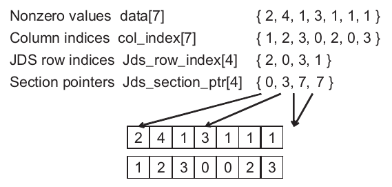

Above is shown a JDS–ELL representation of our small sparse matrix. The first section has only one row so that the transposed layout is the same as the original one. The second section is a $2 × 2$ matrix and has been transposed. The third section consists of *Row 1*, which has no nonzero element. This lack of nonzero elements is reflected in the fact that its starting location and the starting position of the next section are identical.

---