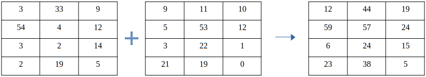
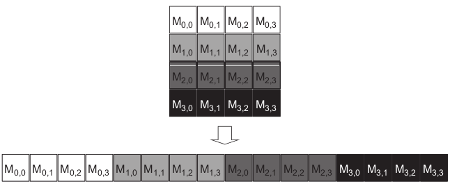

# Matrix Addition


## Introduction

Matrix Addition is a basic operation in linear algebra. It is used to add two matrices of the same size. The result of the addition is a matrix of the same size as the input matrices. The addition is done element-wise. The addition of two matrices is shown below. 



Again we will demonstrate the addition of two matrices in the linearized format.



---

## Thread Hierarchy and Not Coalesced vs Coalesced Memory Access

The threads are splitted into blocks. The blocks can have up to 3 dimensions (x, y, z). In matrix addition we will only need the first two dimensions (x, y). 

The threads are scheduled within warps. A warp is a group of 32 threads (in all generations till now). The thread scheduling starts from the x-dimension and then the y and z dimensions.

Each warp schedules threads in a SIMD fashion. This means that all threads in a warp execute the same instruction at the same time. To utilize this property, the threads in the same warp should access adjacent memory locations. This is called coalesced memory access.

---

## Code

The host code initializes the input matrices with random values and calls the kernel to perform the matrix addition. The input matrices are stored in a linearized format.

The two kernels for the non-coalesced and coalesced memory access are shown below.

```cpp
__global__ void array_add_not_coalesced(T *a, T *b, T *c, int m, int n)
{
    int i = blockIdx.x * blockDim.x + threadIdx.x;
    int j = blockIdx.y * blockDim.y + threadIdx.y;
    int index = i * m + j;

    if(i < n && j < m)
        c[index] = a[index] + b[index];
}

__global__ void array_add_coalesced(T *a, T *b, T *c, int m, int n)
{
    int i = blockIdx.y * blockDim.y + threadIdx.y;
    int j = blockIdx.x * blockDim.x + threadIdx.x;
    int index = i * m + j;

    if(i < n && j < m)
        c[index] = a[index] + b[index];
}
```

The only difference between the two kernels is the first two lines.

```cpp
int i = blockIdx.x * blockDim.x + threadIdx.x;
int j = blockIdx.y * blockDim.y + threadIdx.y;

int i = blockIdx.y * blockDim.y + threadIdx.y;
int j = blockIdx.x * blockDim.x + threadIdx.x;
```

 - In the first kernel the i index (row) is indexed by the x-dimension and the j index (column) is indexed by the y-dimension. This will lead threads in the same warp to access non-adjacent memory locations.
 - However in the second kernel the i index (row) is indexed by the y-dimension and the j index (column) is indexed by the x-dimension. This will lead threads in the same warp to access adjacent memory locations.

The next line calculates the linearized index of the current thread.

```cpp
int index = i * m + j;
```

And in the last lines the kernel checks if the current thread is accessing a valid memory location and performs the addition.

```cpp
if(i < n && j < m)
    c[index] = a[index] + b[index];
```

---

## Performance

The performance of the kernel is measured in multiple GPUs using the [NvBench](https://github.com/NVIDIA/nvbench) project. The performance measurements that we will be looking at are:

 - **Memory bandwidth**: The amount of data transferred per second.
 - **Memory bandwidth utilization**: The percentage of the memory bandwidth that is utilized.

---

### Non-Coalesced Memory Access

%20-%20Memory%20Bandwidth%20(GB%20per%20s).png)

---

%20-%20Memory%20Bandwidth%20Utilization.png)

---

### Coalesced Memory Access

%20-%20Memory%20Bandwidth%20(GB%20per%20s).png)

---

%20-%20Memory%20Bandwidth%20Utilization.png)

---

### Comparison

We can observe a few things:

- When the kernel access elements in a coalesced manner all the GPUs achieve better performance as expected. 
- The kernel that accesses elements in a non-coalesced manner achieves the best memory bandwidth when the axis size is 1024 and then the bandwidth either drops or gets a bit higher. 

A reason for the latter might be that each Streaming Multiprocessor (SM) can have up to 1024 threads in older GPUs (GTX 1650 and RTX 2060) and the other GPUs (RTX 3060l, 3060, 3060ti, 3070ti, 3080) can have up to 1536 threads. This means that between SMs there is a change that the threads will try to load elements that are adjacent to each other. This possibility drops as the axis size increases and SMs might load elements from the same column.

---