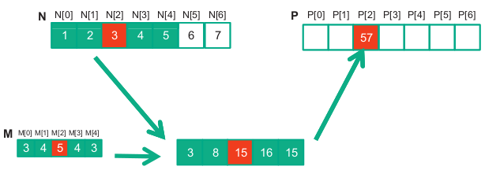

# Convolution


## Introduction

Convolution is a popular array operation that is used in many applications. It is used in image processing, signal processing, and machine learning.

An example of a convolution operation is shown below:



---

## Basic Approach, Constant Memory, Tiled Approach and Caching

### Basic Approach

In the basic approach, the convolution is computed by iterating over the input array and computing the convolution for each element. This approach is very simple to implement, but it is not very efficient. The reason for this is that the convolution operation requires the input array and the mask to be accessed multiple times.

---

### Constant Memory

To avoid multiple accesses to the mask we can store the elements of the mask to the constant memory. This will allow the hardware to aggressively cache the mask elements to the L2 cache memory. This will greatly reduce global memory accesses and improve the performance of the kernel.

---

### Tiled Approach

The tiled approach uses shared memory to cache the input array. Because the convolution operation accesses the same input elements multiple times, we can cache chunks of the input elements to the shared memory so adjacent threads will not load the same elements from the global memory.

---

### Caching

The caching approach is a variation of the tiled approach. The only difference is that the corner elements that are halo cells are accessed from the global memory. We do this because the halo cells are internal cells from the neighboring blocks. This means that these elements may be found in the L2 cache and will allow us to again avoid global memory accesses while simplifying the code.

---

All these variations are shown below for 1D and 2D convolutions.

---

## Code

The clamp macro that is used is to limit the results of the convolution from 0 to 1 inclusive. 

```cpp
#define clamp(x) (min(max((x), 0.0), 1.0))
```

---

### 1D Convolution - Basic Approach

```cpp
__global__
void convolution_1D_basic_kernel(float *N, float *M, float *P, int mask_width, int width) {

    int i = blockIdx.x * blockDim.x + threadIdx.x;

    if(i >= width) return;

    float Pvalue = 0;
    int n_start_point = i - (mask_width / 2);
    for (int j = 0; j < mask_width; ++j)
        if (n_start_point + j >= 0 && n_start_point + j < width)
            Pvalue += N[n_start_point + j] * M[j];

    P[i] = clamp(Pvalue);
}
```

The kernel starts by computing the starting index of the input array that will be used for the convolution. This is done by subtracting half of the mask width from the current index. 

```cpp
int n_start_point = i - (mask_width / 2);
```

The convolution is then computed by iterating over the mask and adding the product of the input array and the mask to the output array.

```cpp
for (int j = 0; j < mask_width; ++j)
    if (n_start_point + j >= 0 && n_start_point + j < width)
        Pvalue += N[n_start_point + j] * M[j];
```

Finally the result is stored in the output array.

```cpp
P[i] = clamp(Pvalue);
```

---

### 1D Convolution - Constant Memory

The kernel code is exactly the same as the basic approach, but the mask is stored in the constant memory and it is not passed as a parameter to the kernel.

The declaration of the mask is shown below.

```cpp
#define MAX_MASK_WIDTH A_NUMBER
__constant__ float M[MAX_MASK_WIDTH];
```

```cpp
__global__
void convolution_1D_constant_memory_kernel(float *N, float *P, int mask_width, int width) {

    int i = blockIdx.x * blockDim.x + threadIdx.x;

    float Pvalue = 0;
    int n_start_point = i - (mask_width / 2);
    for (int j = 0; j < mask_width; j++)
        if (n_start_point + j >= 0 && n_start_point + j < width)
            Pvalue += N[n_start_point + j] * M[j];

    P[i] = clamp(Pvalue);
}
```

---

### 1D Convolution - Tiled Approach

```cpp
__global__
void convolution_1D_tiled_kernel(float *N, float *P, int mask_width, int width) {

    extern __shared__ float N_ds[];

    int i = blockIdx.x * blockDim.x + threadIdx.x;

    int n = mask_width / 2;

    int halo_index_left = (blockIdx.x - 1) * blockDim.x + threadIdx.x;
    if (threadIdx.x >= blockDim.x - n)
        N_ds[threadIdx.x - (blockDim.x - n)] = (halo_index_left < 0) ? 0 : N[halo_index_left];

    N_ds[n + threadIdx.x] = N[blockIdx.x * blockDim.x + threadIdx.x];

    int halo_index_right = (blockIdx.x + 1) * blockDim.x + threadIdx.x;
    if (threadIdx.x < n)
        N_ds[n + blockDim.x + threadIdx.x] = (halo_index_right >= width) ? 0 : N[halo_index_right];

    __syncthreads();

    float Pvalue = 0;
    for (int j = 0; j < mask_width; j++)
        Pvalue += N_ds[threadIdx.x + j] * M[j];

    P[i] = clamp(Pvalue);
}
```

The kernel needs to load the halo cells from the previous, the next block and the internal cells from the current block.

First the index of the halo cell from the previous block is computed.

```cpp
int halo_index_left = (blockIdx.x - 1) * blockDim.x + threadIdx.x;
```

The last $n$ threads will load the left $n$ halo cells from the previous block.

```cpp
if (threadIdx.x >= blockDim.x - n)
    N_ds[threadIdx.x - (blockDim.x - n)] = (halo_index_left < 0) ? 0 : N[halo_index_left];
```

All threads will load the internal cells from the current block.

```cpp
N_ds[n + threadIdx.x] = N[blockIdx.x * blockDim.x + threadIdx.x];
```

The index of the halo cell from the next block is computed.

```cpp
int halo_index_right = (blockIdx.x + 1) * blockDim.x + threadIdx.x;
```

The first $n$ threads will load the right $n$ halo cells from the next block.

```cpp
if (threadIdx.x < n)
    N_ds[n + blockDim.x + threadIdx.x] = (halo_index_right >= width) ? 0 : N[halo_index_right];
```

The shared memory is synchronized to make sure that all threads have loaded the data.

```cpp
__syncthreads();
```

The convolution is then computed by iterating over the mask and adding the product of the input array and the mask to the output array.

```cpp
float Pvalue = 0;
for (int j = 0; j < mask_width; j++)
    Pvalue += N_ds[threadIdx.x + j] * M[j];
```

Finally the result is stored in the output array.

```cpp 
P[i] = clamp(Pvalue);
```

---

### 1D Convolution - Caching Approach

```cpp
__global__
void convolution_1D_tiled_caching_kernel(float *N, float *P, int mask_width, int width) {

    extern __shared__ float N_ds[];

    int i = blockIdx.x * blockDim.x + threadIdx.x;

    N_ds[threadIdx.x] = N[i];
    __syncthreads();

    int this_tile_start_point =  blockIdx.x      * blockDim.x;
    int next_tile_start_point = (blockIdx.x + 1) * blockDim.x;
    int n_start_point = i - (mask_width / 2);
    float Pvalue = 0;
    for (int j = 0; j < mask_width; j++) {

        int n_index = n_start_point + j;
        if (n_index >= 0 && n_index < width) {
            if ((n_index >= this_tile_start_point) && (n_index < next_tile_start_point))
                Pvalue += N_ds[threadIdx.x + j - (mask_width / 2)] * M[j];
            else
                Pvalue += N[n_index] * M[j];
        }
    }

    P[i] = clamp(Pvalue);
}
```

The kernel first loads the elements from the current block into the shared memory.

```cpp
N_ds[threadIdx.x] = N[i];
__syncthreads();
```

The start point of the current block and the next block are computed.

```cpp
int this_tile_start_point =  blockIdx.x      * blockDim.x;
int next_tile_start_point = (blockIdx.x + 1) * blockDim.x;
```

The start point of the input array is computed.

```cpp
int n_start_point = i - (mask_width / 2);
```

The convolution is then computed by checking if the loads are from the current block or from adjacent ones (to load the halo cells).

 - If the loads are done from the current block, the elements are loaded from the shared memory.
 - If the loads are done from adjacent blocks, the elements are loaded from the global memory (hopefully from the L2 cache).
  
```cpp
float Pvalue = 0;
for (int j = 0; j < mask_width; j++) {

    int n_index = n_start_point + j;
    if (n_index >= 0 && n_index < width) {
        if ((n_index >= this_tile_start_point) && (n_index < next_tile_start_point))
            Pvalue += N_ds[threadIdx.x + j - (mask_width / 2)] * M[j];
        else
            Pvalue += N[n_index] * M[j];
    }
}
```

Finally the result is stored in the output array.

```cpp
P[i] = clamp(Pvalue);
```

---

### 2D Convolution - Basic Approach

```cpp
__global__
void convolution_2D_basic_kernel(float *N, float *M, float *P,
                                 int mask_height, int mask_width,
                                 int height, int width, int channels) {

    int i = blockIdx.y * blockDim.y + threadIdx.y;
    int j = blockIdx.x * blockDim.x + threadIdx.x;

    if(i >= height || j >= width) return;

    int ni_start_point = i - (mask_height / 2);
    int nj_start_point = j - (mask_width / 2);
    for(int c = 0; c < channels; ++c){
        float Pvalue = 0;
        for(int k = 0; k < mask_height; ++k)
            for(int l = 0; l < mask_width; ++l)
                if (ni_start_point + k >= 0 && ni_start_point + k < height &&
                    nj_start_point + l >= 0 && nj_start_point + l < width)
                    Pvalue += N[((ni_start_point + k) * width + nj_start_point + l) * channels + c] * M[k * mask_width + l];
        P[(i * width + j) * channels + c] = clamp(Pvalue);
    }
}
```

The logic of the 2D kernels are similar to the 1D kernels. The only difference is that the arrays are 2D and have multiple channels. The mask is 2D and the convolution is computed for each channel.

The kernel first computes the start points in both dimensions of the input array.

```cpp
int ni_start_point = i - (mask_height / 2);
int nj_start_point = j - (mask_width / 2);
```

The convolution is then computed by iterating over the mask and adding the product of the input array and the mask to the output array for each channel and the result is stored in the output array.

```cpp
for(int c = 0; c < channels; ++c){
    float Pvalue = 0;
    for(int k = 0; k < mask_height; ++k)
        for(int l = 0; l < mask_width; ++l)
            if (ni_start_point + k >= 0 && ni_start_point + k < height &&
                nj_start_point + l >= 0 && nj_start_point + l < width)
                Pvalue += N[((ni_start_point + k) * width + nj_start_point + l) * channels + c] * M[k * mask_width + l];
    P[(i * width + j) * channels + c] = clamp(Pvalue);
}
```

---

### 2D Convolution - Constant Memory

The kernel code is exactly the same as the basic approach, but the mask is stored in the constant memory and it is not passed as a parameter to the kernel.

The declaration of the mask is shown below.

```cpp
#define MAX_MASK_WIDTH A_NUMBER
__constant__ float M[MAX_MASK_WIDTH];
```

```cpp
__global__
void convolution_2D_constant_memory_kernel(float *N, float *P,
                                           int mask_height, int mask_width,
                                           int height, int width, int channels) {

    int i = blockIdx.y * blockDim.y + threadIdx.y;
    int j = blockIdx.x * blockDim.x + threadIdx.x;

    if(i >= height || j >= width) return;

    int ni_start_point = i - (mask_height / 2);
    int nj_start_point = j - (mask_width / 2);
    for(int c = 0; c < channels; ++c){
        float Pvalue = 0;
        for(int k = 0; k < mask_height; ++k)
            for(int l = 0; l < mask_width; ++l)
                if (ni_start_point + k >= 0 && ni_start_point + k < height &&
                    nj_start_point + l >= 0 && nj_start_point + l < width)
                    Pvalue += N[((ni_start_point + k) * width + nj_start_point + l) * channels + c] * M[k * mask_width + l];
        P[(i * width + j) * channels + c] = clamp(Pvalue);
    }
}
```

---

### 2D Convolution - Shared Memory

```cpp
__global__
void convolution_2D_tiled_kernel(float *N, float *P,
                                 int mask_height, int mask_width,
                                 int height, int width, int channels) {
    
    extern __shared__ float N_ds[];

    int O_TILE_HEIGHT = blockDim.y - mask_height + 1;
    int O_TILE_WIDTH = blockDim.x - mask_width + 1;

    int ty = threadIdx.y;
    int tx = threadIdx.x;
    
    int row_o = blockIdx.y * O_TILE_HEIGHT + ty;
    int col_o = blockIdx.x * O_TILE_WIDTH  + tx;

    int row_i = row_o - (mask_height / 2);
    int col_i = col_o - (mask_width / 2);

    for(int c = 0; c < channels; ++c){

        if(row_i >= 0 && row_i < height && col_i >= 0 && col_i < width)
            N_ds[ty * blockDim.x + tx] = N[(row_i * width + col_i) * channels + c];
        else
            N_ds[ty * blockDim.x + tx] = 0;

        __syncthreads();

        float Pvalue = 0;
        if(ty < O_TILE_HEIGHT && tx < O_TILE_WIDTH && row_o < height && col_o < width) {

            for(int k = 0; k < mask_height; ++k)
                for(int l = 0; l < mask_width; ++l)
                    Pvalue += N_ds[(ty + k) * blockDim.x + tx + l] * M[k * mask_width + l];  
        
            P[(row_o * width + col_o) * channels + c] = clamp(Pvalue);
        }

        __syncthreads();
    }
}
```

In this kernel, the block dimensions is equal to the mask dimensions.

First the dimensions of the output tile is computed.

```cpp
int O_TILE_HEIGHT = blockDim.y - mask_height + 1;
int O_TILE_WIDTH = blockDim.x - mask_width + 1;
```

Then the row and column of the output tile is computed.

```cpp
int row_o = blockIdx.y * O_TILE_HEIGHT + ty;
int col_o = blockIdx.x * O_TILE_WIDTH  + tx;
```

The row and column of the input tile is computed.

```cpp
int row_i = row_o - (mask_height / 2);
int col_i = col_o - (mask_width / 2);
```

For each channel first the input tile is loaded into the shared memory.

```cpp
if(row_i >= 0 && row_i < height && col_i >= 0 && col_i < width)
    N_ds[ty * blockDim.x + tx] = N[(row_i * width + col_i) * channels + c];
else
    N_ds[ty * blockDim.x + tx] = 0;
```

Then the convolution is computed only by the threads that are inside the output tile and the result is stored in the output array.

```cpp
if(ty < O_TILE_HEIGHT && tx < O_TILE_WIDTH && row_o < height && col_o < width) {

    for(int k = 0; k < mask_height; ++k)
        for(int l = 0; l < mask_width; ++l)
            Pvalue += N_ds[(ty + k) * blockDim.x + tx + l] * M[k * mask_width + l];  

    P[(row_o * width + col_o) * channels + c] = clamp(Pvalue);
}
```

---                                                                                                                                           

## Performance

The performance of the kernel is measured in multiple GPUs using the [NvBench](https://github.com/NVIDIA/nvbench) project. The performance measurements that we will be looking at are:

 - **Memory bandwidth**: The amount of data transferred per second.
 - **Memory bandwidth utilization**: The percentage of the memory bandwidth that is utilized.

---

### 1D Convolution - Basic Approach

%20-%20Memory%20Bandwidth%20(GB%20per%20s).png)

---

%20-%20Memory%20Bandwidth%20Utilization.png)

---

### 1D Convolution - Constant Memory

%20-%20Memory%20Bandwidth%20(GB%20per%20s).png)

---

%20-%20Memory%20Bandwidth%20Utilization.png)

---

### 1D Convolution - Shared Memory

%20-%20Memory%20Bandwidth%20(GB%20per%20s).png)

---

%20-%20Memory%20Bandwidth%20Utilization.png)

---

### 1D Convolution - Caching Approach

%20-%20Memory%20Bandwidth%20(GB%20per%20s).png)

---

%20-%20Memory%20Bandwidth%20Utilization.png)

---

### 1D Convolution - Comparison

The performance of the Basic Approach and the Constant Memory Approach is similar. The reason for this might be that the mask is small in size and is used continuously. The hardware may be able to cache the mask in the L2 cache anyway.

However in the Shared Memory Approach the performance is worse. The added complexity to load the input array while checking for boundary conditions and the synchronization between the threads slows down the kernel.

This is even more true for the Caching Approach. The kernel additionally tries to load the input array during the computation of the convolution from the global memory hoping that the hardware will be able to cache the input array in the L2 cache. This might not be the case for every load.

---

### 2D Convolution - Basic Approach

%20-%20Memory%20Bandwidth%20(GB%20per%20s).png)

---

%20-%20Memory%20Bandwidth%20Utilization.png)

---

### 2D Convolution - Constant Memory

%20-%20Memory%20Bandwidth%20(GB%20per%20s).png)

---

%20-%20Memory%20Bandwidth%20Utilization.png)

---

### 2D Convolution - Shared Memory

%20-%20Memory%20Bandwidth%20(GB%20per%20s).png)

---

%20-%20Memory%20Bandwidth%20Utilization.png)

---

### 2D Convolution - Comparison

This time the performance of the Constant Memory Approach is slightly better than the Basic Approach. This is because the mask is larger in size and the hardware is not able to cache it in the L2 cache easily. This gives the Constant Memory Approach an advantage.

The Shared Memory Approach is also slightly better than the Basic Approach but not better from the Constant Memory one. The 2D space is better to be tiled than the 1D space. This is because the 2D space is not easily cached into the L2 cache. But the added complexity of the kernel slows it down and the advantage of the tiling over the basic is not that big.

---
