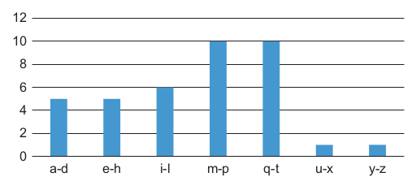

# Histogram

## Introduction

Histogram computation is the process of counting the number of occurrences of data in a given range. The data can be a set of numbers or a set of characters. The range can be a set of numbers or a set of characters. The histogram computation is a very common operation in image processing and computer vision.

For example, the histogram of the sentence "programming massively parallel processors" is shown below.



---

## Thread Hierarchy and Use of Atomic Operations

To compute the histogram in parallel we need to split the data into chunks and assign each chunk to a thread. Each thread will use atomic operations to update the histogram.

Using this approach we can compute the histogram of a set of data in parallel. However, this approach has a major drawback. The atomic operations on the global memory have a high latency. This means that the threads will be waiting for the atomic operations to finish before they can continue. This will lead to a low utilization of the GPU.

One solution is to use atomic operations on the shared memory. This will reduce the latency of the atomic operations. Each chunk will initialize and update its own histogram in the shared memory. Then the threads will use atomic operations on the global memory to update the final histogram. This technique is called *privatization*.

---

## Code

The host code initializes the input data with random values and calls the kernel to perform the histogram computation.

The two kernels are shown below.

```cpp

__global__
void simple_histogram(unsigned int *input, unsigned int *bins,
                      unsigned int num_elements, unsigned int num_bins) {

    unsigned int tid = blockIdx.x * blockDim.x + threadIdx.x;

    // Initialize bins
    for (unsigned int binIdx = tid; binIdx < num_bins; binIdx += blockDim.x * gridDim.x)
        bins[binIdx] = 0;
        
    __syncthreads();

    // Histogram
    for (unsigned int i = tid; i < num_elements; i += blockDim.x * gridDim.x)
        atomicAdd(&bins[input[i]], 1);
}

__global__ 
void histogram_shared(unsigned int *input, unsigned int *bins,
                      unsigned int num_elements, unsigned int num_bins) {

    unsigned int tid = blockIdx.x * blockDim.x + threadIdx.x;
    
    // Privatized bins
    extern __shared__ unsigned int bins_s[];
    
    // Initialize privatized bins
    for (unsigned int binIdx = threadIdx.x; binIdx < num_bins; binIdx += blockDim.x)
        bins_s[binIdx] = 0;
        
    __syncthreads();

    // Histogram
    for (unsigned int i = tid; i < num_elements; i += blockDim.x * gridDim.x)
        atomicAdd(&bins_s[input[i]], 1);
        
    __syncthreads();
    
    // Commit to global memory
    for (unsigned int binIdx = threadIdx.x; binIdx < num_bins; binIdx += blockDim.x)
        atomicAdd(&bins[binIdx], bins_s[binIdx]);
}
```
---

### Simple Histogram

The kernel code for the simple histogram computation first initializes the bins to zero.

```cpp
    unsigned int tid = blockIdx.x * blockDim.x + threadIdx.x;

    // Initialize bins
    for (unsigned int binIdx = tid; binIdx < num_bins; binIdx += blockDim.x * gridDim.x)
        bins[binIdx] = 0;
        
    __syncthreads();
```

Then it computes the histogram using interleaved partioting for coalesced global memory access.

```cpp
    // Histogram
    for (unsigned int i = tid; i < num_elements; i += blockDim.x * gridDim.x)
        atomicAdd(&bins[input[i]], 1);
```

---

### Histogram with Privatization

The kernel code for the histogram computation with privatization first initializes the privatized bins to zero.

```cpp
    unsigned int tid = blockIdx.x * blockDim.x + threadIdx.x;
    
    // Privatized bins
    extern __shared__ unsigned int bins_s[];
    
    // Initialize privatized bins
    for (unsigned int binIdx = threadIdx.x; binIdx < num_bins; binIdx += blockDim.x)
        bins_s[binIdx] = 0;
        
    __syncthreads();
```

Then it computes the local histogram using interleaved partioting for coalesced global memory access.

```cpp
    // Histogram
    for (unsigned int i = tid; i < num_elements; i += blockDim.x * gridDim.x)
        atomicAdd(&bins_s[input[i]], 1);

    __syncthreads();
```

Finally, it uses atomic operations on the global memory to update the final histogram.

```cpp    
    // Commit to global memory
    for (unsigned int binIdx = threadIdx.x; binIdx < num_bins; binIdx += blockDim.x)
        atomicAdd(&bins[binIdx], bins_s[binIdx]);
```

---

## Performance

The performance of the kernel is measured in multiple GPUs using the [NvBench](https://github.com/NVIDIA/nvbench) project. The performance measurements that we will be looking at are:

 - **Memory bandwidth**: The amount of data transferred per second.
 - **Memory bandwidth utilization**: The percentage of the memory bandwidth that is utilized.

---

### Simple Histogram

%20-%20Memory%20Bandwidth%20(GB%20per%20s).png)

---

%20-%20Memory%20Bandwidth%20Utilization.png)

---

### Histogram Shared Bins

%20-%20Memory%20Bandwidth%20(GB%20per%20s).png)

---

%20-%20Memory%20Bandwidth%20Utilization.png)

---

### Comparison

We can see that by using shared bins the memory bandwidth utilization is more than 10x times higher. This is expected because the latency of shared memory is much lower than global memory and we also avoid congestion.