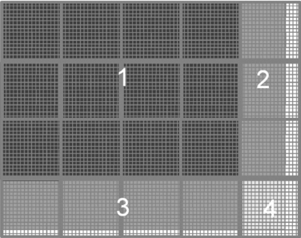
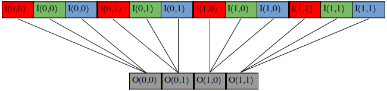

# Image To GrayScale


## Introduction

Image to grayscale is a common operation in image processing. It is used to convert a color image to a grayscale image.

 - The input image is a color image with 3 channels (RGB).
 - The output image is a grayscale image with 1 channel.

An example of the input and output images is shown below.


---

## Thread Hierarchy

We will use a 2D thread hierarchy for the grayscale conversion. 

 - The number of threads in the y-dimension is equal to the height of the image.
 - The number of threads in the x-dimension is equal to the width of the image.
 - The number of blocks in each dimension is equal to the number of threads in that dimension divided by the block size in that dimension.

An example of the thread hierarchy is shown below.



The blocks are organized to cover the entire image. However, the threads in the last block in each dimension may come out of the image. This is because the number of threads in each dimension may not be a multiple of the block size in that dimension. We will need to deactivate these threads.

---

## Code

The host code initializes the input image with random values and calls the kernel to convert the image to grayscale. The input image is stored in a linearized format. The original image is expected to have a shape of [height, width, channels]. 

An example of the linearized input image is shown below **(format: [2, 2, 3])**.



The kernel code is shown below.

```cpp
#define NUM_CHANNELS 3

__global__
void color_to_grayscale_conversion(uint8_t *in, uint8_t *out, int width, int height){

    int row = blockIdx.y * blockDim.y + threadIdx.y;
    int col = blockIdx.x * blockDim.x + threadIdx.x;

    if(row < 0 || row >= height || col < 0 || col >= width) return;

    int grey_offset = row * width + col;

    int rgb_offset = grey_offset * NUM_CHANNELS;

    uint8_t r = in[rgb_offset + 0];
    uint8_t g = in[rgb_offset + 1];
    uint8_t b = in[rgb_offset + 2];

    out[grey_offset] = (uint8_t)(0.21f * r + 0.71f * g + 0.07f * b);
}
```

In the first two lines
```cpp
int row = blockIdx.y * blockDim.y + threadIdx.y;
int col = blockIdx.x * blockDim.x + threadIdx.x;
```
the kernel calculates the corresponding row and column of the output image for the current thread.

Then it does a boundary check to make sure that the current thread is not accessing an invalid memory location.
```cpp
if(row < 0 || row >= height || col < 0 || col >= width) return;
```

The kernel then calculates the offset of the current thread in the linearized input and output images.
```cpp
int grey_offset = row * width + col;
int rgb_offset = grey_offset * NUM_CHANNELS;
```

Finally it reads the corresponding pixel from the input image, converts it to grayscale and writes it to the output image.
```cpp
uint8_t r = in[rgb_offset + 0];
uint8_t g = in[rgb_offset + 1];
uint8_t b = in[rgb_offset + 2];

out[grey_offset] = (uint8_t)(0.21f * r + 0.71f * g + 0.07f * b);
```

---

## Performance

The performance of the kernel is measured in multiple GPUs using the [NvBench](https://github.com/NVIDIA/nvbench) project. The performance measurements that we will be looking at are:

 - **Memory bandwidth**: The amount of data transferred per second.
 - **Memory bandwidth utilization**: The percentage of the memory bandwidth that is utilized.

---

%20-%20Memory%20Bandwidth%20(GB%20per%20s).png)

---

%20-%20Memory%20Bandwidth%20Utilization.png)

---

From the plots above we can observe some interesting trends.

 - The memory bandwidth utilization is quite high for all the GPUs as the axis size becomes larger. This is because the kernel is memory bound.
 - The GTX 1650 and RTX 3060 Laptop GPUs have higher memory bandwidth utilization in smaller axis sizes. But as the axis size increases, this trend seems to reverse.

Let's try to understand why this is happening.

Below there is a table that shows some of the specifications of the GPUs that we are using.

| GPU | Theoretical Bandwidth (GBs) | SM count | Threads per SM | Max Active Threads |
| --- | --- | --- | --- | --- |
| GTX 1650 | 192 | 14 | 1024 | 14 $*$ 1024 = 14336 |
| GTX 2060 | 336 | 30 | 1024 | 30 $*$ 1024 = 30720 |
| RTX 3060 Laptop | 288 | 30 | 1536 | 30 $*$ 1536 = 46080 |
| RTX 3060 | 360 | 28 | 1536 | 28 $*$ 1536 = 43008 |
| RTX 3060 Ti | 448 | 38 | 1536 | 38 $*$ 1536 = 58368 |
| RTX 3070 Ti | 608 | 48 | 1536 | 48 $*$ 1536 = 73728 |
| RTX 3080 | 760 | 68 | 1536 | 68 $*$ 1536 = 104448 |

From the table we can observe for example that the RTX 3060 Laptop GPU has a low theoritical bandwidth but a high number of SMs and threads per SM. 

This means that the RTX 3060 Laptop GPU can load a lot more elements relatively to its memory bandwidth than the other GPUs.

---
