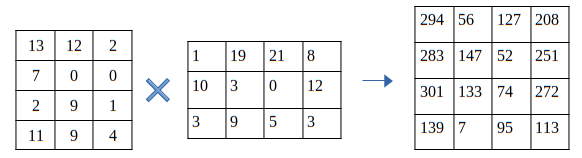
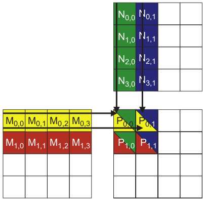
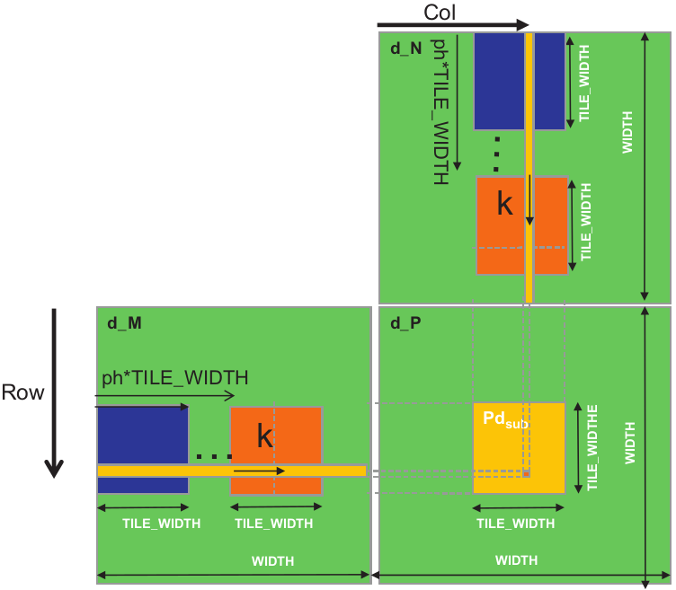
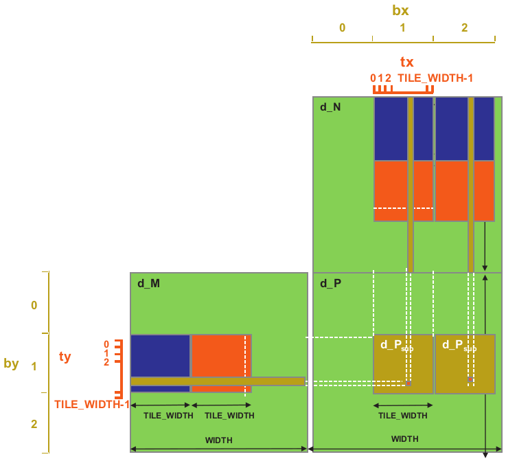

# Matrix - Matrix Multiplication


## Introduction

Matrix - Matrix Multiplication is an important component of the Basic Linear Algebra Subprograms (BLAS). It is used as basis for many other operations in linear algebra. The multiplication of two matrices is shown below.



---

## Basic Approach, Square Tiles and Rectangular Tiles

### Basic Approach

The basic approach to perform matrix - matrix multiplication is to use a single thread to perform the multiplication of a single element of the output matrix. This means that the number of threads that are required is equal to the number of elements in the output matrix. The threads are arranged in a 2D grid and each thread is assigned a unique index. The index of the thread is used to access the corresponding row and column of the input matrices. The multiplication of the row and the column is performed and the result is stored in the corresponding element of the output matrix.

The major drawback with this approach is that multiple threads load the same rows and columns to compute their outputs. An example is shown below.



As shown in the figure above, to compute $P_{0,0}$ and $P_{0,1}$ both threads will need to load the whole $M_{0,:}$ row. The same is true for $P_{0,0}$ and $P_{1,0}$. Both threads will need to load the whole $N_{:,0}$ column. This means that the threads will be accessing the same memory locations multiple times.

### Square Tiles

To avoid this problem we can use tiles. A tile is a small portion of the input matrices that is loaded into shared memory. The threads will load the tiles into shared memory and then perform the multiplication. The figure below illustrates this technique.



The kernel splits the computation in phases. In each phase the threads will load the tiles from $M$ and $N$ matrices into shared memory. The threads will then perform the multiplication of the tiles and accumulate the result in the corresponding element of the output matrix.

With this technique it can be shown that we reduce global memory accesses by a factor of $TILE\_WIDTH$.

### Rectangular Tiles

To further reduce global memory accesses we can use rectangular tiles as shown below.



With this technique we increase the work that each thread does to reduce even further the number of global memory accesses. The kernel again splits the computation in phases. In each phase the threads will load one tile from $M$ and 2 tiles from $N$ into shared memory. The threads will then perform the multiplication of the tiles and accumulate the result in the corresponding elements of the output matrix.

---

## Code

The host code initializes the input matrices with random values and calls the kernel to perform the multiplication. The input matrices is stored in a linearized format.

The kernels are shown below.

### Basic Approach

```cpp
template<typename T> __global__
void mat_mat_mul(T *in_mat1, T *in_mat2, T *out_mat, 
                 int mat1_rows, int mat1_cols, 
                 int mat2_rows, int mat2_cols) {

    int row = blockIdx.y * blockDim.y + threadIdx.y;
    int col = blockIdx.x * blockDim.x + threadIdx.x;

    if (row >= mat1_rows || col >= mat2_cols) return;

    T sum = 0;
    for (int k = 0; k < mat1_cols; ++k)
        sum += in_mat1[row * mat1_cols + k] * in_mat2[k * mat2_cols + col];

    out_mat[row * mat2_cols + col] = sum;
}
```

In this basic approach the kernel is really simple.

The threads first compute their row and column index. If the row or column index is greater than the number of rows or columns of the input matrices then the thread returns.

```cpp
int row = blockIdx.y * blockDim.y + threadIdx.y;
int col = blockIdx.x * blockDim.x + threadIdx.x;

if (row >= mat1_rows || col >= mat2_cols) return;
```

The threads then perform the multiplication of the row and the column and store the result in the corresponding element of the output matrix.

```cpp
T sum = 0;
for (int k = 0; k < mat1_cols; ++k)
    sum += in_mat1[row * mat1_cols + k] * in_mat2[k * mat2_cols + col];

out_mat[row * mat2_cols + col] = sum;
```

We can observe that the threads will not only load the same rows and columns multiple times but they will also load the the elements of $in\_mat1$ in a non-coalesced manner. This means that the threads will not be able to fully utilize the memory bandwidth.

### Square Tiles

```cpp
template<typename T> __global__
void mat_mat_mul_tiles(T *in_mat1, T *in_mat2, T *out_mat,
                       int mat1_rows, int mat1_cols,
                       int mat2_rows, int mat2_cols) {
    
    // Initialize shared memory
    int TILE_WIDTH = blockDim.x;
    extern __shared__ uint8_t shared_mem[];
    T *ds_mat1 = reinterpret_cast<T*>(shared_mem);
    T *ds_mat2 = reinterpret_cast<T*>(shared_mem + TILE_WIDTH * TILE_WIDTH * sizeof(T));
    
    int bx = blockIdx.x,  by = blockIdx.y;
    int tx = threadIdx.x, ty = threadIdx.y;

    int row = by * TILE_WIDTH + ty;
    int col = bx * TILE_WIDTH + tx;

    T out_value = 0;
    // Loop over the in_mat1 and in_mat2 tiles required to compute the out_mat element
    for (int ph = 0; ph < (mat1_cols + TILE_WIDTH - 1) / TILE_WIDTH; ++ph) {

        // Collaborative loading of in_mat1 and in_mat2 tiles into shared memory
        ds_mat1[ty * TILE_WIDTH + tx] = row < mat1_rows && ph * TILE_WIDTH + tx < mat1_cols ?
                                        in_mat1[row * mat1_cols + ph * TILE_WIDTH + tx] : 0;
                                        
        ds_mat2[ty * TILE_WIDTH + tx] = ph * TILE_WIDTH + ty < mat2_rows && col < mat2_cols ?
                                        in_mat2[(ph * TILE_WIDTH + ty) * mat2_cols + col] : 0;

        // Synchronize to make sure the tiles are loaded
        __syncthreads();

        // Compute the out_mat element
        for (int k = 0; k < TILE_WIDTH; ++k)
            out_value += ds_mat1[ty * TILE_WIDTH + k] * ds_mat2[k * TILE_WIDTH + tx];
        
        // Synchronize to make sure the out_mat element is computed
        // before other threads load new tiles
        __syncthreads();
    }

    // Store the out_mat element in out_mat
    if (row < mat1_rows && col < mat2_cols)
        out_mat[row * mat2_cols + col] = out_value;
}
```

In this approach we use shared memory to store the tiles of the input matrices. The threads first compute their row and column index. If the row or column index is greater than the number of rows or columns of the input matrices then the thread returns.

```cpp
int row = by * TILE_WIDTH + ty;
int col = bx * TILE_WIDTH + tx;

if (row >= mat1_rows || col >= mat2_cols) return;
```

In each phase:

The threads load the tiles into shared memory. The tiles are loaded in a coalesced manner.

```cpp
// Collaborative loading of in_mat1 and in_mat2 tiles into shared memory
ds_mat1[ty * TILE_WIDTH + tx] = row < mat1_rows && ph * TILE_WIDTH + tx < mat1_cols ?
                                in_mat1[row * mat1_cols + ph * TILE_WIDTH + tx] : 0;

ds_mat2[ty * TILE_WIDTH + tx] = ph * TILE_WIDTH + ty < mat2_rows && col < mat2_cols ?
                                in_mat2[(ph * TILE_WIDTH + ty) * mat2_cols + col] : 0;

// Synchronize to make sure the tiles are loaded
__syncthreads();
```

When the threads are done loading the tiles they compute the output matrix element. The threads compute the output matrix element by multiplying the corresponding row and column of the tiles and summing the results.

```cpp 
// Compute the out_mat element
for (int k = 0; k < TILE_WIDTH; ++k)
    out_value += ds_mat1[ty * TILE_WIDTH + k] * ds_mat2[k * TILE_WIDTH + tx];

// Synchronize to make sure the out_mat element is computed
// before other threads load new tiles
__syncthreads();
```

Finally, the threads store the output matrix element in the output matrix.

```cpp
// Store the out_mat element in out_mat
out_mat[row * mat2_cols + col] = out_value;
```

### Rectangular Tiles

```cpp
template<typename T> __global__
void mat_mat_mul_rec_tiles(T *in_mat1, T *in_mat2, T *out_mat,
                           int mat1_rows, int mat1_cols,
                           int mat2_rows, int mat2_cols) {
    
    // Initialize shared memory
    int TILE_WIDTH = blockDim.x;
    extern __shared__ uint8_t shared_mem[];
    T *ds_mat1 = reinterpret_cast<T*>(shared_mem);
    T *ds_mat2 = reinterpret_cast<T*>(shared_mem + TILE_WIDTH * TILE_WIDTH * sizeof(T));
    
    int bx = blockIdx.x, by = blockIdx.y;
    int tx = threadIdx.x, ty = threadIdx.y;

    int row = by * TILE_WIDTH     + ty;
    int col = bx * TILE_WIDTH * 2 + tx;

    T out_value1 = 0;
    T out_value2 = 0;
    // Loop over the in_mat1 and in_mat2 tiles required to compute the out_mat element
    for (int ph = 0; ph < (mat1_cols + TILE_WIDTH - 1) / TILE_WIDTH; ++ph) {

        // Collaborative loading of in_mat1 and in_mat2 tiles into shared memory
        ds_mat1[ty * TILE_WIDTH + tx] = row < mat1_rows && ph * TILE_WIDTH + tx < mat1_cols ?
                                        in_mat1[row * mat1_cols + ph * TILE_WIDTH + tx] : 0;

        ds_mat2[ty * TILE_WIDTH + tx] = ph * TILE_WIDTH + ty < mat2_rows && col < mat2_cols ?
                                        in_mat2[(ph * TILE_WIDTH + ty) * mat2_cols + col] : 0;

        ds_mat2[ty * TILE_WIDTH + TILE_WIDTH + tx] = ph * TILE_WIDTH + ty < mat2_rows && TILE_WIDTH + col < mat2_cols ?
                                                     in_mat2[(ph * TILE_WIDTH + ty) * mat2_cols + TILE_WIDTH + col] : 0;

        // Synchronize to make sure the tiles are loaded
        __syncthreads();

        // Compute the out_mat element
        for (int k = 0; k < TILE_WIDTH; k++){
            out_value1 += ds_mat1[ty * TILE_WIDTH + k] * ds_mat2[k * TILE_WIDTH + tx];
            out_value2 += ds_mat1[ty * TILE_WIDTH + k] * ds_mat2[k * TILE_WIDTH + TILE_WIDTH + tx];
        }
        
        // Synchronize to make sure the Pvalues are computed
        // before other threads load new tiles
        __syncthreads();
    }

    // Store the Pvalues in out_mat
    if (row < mat1_rows && col < mat2_cols)
      //out_mat[row][col];
        out_mat[row * mat2_cols + col] = out_value1;

    if (row < mat1_rows && TILE_WIDTH + col < mat2_cols)
      //out_mat[row][TILE_WIDTH + col];
        out_mat[row * mat2_cols + TILE_WIDTH + col] = out_value2;
}
```

This kernel is almost the same with the square tiles kernel.

First the threads compute the row and column of the output matrix element that they will compute.

```cpp
int row = by * TILE_WIDTH     + ty;
int col = bx * TILE_WIDTH * 2 + tx;
```

Then the threads load the tiles into the shared memory. The only difference is that the threads load two tiles from $in\_mat2$ instead of one.

```cpp
// Collaborative loading of in_mat1 and in_mat2 tiles into shared memory
ds_mat1[ty * TILE_WIDTH + tx] = row < mat1_rows && ph * TILE_WIDTH + tx < mat1_cols ?
                                in_mat1[row * mat1_cols + ph * TILE_WIDTH + tx] : 0;

ds_mat2[ty * TILE_WIDTH + tx] = ph * TILE_WIDTH + ty < mat2_rows && col < mat2_cols ?
                                in_mat2[(ph * TILE_WIDTH + ty) * mat2_cols + col] : 0;

ds_mat2[ty * TILE_WIDTH + TILE_WIDTH + tx] = ph * TILE_WIDTH + ty < mat2_rows && TILE_WIDTH + col < mat2_cols ?
                                                in_mat2[(ph * TILE_WIDTH + ty) * mat2_cols + TILE_WIDTH + col] : 0;

// Synchronize to make sure the tiles are loaded
__syncthreads();
```

Then the threads compute the two output matrix elements.

```cpp
// Compute the out_mat element
for (int k = 0; k < TILE_WIDTH; k++){
    out_value1 += ds_mat1[ty * TILE_WIDTH + k] * ds_mat2[k * TILE_WIDTH + tx];
    out_value2 += ds_mat1[ty * TILE_WIDTH + k] * ds_mat2[k * TILE_WIDTH + TILE_WIDTH + tx];
}

// Synchronize to make sure the Pvalues are computed
// before other threads load new tiles
__syncthreads();
```

Finally the threads store the two output matrix elements.

```cpp
// Store the Pvalues in out_mat
if (row < mat1_rows && col < mat2_cols)
  //out_mat[row][col];
    out_mat[row * mat2_cols + col] = out_value1;

if (row < mat1_rows && TILE_WIDTH + col < mat2_cols)
  //out_mat[row][TILE_WIDTH + col];
    out_mat[row * mat2_cols + TILE_WIDTH + col] = out_value2;
```

---

## Performance

The performance of the kernel is measured in multiple GPUs using the [NvBench](https://github.com/NVIDIA/nvbench) project. The performance measurements that we will be looking at are:

 - **Memory bandwidth**: The amount of data transferred per second.
 - **Memory bandwidth utilization**: The percentage of the memory bandwidth that is utilized.

---

### Basic Approach

%20-%20Memory%20Bandwidth%20(GB%20per%20s).png)

---

%20-%20Memory%20Bandwidth%20Utilization.png)

---

### Square Tiles

%20-%20Memory%20Bandwidth%20(GB%20per%20s).png)

---

%20-%20Memory%20Bandwidth%20Utilization.png)

---

### Rectangular Tiles

%20-%20Memory%20Bandwidth%20(GB%20per%20s).png)

---

%20-%20Memory%20Bandwidth%20Utilization.png)

### Comparison

Both tiles approaches (square and rectangular tiles) have a better memory bandwidth utilization than the basic approach. 

However we can see that all kernels have very low memory bandwidth utilization. This shows that the kernel is compute bound and not memory bound.

---