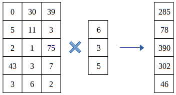

# Matrix - Vector Multiplication


## Introduction

Matrix - Vector Multiplication is a basic operation in linear algebra. It is used to multiply a matrix with a vector. The result of the multiplication is a vector of the same size as the input vector. The multiplication of a matrix and a vector is shown below.



---

## Basic Approach and Tile Usage

The basic approach to perform matrix - vector multiplication is to use a single thread to perform the multiplication of a single element of the output vector. This means that the number of threads that are required is equal to the number of elements in the output vector. The threads are arranged in a 1D grid and each thread is assigned a unique index. The index of the thread is used to access the corresponding row of the input matrix. The multiplication of the row and the vector is performed and the result is stored in the corresponding element of the output vector.

In this basic approach each thread will load the whole vector. This is not efficient as the vector is loaded multiple times. To avoid this we can use a tile to store the vector in shared memory. The tile is a 1D array of size equal to the number of threads in a block. The vector is loaded into the tile and each thread uses the tile to perform the multiplication.

---

## Code

The host code initializes the input matrix and vector with random values and calls the kernel to perform the multiplication. The input matrix is stored in a linearized format.

The two kernels are shown below.

```cpp
template<typename T> __global__
void mat_vec_mul(T *out, T *in_mat, T *in_vec, int m, int n) {

    int i = blockIdx.x * blockDim.x + threadIdx.x;
    if(i >= m) return;
    
    T temp = 0;
    for (int k = 0; k < n; ++k)
        temp += in_mat[i * n + k] * in_vec[k];
    out[i] = temp;
}

template<typename T> __global__
void mat_vec_mul_tiles(T *out, T *in_mat, T *in_vec, int m, int n) {

    extern __shared__ uint8_t tiles_uint8[];
    T *tiles = reinterpret_cast<T*>(tiles_uint8);

    int i = blockIdx.x * blockDim.x + threadIdx.x;

    T res = 0;
    int n_phases = (n + blockDim.x - 1) / blockDim.x;
    for (int phase = 0; phase < n_phases; ++phase){

        int elem_idx = phase * blockDim.x + threadIdx.x;
        tiles[threadIdx.x] = elem_idx < n ? in_vec[elem_idx] : 0;
        __syncthreads();

        if(i < m)
            for (int k = 0; k < blockDim.x && phase * blockDim.x + k < n; ++k)
                res += in_mat[i * n + phase * blockDim.x + k] * tiles[k];
        __syncthreads();
    }
    out[i] = res;
}
```
### Basic Approach

The kernel first computes the index of the thread. If the index is within the range of the output vector then the multiplication is performed.

```cpp
int i = blockIdx.x * blockDim.x + threadIdx.x;
if(i >= m) return;
```
The multiplication is performed by looping over the columns of the input matrix and multiplying the corresponding elements of the row and the vector. The result is stored in the corresponding element of the output vector.

```cpp
T temp = 0;
for (int k = 0; k < n; ++k)
    temp += in_mat[i * n + k] * in_vec[k];
out[i] = temp;
```

### Tiled Approach

The kernel first computes the index of the thread. The kernel does not check for boundary conditions as the threads that are outside the range of the output vector might be needed to load the vector into the tiles.

```cpp
int i = blockIdx.x * blockDim.x + threadIdx.x;
```

The multiplication is now splitted into phases. In each phase the threads will load a single or no elements (if they are out of bounds) of the vector into the tiles. Then the threads will perform the multiplication of the vector loaded into tiles and the corresponding elements of the row of the input matrix. The result is stored in the corresponding element of the output vector.

Both when loading the vector into the tiles and when performing the multiplication the threads perform boundary checks to avoid out of bounds accesses.

```cpp
T res = 0;
int n_phases = (n + blockDim.x - 1) / blockDim.x;
for (int phase = 0; phase < n_phases; ++phase){

    int elem_idx = phase * blockDim.x + threadIdx.x;
    tiles[threadIdx.x] = elem_idx < n ? in_vec[elem_idx] : 0;
    __syncthreads();

    if(i < m)
        for (int k = 0; k < blockDim.x && phase * blockDim.x + k < n; ++k)
            res += in_mat[i * n + phase * blockDim.x + k] * tiles[k];
    __syncthreads();
}
out[i] = res;
```

---

## Performance

The performance of the kernel is measured in multiple GPUs using the [NvBench](https://github.com/NVIDIA/nvbench) project. The performance measurements that we will be looking at are:

 - **Memory bandwidth**: The amount of data transferred per second.
 - **Memory bandwidth utilization**: The percentage of the memory bandwidth that is utilized.

---

### Basic Approach

%20-%20Memory%20Bandwidth%20(GB%20per%20s).png)

---

%20-%20Memory%20Bandwidth%20Utilization.png)

---

### Tiled Approach

%20-%20Memory%20Bandwidth%20(GB%20per%20s).png)

---

%20-%20Memory%20Bandwidth%20Utilization.png)

### Comparison

The tiled approach does not perform better than the basic approach. 

In the basic approach all threads will load the same vector elements. This allows the hardware to optimize the memory accesses by putting these elements into L2 cache. Therefore, most of the warps will be able to load the vector elements from the L2 cache. 

In the tiled approach the threads will load the vector elements in phases. Using this technique the hardware will coalesce these access but we need to synchronize the threads after each load and computation.

Another reason why the tiled approach does not seem to perform better is that if the matrix has a $m*n$ shape the the vector is $m$ times smaller than the matrix. This means that is not the dominant factor in the memory bandwidth utilization.

---