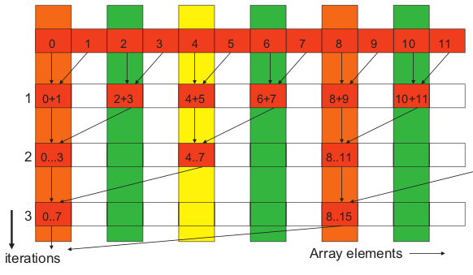
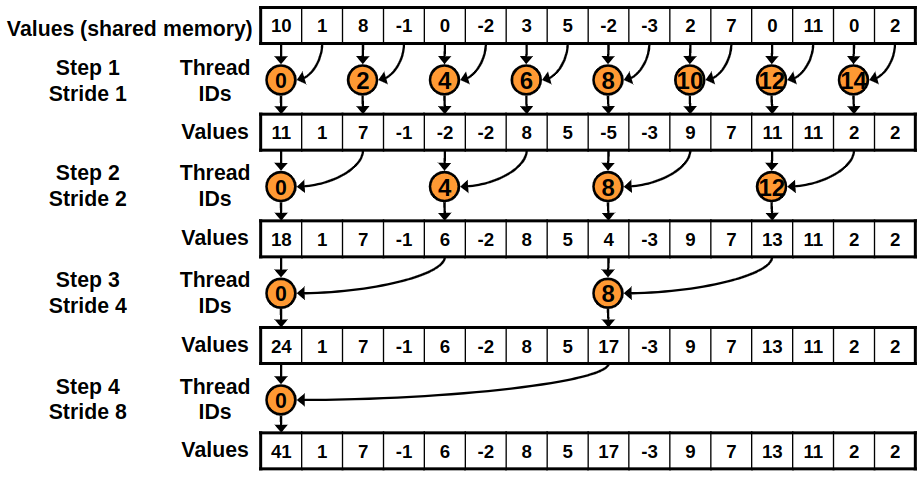
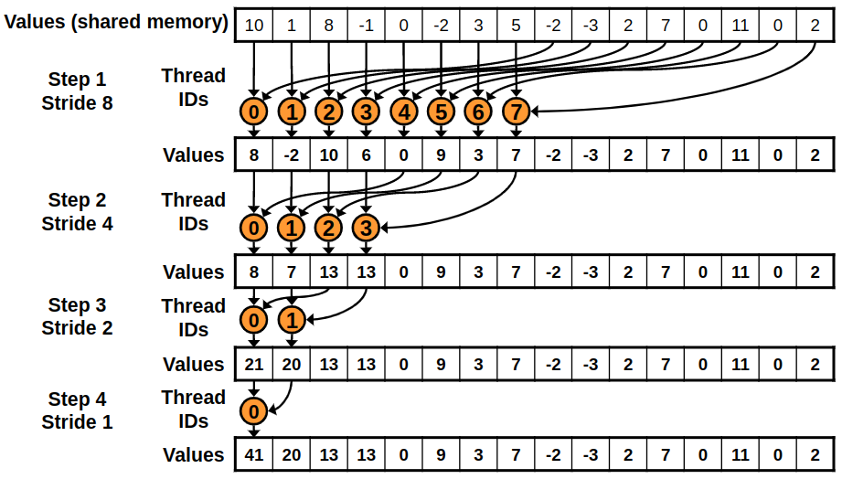

# Reduction


## Introduction

A reduction algorithm derives a single value from an array of values. The single value could be the sum, the maximal, the minimal, etc. among all elements.

An example of sum reduction is shown below.



---

## Thread Hierarchy 

The common organization of threads in a reduction algorithm is to use one thread for each element. Below we will see many techniques which utilize threads in different ways.

---

## Code

### Reduction 1: Interleaved Addressing - Diverge Warps

```cpp
template<typename T> __global__
void reduction1(T* X, uint32_t n, T* Y){

    extern __shared__ uint8_t shared_mem[];
    T* partial_sum = reinterpret_cast<T*>(shared_mem);

    uint32_t tx = threadIdx.x;
    uint32_t i = blockIdx.x * blockDim.x + threadIdx.x;

    // Load the elements of the array into the shared memory
    partial_sum[tx] = i < n ? X[i] : 0;
    __syncthreads();

    // Accumulate the elements using reduction
    for(uint32_t stride = 1; stride < blockDim.x; stride <<= 1){
        if(tx % (2 * stride) == 0)
            partial_sum[tx] += tx + stride < n ? partial_sum[tx + stride] : 0;
        __syncthreads();
    }

    if(tx == 0) Y[blockIdx.x] = partial_sum[0];
}
```



First the kernel loads the elements of the array into the shared memory. Then in each iteration, it adds the elements that are $i^2$ elements apart ($i_{th}$ iteration).The first iteration adds the elements that are next to each other. The second iteration adds the elements that are 2 elements apart, etc. The loop ends when the stride is larger than the number of threads in the block.

Finally the kernel writes the result to the output array.

With this kernel the threads that add elements are not consecutive and in each iteration the threads get more diverged. This will cause the warps to rerun a lot of the code.

---

### Reduction 2: Interleaved Addressing - Bank Conflicts

```cpp
template<typename T> __global__
void reduction2(T* X, uint32_t n, T* Y){

    extern __shared__ uint8_t shared_mem[];
    T* partial_sum = reinterpret_cast<T*>(shared_mem);

    uint32_t tx = threadIdx.x;
    uint32_t i = blockIdx.x * blockDim.x + threadIdx.x;

    // Load the elements of the array into the shared memory
    partial_sum[tx] = i < n ? X[i] : 0;
    __syncthreads();

    // Accumulate the elements using reduction
    for(uint32_t stride = 1; stride < blockDim.x; stride <<= 1){
        int index = 2 * stride * tx;
        
        if (index < blockDim.x)
            partial_sum[index] += index + stride < n ? partial_sum[index + stride] : 0;
        __syncthreads();
    }

    if(tx == 0) Y[blockIdx.x] = partial_sum[0];
}
```


This kernel is similar to the previous one. The only difference is that the threads that add elements are consecutive. This will allow the warps to run the code more efficiently.

The problem with this kernel is that it causes bank conflicts. Bank conflicts happen when two threads access the same bank of the shared memory. Devices with compute capability 2.0 and above have 32 banks that are 32 bits wide. If two threads access the same bank, the second access will be delayed until the first access is finished.

---

### Reduction 3: Sequential Addressing

```cpp
template<typename T> __global__
void reduction3(T* X, uint32_t n, T* Y){

    extern __shared__ uint8_t shared_mem[];
    T* partial_sum = reinterpret_cast<T*>(shared_mem);

    uint32_t tx = threadIdx.x;
    uint32_t i = blockIdx.x * blockDim.x + threadIdx.x;

    // Load the elements of the array into the shared memory
    partial_sum[tx] = i < n ? X[i] : 0;
    __syncthreads();

    // Accumulate the elements using reduction
    for(uint32_t stride = blockDim.x / 2; stride > 0; stride >>= 1){
        if(tx < stride)
            partial_sum[tx] += partial_sum[tx + stride];
        __syncthreads();
    }

    if(tx == 0) Y[blockIdx.x] = partial_sum[0];
}
```



To avoid bank conflicts, this kernel uses sequential addressing. In each iteration, the threads and the elements are consecutive.

The problem with this kernel is that half of the threads are idle on first loop iteration.

---

### Reduction 4: First Add During Load

```cpp
template<typename T> __global__
void reduction4(T* X, uint32_t n, T* Y){

    extern __shared__ uint8_t shared_mem[];
    T* partial_sum = reinterpret_cast<T*>(shared_mem);

    uint32_t tx = threadIdx.x;
    uint32_t i = blockIdx.x * (blockDim.x * 2) + threadIdx.x;

    // Load the elements of the array into the shared memory
    partial_sum[tx] = i < n ? X[i] : 0;
    partial_sum[tx] += i + blockDim.x < n ? X[i + blockDim.x] : 0;
    __syncthreads();

    // Accumulate the elements using reduction
    for(uint32_t stride = blockDim.x / 2; stride > 0; stride >>= 1){
        if(tx < stride)
            partial_sum[tx] += partial_sum[tx + stride];
        __syncthreads();
    }

    if(tx == 0) Y[blockIdx.x] = partial_sum[0];
}
```

Again this kernel is similar to the previous one. The only difference is that each thread loads and adds two elements of the array before the iterations start.

---

### Reduction 5: Unroll Last Warp

```cpp
template<typename T> __device__ 
void warpReduce(volatile T* partial_sum, uint32_t tx){
    partial_sum[tx] += partial_sum[tx + 32];
    partial_sum[tx] += partial_sum[tx + 16];
    partial_sum[tx] += partial_sum[tx +  8];
    partial_sum[tx] += partial_sum[tx +  4];
    partial_sum[tx] += partial_sum[tx +  2];
    partial_sum[tx] += partial_sum[tx +  1];
}

template<typename T, int block_size> __global__
void reduction5(T* X, uint32_t n, T* Y){

    extern __shared__ uint8_t shared_mem[];
    T* partial_sum = reinterpret_cast<T*>(shared_mem);

    uint32_t tx = threadIdx.x;
    uint32_t i = blockIdx.x * (blockDim.x * 2) + threadIdx.x;

    // Load the elements of the array into the shared memory
    partial_sum[tx] = i < n ? X[i] : 0;
    partial_sum[tx] += i + blockDim.x < n ? X[i + blockDim.x] : 0;

    // Accumulate the elements using reduction
    for(uint32_t stride = blockDim.x / 2; stride > 32; stride >>= 1){
        if(tx < stride)
            partial_sum[tx] += partial_sum[tx + stride];
        __syncthreads();
    }

    if(tx < 32) warpReduce(partial_sum, tx);

    if(tx == 0) Y[blockIdx.x] = partial_sum[0];
}
```

The kernel again is similar to the previous one. The only difference is that the last warp is unrolled. This will allow the warp to run the code without control divergence.

---

## Performance

The performance of the kernel is measured in multiple GPUs using the [NvBench](https://github.com/NVIDIA/nvbench) project. The performance measurements that we will be looking at are:

 - **Memory bandwidth**: The amount of data transferred per second.
 - **Memory bandwidth utilization**: The percentage of the memory bandwidth that is utilized.

---

### Reduction 1: Interleaved Addressing - Diverge Warps

%20-%20Memory%20Bandwidth%20(GB%20per%20s).png)

---

%20-%20Memory%20Bandwidth%20Utilization.png)

---

### Reduction 2: Interleaved Addressing - Bank Conflicts

%20-%20Memory%20Bandwidth%20(GB%20per%20s).png)

---

%20-%20Memory%20Bandwidth%20Utilization.png)

---

### Reduction 3: Sequential Addressing

%20-%20Memory%20Bandwidth%20(GB%20per%20s).png)

---

%20-%20Memory%20Bandwidth%20Utilization.png)

---

### Reduction 4: First Add During Load

%20-%20Memory%20Bandwidth%20(GB%20per%20s).png)

---

%20-%20Memory%20Bandwidth%20Utilization.png)
---

### Reduction 5: Unroll Last Warp

%20-%20Memory%20Bandwidth%20(GB%20per%20s).png)

---

%20-%20Memory%20Bandwidth%20Utilization.png)

---

### Conclusion

As expected with each kernel we see an increase in the memory bandwidth utilization. 

In each kernel a different idea/technique was used to achieve this. 

All modifications achieved great increases in memory bandwidth utilization starting from 10-20% utilization to 50-90% utilization.

---