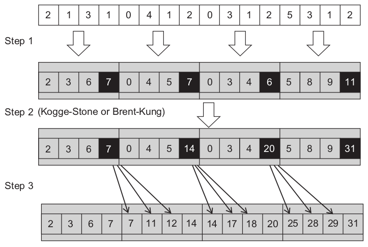

# Scan

## Introduction

The *scan* operation is a common operation in many applications. An inclusive scan operation takes a binary operator $⊕$ and an input array and computes the output array as follows:

$[ x_0 , ( x_0 ⊕ x_1 ), …, ( x_0 ⊕ x_1 ⊕ … ⊕ x_{n−1} )]$

---

## Hierarchical Scan and Different Techniques

### Kogge-Stone's Algorithm

**Kogge-Stone's algorithm** was originally invented for designing fast added circuits. The algorithm is used today to design high-speed computer arithmetic hardware.

An illustration of the algorithm is shown below.


 - In Kogge-Stone's algorithm all threads will iterate up to $log_2N$ steps. 
 - The amount of work that Kogge-Stone's algorithm does to complete the scan operation is close to $Nlog_2N$.
 - Kogge-Stone's algorithm will need approximately $Nlog_2N / P$ time steps to complete with P execution units.

---

### Brent-Kung's Algorithm

**Brent-Kung's algorithm** is a variation of Kogge-Stone's algorithm that strategically calculates the intermediate results to reduce the amount of work done by the algorithm.

The algorithm has two phases:
 - The reduction tree phase
 - The reverse tree phase

The algorithm is shown below.


 - In Brent-Kung's algorithm all threads will iterate up to $2log_2N$ steps.
 - The amount of work that Brent-Kung's algorithm does to complete the scan operation is close to $2N-2-log_2N$.
 - Brent-Kung's algorithm will need approximately $(N/2) * (2*log_2N -1) / P$ time steps to complete with P execution units. (very close to Kogge's Stone algorithm - due to CUDA device design)

---

### Three Phase Scan Algorithm

The **Three Phase Scan algorithm** is designed to achieve higher work efficiency that the other two.

The algorithm has three phases:
 - The independent scan phase (in chunks)
 - The scan operation on the last elements of the previous independent scans
 - The last phase that each element of the previous phase is added back to the chunks

The algorithm is shown below.



 - The amount of work done with T threads is $N - 1$ for phase 1. $Tlog_2T$ for phase 2. $N - T$ for phase 3. The total amount of work is $N - 1 + Tlog_2T + N - T$.

 - If we use P execution units, the execution can be expected to take $(N - 1 + Tlog_2T + N - T) / P$ time steps.

---

### Hierarchical Scan

The kernels described aboved have limitations when it comes to the size of the input that they can handle.

- Kogge-Stone's algorithm can handle up to *threads-per-block / 2* elements.
- Brent-Kung's algorithm can handle up to *threads-per-block* elements.
- Three Phase Scan can handle up to *shared-memory-size / sizeof(T)* elements.

The **Hierarchical Scan** algorithm is designed to handle arbitrary-length inputs.

The algorithm is shown below.


 - The algorithm first scans chunks of the input using any of the three algorithms presented above and writes the last element of each scan in the auxiliary array.
 - Then it scans the auxiliary array.
 - And adds each element $i$ to the block with index $i + 1$.
 - If the auxiliary array is big enough it uses the same algorithm to scan it.

---

## Code

### Kogge-Stone's Scan

```cpp
// This kernel can handle up to min(shared_mem_size, max threads per block) / 2 elements
template<typename T> __global__
void Kogge_Stone_inclusive_scan(T *X, T *Y, int n, T *S = NULL){

    extern __shared__ uint8_t shared_mem[];
    T *XY = reinterpret_cast<T*>(shared_mem);

    int i = blockIdx.x * blockDim.x + threadIdx.x;

    // Load elements into shared memory
    if(i < n) XY[threadIdx.x] = X[i];
        
    __syncthreads();

    // Perform scan operation
    for (unsigned int stride = 1; stride < blockDim.x; stride <<= 1){

        if (threadIdx.x >= stride) XY[blockDim.x + threadIdx.x] = XY[threadIdx.x] + XY[threadIdx.x - stride];
        __syncthreads();

        if (threadIdx.x >= stride) XY[threadIdx.x] = XY[blockDim.x + threadIdx.x];
        __syncthreads();
    }

    // Write results
  
    // Write result to global memory
    if (i < n) Y[i] = XY[threadIdx.x];

    // Write last element to global memory
    if (S != NULL && threadIdx.x == blockDim.x - 1)
        S[blockIdx.x] = XY[blockDim.x  - 1];
}
```

The kernel first loads the elements from the input array into the shared memory.

```cpp
int i = blockIdx.x * blockDim.x + threadIdx.x;

// Load elements into shared memory
if(i < n) XY[threadIdx.x] = X[i];
        
__syncthreads();
```

Then it performs the scan operation.

```cpp
// Perform scan operation
for (unsigned int stride = 1; stride < blockDim.x; stride <<= 1){

    if (threadIdx.x >= stride) XY[blockDim.x + threadIdx.x] = XY[threadIdx.x] + XY[threadIdx.x - stride];
    __syncthreads();

    if (threadIdx.x >= stride) XY[threadIdx.x] = XY[blockDim.x + threadIdx.x];
    __syncthreads();
}
```

The elements are written to the output array and the last element to the auxiliary array.
    
```cpp
// Write results to global memory
if (i < n) Y[i] = XY[threadIdx.x];

// Write last element to global memory
if (S != NULL && threadIdx.x == blockDim.x - 1)
    S[blockIdx.x] = XY[blockDim.x  - 1];
```

---

### Brent-Kung's Scan

```cpp
// This kernel can handle up to min(shared_mem_size, max threads per block) elements
template<typename T> __global__
void Brent_Kung_inclusive_scan(T *X, T *Y, int n, T *S = NULL){

    extern __shared__ uint8_t shared_mem[];
    T *XY = reinterpret_cast<T*>(shared_mem);

    int i = 2 * blockIdx.x * blockDim.x + threadIdx.x;
    int tx = threadIdx.x;

    // Load elements into shared memory
    XY[tx] = (i < n) ? X[i] : 0;
    XY[tx + blockDim.x] = (i + blockDim.x < n) ? X[i + blockDim.x] : 0;
    __syncthreads();

    // Perform scan operation (Phase 1 - Reduction)
    for (unsigned int stride = 1; stride <= blockDim.x; stride <<= 1){

        unsigned int index = (tx + 1) * stride * 2 - 1;

        if(index < 2 * blockDim.x) XY[index] += XY[index - stride];
        __syncthreads();
    }

    // Perform scan operation (Phase 2 - Reverse-Tree)
    for (unsigned int stride = blockDim.x / 2; stride > 0; stride >>= 1){

        unsigned int index = (tx + 1) * stride * 2 - 1;

        if(index + stride < 2 * blockDim.x) XY[index + stride] += XY[index];
        __syncthreads();
    }

    // Write results
  
    // Write result to global memory
    if(i < n) Y[i] = XY[tx];
    if(i + blockDim.x < n) Y[i + blockDim.x] = XY[tx + blockDim.x];

    // Write last element to global memory
    if (S != NULL && tx == blockDim.x - 1)
        S[blockIdx.x] = XY[2 * blockDim.x  - 1];
}
```

The kernel first loads two elements from the global memory.

```cpp
int i = 2 * blockIdx.x * blockDim.x + threadIdx.x;
int tx = threadIdx.x;

// Load elements into shared memory
XY[tx] = (i < n) ? X[i] : 0;
    XY[tx + blockDim.x] = (i + blockDim.x < n) ? X[i + blockDim.x] : 0;
    __syncthreads();
```

Then it enters the first phase of reduction.

```cpp
// Perform scan operation (Phase 1 - Reduction)
for (unsigned int stride = 1; stride <= blockDim.x; stride <<= 1){

    unsigned int index = (tx + 1) * stride * 2 - 1;

    if(index < 2 * blockDim.x) XY[2 * blockDim.x + index] = XY[index] + XY[index - stride];
    __syncthreads();

    if(index < 2 * blockDim.x) XY[index] = XY[2 * blockDim.x + index];
    __syncthreads();
}
```

Then it enters the second phase of reverse-tree.

```cpp
// Perform scan operation (Phase 2 - Reverse-Tree)
for (unsigned int stride = blockDim.x / 2; stride > 0; stride >>= 1){

    unsigned int index = (tx + 1) * stride * 2 - 1;

    if(index + stride < 2 * blockDim.x) XY[2 * blockDim.x + index + stride] = XY[index + stride] + XY[index];
    __syncthreads();

    if(index + stride < 2 * blockDim.x) XY[index + stride] = XY[2 * blockDim.x + index + stride];
    __syncthreads();
}
```

The elements are written to the output array and the last element to the auxiliary array.

```cpp
// Write results to global memory
if(i < n) Y[i] = XY[tx];
if(i + blockDim.x < n) Y[i + blockDim.x] = XY[tx + blockDim.x];

// Write last element to global memory
if (S != NULL && tx == blockDim.x - 1)
    S[blockIdx.x] = XY[2 * blockDim.x  - 1];
```

---

### Three-Phase-Scan Algorithm

```cpp
template<typename T> __global__
void three_phase_parallel_inclusive_scan(T *X, T *Y, int n, int shared_mem_size, T *S = NULL){

    extern __shared__ uint8_t shared_mem[];
    T *XY = reinterpret_cast<T*>(shared_mem);

    int start_pos = blockIdx.x * shared_mem_size;
    int tx = threadIdx.x;

    for(int j = tx; j < shared_mem_size; j += blockDim.x) 
        XY[j] = start_pos + j < n ? X[start_pos + j] : 0;
    __syncthreads();

    // Phase 1
    // Scan each section
    int size = shared_mem_size / blockDim.x;
    int start = size * tx;
    int stop = start + size;
    T acc = 0;
    if(start_pos + start < n) { // Threads that all their values are 0 do not execute (start > n)
        for(int i = start; i < stop; ++i) {
            acc += XY[i];
            XY[i] = acc;
        }
    }
    __syncthreads();

    // Phase 2
    // Use Brent-Kung algorithm to scan the last elements of each section
    for (unsigned int stride = 1; stride <= blockDim.x; stride <<= 1){

        __syncthreads();

        unsigned int index = (tx + 1) * stride * 2 * size - 1;
        if(index < shared_mem_size) XY[index] += XY[index - (stride * size)];
    }

    for (unsigned int stride = shared_mem_size / 4; stride >= size; stride >>= 1){

        __syncthreads();

        unsigned int index = (tx + 1) * stride * 2 - 1;
        if(index + stride < shared_mem_size) XY[index + stride] += XY[index];
    }
    __syncthreads();

    // Phase 3
    // Add the last elements of each section to the next section
    if(tx != 0) {
        int value = XY[start - 1];
        for(int i = start; i < stop - 1; ++i) 
            XY[i] += value;
    }
    __syncthreads();

    // Write results
    
    // Write result to global memory
    for(int i = tx; i < shared_mem_size; i += blockDim.x) 
        if(start_pos + i < n) 
            Y[start_pos + i] = XY[i];
    
    // Write last element to global memory
    if (S != NULL && tx == blockDim.x - 1)
        S[blockIdx.x] = XY[shared_mem_size - 1];
}
```

The kernel first loads the elements from the global memory.

```cpp
int start_pos = blockIdx.x * shared_mem_size;
int tx = threadIdx.x;

for(int j = tx; j < shared_mem_size; j += blockDim.x) 
    XY[j] = start_pos + j < n ? X[start_pos + j] : 0;
__syncthreads();
```

Then each thread performs sequential scan in its section.

```cpp
// Phase 1
// Scan each section
int size = shared_mem_size / blockDim.x;
int start = size * tx;
int stop = start + size;
T acc = 0;
if(start_pos + start < n) { // Threads that all their values are 0 do not execute (start > n)
    for(int i = start; i < stop; ++i) {
        acc += XY[i];
        XY[i] = acc;
    }
}
__syncthreads();
```

Then the last elements of each section are scanned using Brent-Kung algorithm (the algorithm is shown [here](README.md#brent-kungs-scan)).

Then all threads except the first write the element that corresponds to the previous thread to their elements.

```cpp
// Phase 3
// Add the last elements of each section to the next section
if(tx != 0) {
    int value = XY[start - 1];
    for(int i = start; i < stop - 1; ++i) 
        XY[i] += value;
}
__syncthreads();
```

The elements are written to the output array and the last element to the auxiliary array.

```cpp
// Write results

// Write result to global memory
for(int i = tx; i < shared_mem_size; i += blockDim.x) 
    if(start_pos + i < n) 
        Y[start_pos + i] = XY[i];
    
// Write last element to global memory
if (S != NULL && tx == blockDim.x - 1)
    S[blockIdx.x] = XY[shared_mem_size - 1];
```

### Hierarchical Scan

```cpp
template<typename T>
void hierarchical_scan_using_algorithm(T *X, T *Y, int n, int t_x, int shared_mem_size, int elems_per_block){

    T *d_S;

    int blocks = (n + elems_per_block - 1) / elems_per_block;

    // Allocate memory on the device for the intermediate results
    cudaMalloc((void **)&d_S, blocks * sizeof(T));

    // Perform scan operation
    algorithm<T><<<blocks, t_x, shared_mem_size * sizeof(T), launch.get_stream()>>>(
        X, Y, n, shared_mem_size, d_S);

    if(blocks > elems_per_block) 
        hierarchical_scan_three_phase<T>(d_S, d_S, blocks, t_x, shared_mem_size, elems_per_block, launch);

    if(blocks > 1){

        if(blocks <= elems_per_block)
            algorithm<T><<<1, t_x, shared_mem_size * sizeof(T), launch.get_stream()>>>(
                d_S, d_S, blocks, shared_mem_size, NULL);

        // Add the intermediate results to the final results
        add_intermediate_results<T><<<blocks - 1, t_x, 0, launch.get_stream()>>>(
            Y + elems_per_block, n - elems_per_block, d_S, elems_per_block);
    }

    // Free memory on the device
    cudaFree(d_S);
}
```

The kernel first computes in how many chunks the input will be separated to.

```
int blocks = (n + elems_per_block - 1) / elems_per_block;
```

Then it allocates memory on the device for the intermediate results.

```cpp
// Allocate memory on the device for the intermediate results
cudaMalloc((void **)&d_S, blocks * sizeof(T));
```

Then it performs the scan operation on each chunk and writes the last elements on the auxiliary array.

```cpp
// Perform scan operation
algorithm<T><<<blocks, t_x, shared_mem_size * sizeof(T), launch.get_stream()>>>(
    X, Y, n, shared_mem_size, d_S);
```

If the number of chunks is greater than the number of elements per block, then the algorithm is called recursively to scan the whole auxiliary array.

```cpp
if(blocks > elems_per_block) 
    hierarchical_scan_three_phase<T>(d_S, d_S, blocks, t_x, shared_mem_size, elems_per_block, launch);
```

or we using the basic algorithm to scan the auxiliary array.

```cpp
if(blocks <= elems_per_block)
    algorithm<T><<<1, t_x, shared_mem_size * sizeof(T), launch.get_stream()>>>(
        d_S, d_S, blocks, shared_mem_size, NULL);
```

Finally if the number of blocks is greater than one (meaning that we need to distribute the resuts) we call the kernel that adds the auxiliary array to the final output.

```cpp
// Add the intermediate results to the final results
add_intermediate_results<T><<<blocks - 1, t_x, 0, launch.get_stream()>>>(
    Y + elems_per_block, n - elems_per_block, d_S, elems_per_block);
```

---

## Performance

The performance of the kernel is measured in multiple GPUs using the [NvBench](https://github.com/NVIDIA/nvbench) project. The performance measurements that we will be looking at are:

 - **Memory bandwidth**: The amount of data transferred per second.
 - **Memory bandwidth utilization**: The percentage of the memory bandwidth that is utilized.

We will only see the benchmark results of the kernels using the hierarchical scan. Using the kernels alone is not very interesting because they cannot scan many elements.

---

### Hierarchical Scan Using Kogge-Stone's Algorithm

%20-%20Memory%20Bandwidth%20(GB%20per%20s).png)

---

%20-%20Memory%20Bandwidth%20Utilization.png)

---

### Hierarchical Scan Using Brent-Kung's Algorithm

%20-%20Memory%20Bandwidth%20(GB%20per%20s).png)

---

%20-%20Memory%20Bandwidth%20Utilization.png)

---

### Hierarchical Scan Using Three-Phase Algorithm

%20-%20Memory%20Bandwidth%20(GB%20per%20s).png)

---

%20-%20Memory%20Bandwidth%20Utilization.png)

---

### Comparison

- As expected Hierarchical Scan using Three-Phase Algorithm is the best algorithm.
- The Brent-Kung algorithm although does less work than the Kogge-Stone algorithm theoretically, it is slower in practice in a cuda device maybe bacause of the added complexity of the algorithm.

---

