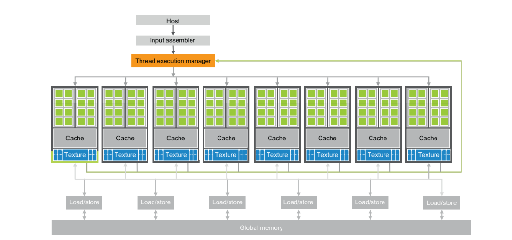

# 1. Introduction

*CPUs drove rapid performance increases and cost reductions for many years in the past. These performance increases allowed users to have better experiences and more functionalities.*

*However this drive slowed down due to energy consumption and heat dissipation which led vendors to switch to models where multiple processor units are used instead of increasing performance in a single processing unit.*

*Now all the new processors are parallel computers with 2 or more processing units, thus the number of applications that need to be developed as parallel programs has increased dramatically.*

---

## 1.1 Heterogeneous Parallel Computing

The semiconductor industry has settled on two main trajectories for designing microprecessors.

- The multicore trajectory which seek to maintain the execution speed of sequential programs while moving into multiple cores.
- And the many-thread trajectory which focuses more on the execution throughput of parallel programs.

Not surprisingly, the computationally intensive parts of a program are the main focus of parallel programming - when there is more work to do, there is more opportunity to divide the work among cooperating parallel workers.

The design of a CPU is optimized for sequential code performance by:

- Utilizing sophisticated control logic to allow [instructions from a single thread to execute in parallel](https://en.wikipedia.org/wiki/Instruction-level_parallelism) or [out of their sequential order](https://en.wikipedia.org/wiki/Out-of-order_execution).
- Large cache memories are provided to reduce the instruction and data access latency.
- Typically CPUs have 8 or more processor cores and many megabytes of on-chip cache memories to deliver strong sequential code performance.

This design with large cache memories, low-latency arithmetic units and units, and sophisticated operand delivery logic consume chip area and power that could be otherwise used to provide more arithmetic execution units and memory access channels. This design style is commonly referred to as latency-oriented design.

On the other hand a GPU is designed with:

- Large memory bandwidths to move extremely large amounts of data in and out of its [DRAM](https://en.wikipedia.org/wiki/Dynamic_random-access_memory) because of graphics frame buffer requirements.
- Maximized chip area and power budget dedicated to floating-point calculations.
- Small cache memories are provided to reduce the number of accesses to DRAM.

This design style is referred to as throughput-oriented design as it strives to maximize the total execution throughput of a large number of threads while allowing individual threads to take a potentially much longer time to execute.

The GPUs are designed as parallel, throughput-oriented computing engines and they will not perform well on some tasks on which CPUs are designed to perform well. For programs that have one or very few threads, CPUs with lower operation latencies can achieve much higher performance than GPUs. When a program has a large number of threads, GPUs with higher execution throughput can achieve much higher performance than CPUs. Therefore, one should expect that many applications use both CPUs and GPUs, executing the sequential parts on the CPU and numerically intensive parts on the GPUs.

---

## 1.2 Architecture of a Modern GPU

A CUDA-cabable GPU is organized as an array of highly threaded streaming muliprocessors (SMs). 

SMs form a building block. The number of SMs per building block can be different from one generation to another. Each SM has streaming processors (SPs) that share control logic and instruction cache.

Each GPU currently comes with gigabytes of Graphics Double Data Rate (GDDR), Synchronous DRAM (SDRAM), referred to as Global Memory.

GPUs global memory communicates with the system memory over PCI-E transferring 8-16GB/S in each direction. More recent GPUS support NVLINK a CPU-GPU and GPU-GPU interconnect that allows transfers of up to 40 GB/s per channel.

---

## 1.3 Why More Speed or Parallelism

The main motivation for massively parallel programming is for applications to enjoy continued speed increase in future hardware generations.

Many applications that we have today seem to be running fast enough but when an application is suitable for parallel execution a good implementation on a GPU can achieve more that 100x speedup over the sequential execution on a single CPU.

Many exciting mass market applications can benefit from these speedups.

For example, the biology research community is moving more and more into the molecular-level. But there are limitations to the molecular-level observations that we can make with these instruments. These limitations can be effectively addressed by incorporating a computational model to simulate the underlying molecular activities with boundary conditions set by traditional instrumentation. With simulation we can measure even more details and test more hypotheses than can ever be imagined with traditional instrumentation alone.

User experiences can also be improved into the video game industry. Realistic modeling and simulation of physics effects are known to demand very large amounts of computing power.

All the new applications that we mentioned involve simulating a physical, concurrent world in different ways and at different levels, with tremendous amounts of data being processed.

---

## 1.4 Speeding Up Real Applications

What kind of speedup can we expect from parallelizing an application?  

If the percentage of time spent in the part that can be parallelized is 30%, a 100X speedup of the parallel portion will reduce the execution time by no more than 29.7%.

On the other hand, if 99% of the execution time is in the parallel portion, a 100X speedup of the parallel portion will reduce the application execution to 1.99% of the original time. This gives the entire application a 50X speedup. 

Therefore, it is very important that an application has the vast majority of its execution in the parallel portion for a massively parallel processor to effectively speed up its execution.

In practice, straightforward parallelization of applications often saturates the memory (DRAM) bandwidth, resulting in only about a 10X speedup. The trick is to figure out how to get around memory bandwidth limitations, which involves doing one of many transformations to utilize specialized GPU on-chip memories to drastically reduce the number of accesses to the DRAM.

---
