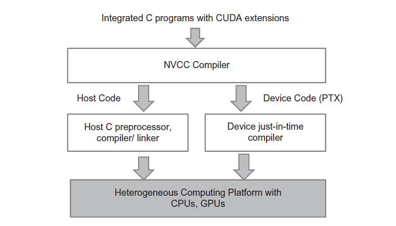

# 2. Data Parallel Computing

*Many code examples are available to illustrate the key concepts in writing scalable parallel programs.*

*CUDA C extends the popular C programming language with minimal new syntax and interfaces to let programmers target heterogeneous computing systems containing both CPU cores and massively parallel GPUs.*

## 2.1 Data Parallelism

When modern software applications run slowly, the problem is usually having too much data to be processed.

Independent evaluation is the basis of [data parallelism](https://en.wikipedia.org/wiki/Data_parallelism): (re)organize the computation around the data, such that we can execute the resulting independent computations in parallel to complete the overall job faster, often much faster.

We will use image processing as a source of running examples in the next chapters.

We can illustrate the concept of data parallelism with the color-to-greyscale conversion as shown below.


To convert the color image to greyscale we compute the luminance value L for each pixel by applying the following weight formula:

$L = 0.21r + 0.72g + 0.07b$

If we consider the input to be an image organized as an array I of RGB values and the output to be a corresponding array O of luminance values, we get the simple computation structure shown below.


None of these per-pixel computations depends on each other; all of them can be performed independently. Clearly the color-to-greyscale conversion exhibits a rich amount of data parallelism.

## 2.2 CUDA C Program Structure

The structure of a CUDA C program reflects the coexistence of a host (CPU) and one or more devices (GPUs) in the computer.

Each CUDA source file can have a mixture of both host and device code. By default, any traditional C program is a CUDA program that contains only host code.

Once device functions and data declarations are added to a source file the code needs to be compiled by a compiler that recognizes and understands these additional declarations. We will be using a CUDA C compiler called [NVCC](https://docs.nvidia.com/cuda/cuda-compiler-driver-nvcc/index.html) (NVIDIA C Compiler).

The NVCC compiler processes a CUDA C program, using the CUDA keywords to separate the host code and device code. 

- The host code is straight ANSI C code, which is further compiled with the host's standard C/C++ compilers and executed on a CPU device. 

- The device code is marked with CUDA keywords for data parallel functions, called kernels, and their associated helper functions and data structures. The device code is further compiled by a run-time component of NVCC and executed on a GPU device.



The execution of a CUDA program starts with host code (CPU serial code). When a kernel function (parallel device code) is launched, it is executed by a large number of [threads](https://en.wikipedia.org/wiki/Thread_(computing)) on a device. All the threads that are generated by a kernel launch are collectively called a [grid](https://en.wikipedia.org/wiki/Thread_block_(CUDA_programming)).

When all threads of a kernel complete their execution, the corresponding grid terminates, the execution continues on the host until another kernel is launched.


Launching a kernel typically generates a large number of threads to exploit data parallelism. In the color-to-greyscale conversion example, each thread could be used to compute one pixel of the output array O.

Cuda programmers can assume that these threads take very few clock cycles to generate and schedule due to efficient hardware support. This is contrast with traditional CPU threads that typically take thousands of clock cycles to generate and schedule.

## 2.3 A Vector Addition Kernel

We now use vector addition to illustrate the CUDA C program structure.

A traditional C program that consists of a main function and a vector addition function. In all our examples, whenever there is a need to distinguish between host and device data, we will prefix the names of variables that are processed by the host with “h_” and those of variables that are processed by a device “d_”.

```C
// Compute vector sum h_C = h_A+h_B
void vecAdd(float* h_A, float* h_B, float* h_C, int n)
{
    for (int i = 0; i < n; i++) h_C[i] = h_A[i] + h_B[i];
}
int main()
{
    // Memory allocation for h_A, h_B, and h_C
    // I/O to read h_A and h_B, N elements each
    …
    vecAdd(h_A, h_B, h_C, N);
}

```

Assume that the vectors to be added are stored in arrays A and B that are allocated and initialized in the main program. The output vector is in array C, which is also allocated in the main program.

The [pointers](https://cplusplus.com/doc/tutorial/pointers/) to these arrays are passed to the vecAdd function, along with the variable N that contains the length of the vectors.

The vecAdd function uses a for-loop to iterate through the vector elements. In the ith iteration, output element h_C[i] receives the sum of h_A[i] and h_B[i]. The vector length parameter n is used to control the loop so that the number of iterations matches the length of the vectors.

When the vecAdd function returns, the subsequent statements in the main function can access the new contents of C.

A straightforward way to execute vector addition in parallel is to modify the vecAdd function and move its calculations to a device.

```C
#include <cuda.h>
…

void vecAdd(float* A, float* B, float* C, int n)
{
    int size = n* sizeof(float);
    float *d_A *d_B, *d_C;
    …
    1. // Allocate device memory for A, B, and C
       // copy A and B to device memory
    2. // Kernel launch code – to have the device
       // to perform the actual vector addition
    3. // copy C from the device memory
       // Free device vectors
}
```

At the beginning of the file, we need to add a C preprocessor directive to include the cuda.h header file. This file defines the CUDA API functions and built-in variables.

Part 1 of the function allocates space in the device (GPU) memory to hold copies of the A, B, and C vectors and copies the vectors from the host memory to the device memory. Part 2 launches parallel execution of the actual vector addition kernel on the device. Part 3 copies the sum vector C from the device memory back to the host memory and frees the vectors in device memory.

- Note that the revised vecAdd function is essentially an outsourcing agent that ships input data to a device, activates the calculation on the device, and collects the results from the device.


## 2.4 Device Global Memory and Data Transfer

Part 1 and Part 3 of the vecAdd function need to use the CUDA API functions to allocate device memory for A, B, and C, transfer A and B from host memory to device memory, transfer C from device memory to host memory at the end of the vector addition, and free the device memory for A, B, and C. We will explain the memory allocation and free functions first.

Below you can see two API functions for allocating and freeing device global memory.

```
cudaMalloc()
• Allocates object in the device global memory
• Two parameters
    1. Address of a pointer to the allocated object
    2. Size of allocated object in terms of bytes

cudaFree()
• Frees object from device global memory
• One parameter
    1. Pointer to freed object
```

The [cudaMalloc](https://docs.nvidia.com/cuda/cuda-runtime-api/group__CUDART__MEMORY.html#group__CUDART__MEMORY_1g37d37965bfb4803b6d4e59ff26856356) function can be called from the host code to allocate a piece of device global memory for an object

- The first parameter to the cudaMalloc function is the address of a pointer variable that will be set to point to the allocated object. The address of the pointer variable should be cast to (void **) because the function expects a generic pointer.
- The second parameter to the cudaMalloc function gives the size of the data to be allocated, in number of bytes.

The [cudaFree](https://docs.nvidia.com/cuda/cuda-runtime-api/group__CUDART__MEMORY.html#group__CUDART__MEMORY_1ga042655cbbf3408f01061652a075e094) function can be called from the host code to free the device global memory allocated for an object

- The parameter is a pointer to an object

An example:

```C
float *d_A;
int size = n * sizeof(float);

cudaMalloc((void**)&d_A, size);
...
cudaFree(d_A);
```

Once the host code has allocated device memory for the data objects, it can request that data be transferred from host to device. This is accomplished by calling one of the CUDA API functions shown below.

```
cudaMemcpy()
• Memory data transfer
• Requires four parameters
    1. Pointer to destination
    2. Pointer to source
    3. Number of bytes copied
    4. Type/Direction of transfer
```

The [cudaMemcpy](https://docs.nvidia.com/cuda/cuda-runtime-api/group__CUDART__MEMORY.html#group__CUDART__MEMORY_1gc263dbe6574220cc776b45438fc351e8) function can be called from the host code to transfer data from host to host, host to device, device to host and device to device.

- The first parameter is a pointer to the destination location for the data object to be copied.
- The second parameter points to the source location.
- The third parameter specifies the number of bytes to be copied.
- The fourth parameter indicates the types of memory involved in the copy. See [here](https://docs.nvidia.com/cuda/cuda-runtime-api/group__CUDART__TYPES.html#group__CUDART__TYPES_1g18fa99055ee694244a270e4d5101e95b).

A more complete version of vecAdd function is shown below:

```C
void vecAdd(float* A, float* B, float* C, int n)
{
    int size = n* sizeof(float);
    float *d_A *d_B, *d_C;
    
    cudaMalloc((void **) %d_A, size);
    cudaMemcpy(d_A, h_A, size, cudaMemcpyHostToDevice);
    cudaMalloc((void **) %d_B, size);
    cudaMemcpy(d_B, h_B, size, cudaMemcpyHostToDevice);

    cudaMalloc((void **) %d_C, size);

    // Kernel invocation code - to be shown later
    ...

    cudaMemcpy(h_C, d_C, size, cudaMemcpyDeviceToHost);

    // Free device memory for A, B, C
    cudaFree(d_A);
    cudaFree(d_B);
    cudaFree(d_C);
}
```


## 2.5 Kernel Functions and Threading

In CUDA, a kernel function specifies the code to be executed by all threads during a parallel phase. Since all these threads execute the same code, CUDA programming is an instance of the well-known Single-Program-Multiple-Data([SPMD](https://en.wikipedia.org/wiki/Single_program,_multiple_data)).

When a program’s host code launches a kernel, the CUDA run-time system generates a grid of threads that are organized into a two-level hierarchy. Each grid is organized as an array of thread blocks. All blocks of a grid are of the same size; each block can contain up to 1024 threads.

The total number of threads in each thread block is specified by the host code when a kernel is launched. The same kernel can be launched with different numbers of threads at different parts of the host code. For a given grid, the number of threads in a block is available in a built-in blockDim variable.

The blockDim variable is of struct type with three unsigned integer fields: x, y, and z, which help a programmer to organize the threads into a one-, two-, or three-dimensional array. For a one-dimensional organization, only the x field will be used. For a two-dimensional organization, x and y fields will be used. For a three dimensional structure, all three fields will be used. The choice of dimensionality for organizing threads usually reflects the dimensionality of the data.

In general, the number of threads **in each dimension** of thread blocks should be multiplies of 32 due to hardware efficiency reasons.

CUDA kernels have access to two more built-in variables (threadIdx, blockIdx) that allow threads to distinguish among themselves and to determine the area of data each thread is to work on. Both of the variables are of struct type with three unsigned integer fields: x, y, and z.

- Variable threadIdx gives each thread a unique coordinate within a block.
- The blockIdx variable gives all threads in a block a common block coordinate.

An example of a grid is shown below:


A unique global index i is calculated as:
```C
i = blockIdx.x * blockDim.x + threadIdx.x
```

Below there is a kernel function for vector addition. The syntax is ANSI C with some notable extensions. First, there is a CUDA C specific keyword “__global__” in front of the declaration of the vecAddKernel function. This keyword indicates that the function is a kernel and that it can be called from a host function to generate a grid of threads on a device.

```C
// Compute vector sum C = A+B
// Each thread performs one pair-wise addition
__global__
void vecAddKernel(float* A, float* B, float* C, int n)
{
    int i = blockDim.x*blockIdx.x + threadIdx.x;
    if(i<n) C[i] = A[i] + B[i];
}
```

In general, CUDA C extends the C language with three qualifier keywords that can be used in function declarations. The meaning of these keywords is summarized below:


By default, all functions in a CUDA program are host functions if they do not have any of the CUDA keywords in their declaration. This makes sense since many CUDA applications are ported from CPU-only execution environments. The programmer would add kernel functions and device functions during porting process.

Note that one can use both “\_\_host__” and “\_\_device__” in a function declaration. This combination tells the compilation system to generate two versions of object files for the same function. One is executed on the host and can only be called from a host function. The other is executed on the device and can only be called from a device or kernel function.

The second notable extension to ANSI C, as in the vecAddKernel, are the built-in variables “threadIdx.x” “blockIdx.x” and “blockDim.x”. Recall that all threads execute the same kernel code. There needs to be a way for them to distinguish among themselves and direct each thread towards a particular part of the data. These built-in variables are the means for threads to access hardware registers that provide the identifying coordinates to threads. Different threads will see different values in their threadIdx.x, blockIdx.x and blockDim.x variables.

There is an automatic (local) variable i, in the vecAddKernel. In a CUDA kernel function, automatic variables are private to each thread.

A quick comparison between the host and the kernel code reveals an important insight for CUDA kernels and CUDA kernel launch. The kernel function does not have a loop. The loop is replaced with the grid of threads. The entire grid forms the equivalent of the loop. Each thread in the grid corresponds to one iteration of the original loop. This type of data parallelism is sometimes also referred to as loop parallelism, where iterations of the original sequential code are executed by threads in parallel.

Note that there is an if (i < n) statement in addVecKernel. This is because not all vector lengths can be expressed as multiples of the block size. For example, let’s assume that the vector length is 100. The smallest efficient thread block dimension is 32. Assume that we picked 32 as block size. One would need to launch four thread blocks to process all the 100 vector elements. However, the four thread blocks would have 128 threads. We need to disable the last 28 threads in thread block 3 from doing work not expected by the original program. This allows the kernel to process vectors of arbitary lengths.

When the host code launches a kernel, it sets the grid and thread block dimensions via execution configuration parameters. This is illustrated below. The configuration parameters are given between the “ <<<” and “>>>” before the traditional C function arguments. The first configuration parameter gives the number of thread blocks in the grid. The second specifies the number of threads in each thread block. In this example, there are 256 threads in each block. In order to ensure that we have enough threads to cover all the vector elements, we apply the C ceiling function to n/256.0.

```C
int vectAdd(float* A, float* B, float* C, int n)
{
    // d_A, d_B, d_C allocations and copies omitted
    // Run ceil(n/256) blocks of 256 threads each
    vecAddKernel<<<ceil(n/256.0), 256>>>(d_A, d_B, d_C, n);
}
```


## 2.6 Kernel Launch

The complete code for the vecAdd kernel is shown below:

```C
void vecAdd(float* A, float* B, float* C, int n)
{
    int size = n* sizeof(float);
    float *d_A *d_B, *d_C;
    
    cudaMalloc((void **) %d_A, size);
    cudaMemcpy(d_A, h_A, size, cudaMemcpyHostToDevice);
    cudaMalloc((void **) %d_B, size);
    cudaMemcpy(d_B, h_B, size, cudaMemcpyHostToDevice);

    cudaMalloc((void **) %d_C, size);

    vecAddKernel<<<ceil(n/256.0), 256>>>(d_A, d_B, d_C, n);

    cudaMemcpy(h_C, d_C, size, cudaMemcpyDeviceToHost);

    // Free device memory for A, B, C
    cudaFree(d_A);
    cudaFree(d_B);
    cudaFree(d_C);
}
```

Note that all the thread blocks operate on different parts of the vectors. They can be executed in any arbitrary order. Programmers must not make any assumptions regarding execution order. A small GPU with a small amount of execution resources may execute only one or two of these thread blocks in parallel. A larger GPU may execute 64 or 128 blocks in parallel. This gives CUDA kernels scalability in execution speed with hardware, that is, same code runs at lower speed on small GPUs andhigher speed on larger GPUs.