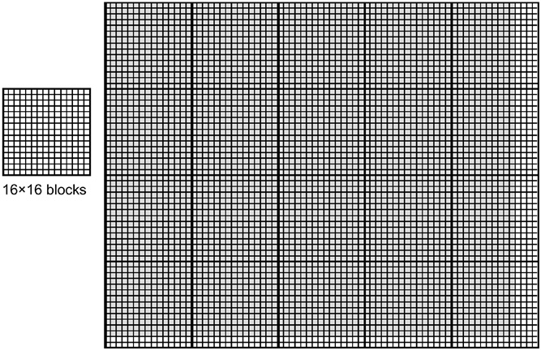
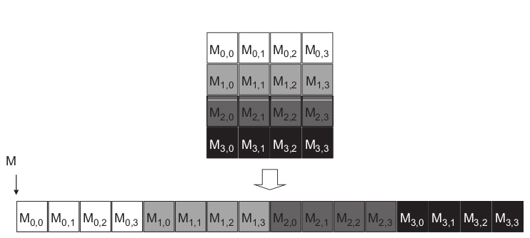

# Scalable Parallel Execution

*In [Chapter 2](https://github.com/R100001/Programming-Massively-Parallel-Processors/tree/master/chapter02), Data parallel computing, we learned to write a simple CUDA C program that launches a kernel and a grid of threads to operate on elements in onedimensional arrays.*

*The kernel specifies the C statements executed by each thread. As we unleash such a massive execution activity, we need to control these activities to achieve desired results, efficiency, and speed.*

*In this chapter, we will study important concepts involved in the control of parallel execution. We will start by learning how thread index and block index can facilitate processing multidimensional arrays. Subsequently, we will explore the concept of flexible resource assignment and the concept of occupancy. We will then advance into thread scheduling, latency tolerance, and synchronization.*

*A CUDA programmer who masters these concepts is well-equipped to write and understand high-performance parallel applications.*

## 3.1 CUDA Thread Organization

All CUDA threads in a grid execute the same kernel function; they rely on coordinates to distinguish themselves from one another and identify the appropriate portion of data to process. These threads are organized into a two-level hierarchy: 
- A grid consists of one or more blocks.
- Each block consists of one or more threads.

All threads in a block share the same block index (blockIdx) variable in a kernel. Each Thread has a thread index (threadIdx) variable in a kernel. 

References to the blockIdx and threadIdx variables return the coordinates of the thread.

The execution configuration parameters in a kernel launch statement

```C
function_name<<<gridDim, blockDim>>>(...);
                    ^       ^
```

specify the dimensions of the grid and the dimensions of each block. These dimensions are the values of the variables gridDim and blockDim in kernel functions.

A grid is a three-dimensional array of blocks, and each block is a three-dimensional array of threads. When launching a kernel, the program needs to specify the size of the grid and blocks in each dimension. The programmer can use fewer than three dimensions by setting the size of the unused dimensions to 1.

The exact organization of a grid is determined by the execution configuration parameters (as shown above).

- The first parameter specifies the number of blocks in the grid.
- The second parameter specifies the number of threads in a block

Both parameters are of the dim3 type, which is a C struct with three unsigned integer fields: x, y and z.

```C
dim3 dimGrid(32, 1, 1);
dim3 dimBlock(128, 1, 1);
vecAddKernel<<<dimGrid, dimBlock>>>(...);
```

For convenience, CUDA C allows the programmer to launch a kernel with one-dimensional grids and blocks. The rest two dimensions will be set to 1.


```C
vecAddKernel<<<ceil(n/256.0), 256>>>(...);
```

- The allowed values of gridDim.x, gridDim.y and gridDim.z range from 1 to 65536.

- The total size of a block is limited to 1024 threads. For instance blockDim(512, 1, 1), blockDim(8, 16, 4) and blockDim(32, 16, 2) are allowable blockDim values, but blockDim(32, 32, 2) is not because the total number of threads exceed 1024.

A CUDA grid organization:

```C
dim3 dimGrid(2, 2, 1);
dim3 dimBlock(4, 2, 2);
KernelFunction<<<dimGrid, dimBlock>>>(…);
```


<br>

## 3.2 Mapping Threads to Multidimensional Data

The choice of 1D, 2D, or 3D thread organizations is usually based on the nature of the data. Pictures are 2D array of pixels. Using a 2D grid that consists of 2D blocks is often convenient for processing the pixels in a picture.



Assume that we decided to use a $16 * 16$ block, with 16 threads in the x and y direction and we want to process a $76 * 62$ picture as shown above.

We wll need 5 blocks in the x direction and 4 in the y direction. Note that we have 4 extra threads in the x direction and 2 in the y direction - i.e. we will generate $80 * 64$ threads to process $76 * 62$ pixels.

Assume that d_Pin is a pointer to the input picture and d_Pout is a pointer to the output picture. An example code to launch a kernel to process a picture is shown below.

```C
int m = 76;
int n = 62;

dim3 dimGrid(ceil(m/16.0), ceil(n/16.0), 1);
dim3 dimBlock(16, 16, 1);
colorToGreyscaleConversion<<<dimGrid, dimBlock>>>(d_Pin, d_Pout, m, n);
```

Ideally, we would like to access d_Pin as a two-dimensional array where an element at row j and column i can be accessed as d_Pin[j][i]. However, the ANSI C standard on which the development of CUDA C was based requires that the number of columns in d_Pin be known at compile time for d_Pin to be accessed as a 2D array. Unfortunately, this information is not known at compiler time for dynamically allocated arrays. Consequently, programmers need to explicitly linearize or “flatten” a dynamically allocated two-dimensional array into an equivalent one-dimensional array in the current CUDA C.

A way to linearize a two-dimensional array is place all elements of the same row into consecutive locations as shown below.



The kernel code uses the formula:

$L = 0.21r + 0.72g + 0.07b$

to convert a color pixel to a greyscale pixel.

---

A total of $blockDim.x*gridDim.x$ threads can be found in the horizontal direction. As in the vecAddKernel example, the expression 

$Col=blockIdx.x*blockDim.x+threadIdx.x$ 

generates every integer value from 0 to $blockDim.x*gridDim.x–1$. 

We know that $gridDim.x*blockDim.x$ is greater than or equal to width (m value passed in from the host code). We have at least as many threads as the number of pixels in the horizontal direction.

Similarly, a total of $blockDim.y*gridDim.y$ threads can be found in the vertical direction.

Therefore, as long as we test and make sure only the threads with both Row and Col values are within range we can cover every pixel in the picture.

---

Given that each row has *width* pixels, we can thus calculate the one-dimensional index for the pixel at row *Row* and column *Col* as $Row*width+Col$.

This one-dimensional index *greyOffset* is the pixel index for *Pout* is the pixel index for *Pout* as each pixel in the output greyscale image is one byte (unsigned char).

As for *Pin*, we multiply the gray pixel index by 3 because each pixel is stored as (r, g, b), with each equal to one byte. The resulting *rgbOffset* gives the starting location of the color pixel in the *Pin* array. We read the r, g, and b values from the three consecutive byte locations of the *Pin* array, perform the calculation of the greyscale pixel value, and write that value into the *Pout* array by using *greyOffset*.
    
```C
// we have 3 channels corresponding to RGB
// The input image is encoded as unsigned characters [0, 255]
__global__
void colorToGreyscaleConversion(unsigned char * Pout, 
                                unsigned char * Pin,
                                int width, int height) 
{
    int Col = threadIdx.x + blockIdx.x * blockDim.x;
    int Row = threadIdx.y + blockIdx.y * blockDim.y;
    if (Col < width && Row < height) {

        // get 1D coordinate for the grayscale image
        int greyOffset = Row*width + Col;

        // one can think of the RGB image having
        // CHANNEL times columns than the grayscale image
        int rgbOffset = greyOffset*CHANNELS;
        unsigned char r = Pin[rgbOffset + 0]; // red value for pixel
        unsigned char g = Pin[rgbOffset + 1]; // green value for pixel
        unsigned char b = Pin[rgbOffset + 2]; // blue value for pixel
        
        // perform the rescaling and store it
        // We multiply by floating point constants
        Pout[grayOffset] = 0.21f*r + 0.71f*g + 0.07f*b;
    }
}
```