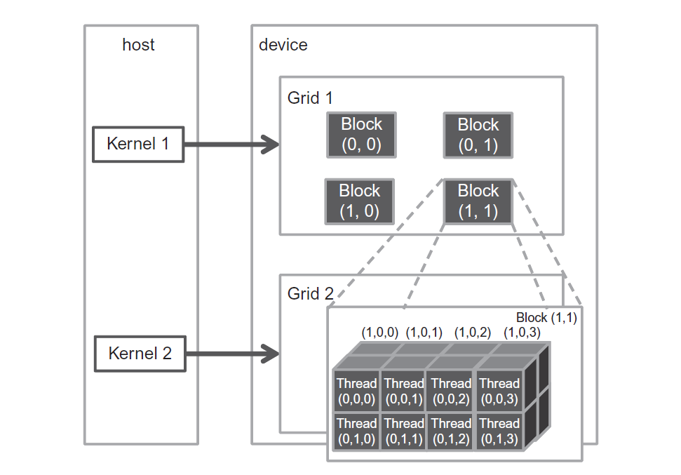

# Scalable Parallel Execution

*In [Chapter 2](https://github.com/R100001/Programming-Massively-Parallel-Processors/tree/master/chapter02), Data parallel computing, we learned to write a simple CUDA C program that launches a kernel and a grid of threads to operate on elements in onedimensional arrays.*

*The kernel specifies the C statements executed by each thread. As we unleash such a massive execution activity, we need to control these activities to achieve desired results, efficiency, and speed.*

*In this chapter, we will study important concepts involved in the control of parallel execution. We will start by learning how thread index and block index can facilitate processing multidimensional arrays. Subsequently, we will explore the concept of flexible resource assignment and the concept of occupancy. We will then advance into thread scheduling, latency tolerance, and synchronization.*

*A CUDA programmer who masters these concepts is well-equipped to write and understand high-performance parallel applications.*

## 3.1 CUDA Thread Organization

All CUDA threads in a grid execute the same kernel function; they rely on coordinates to distinguish themselves from one another and identify the appropriate portion of data to process. These threads are organized into a two-level hierarchy: 
- A grid consists of one or more blocks.
- Each block consists of one or more threads.

All threads in a block share the same block index (blockIdx) variable in a kernel. Each Thread has a thread index (threadIdx) variable in a kernel. 

References to the blockIdx and threadIdx variables return the coordinates of the thread.

The execution configuration parameters in a kernel launch statement

```C
function_name<<<gridDim, blockDim>>>(...);
                    ^       ^
```

specify the dimensions of the grid and the dimensions of each block. These dimensions are the values of the variables gridDim and blockDim in kernel functions.

A grid is a three-dimensional array of blocks, and each block is a three-dimensional array of threads. When launching a kernel, the program needs to specify the size of the grid and blocks in each dimension. The programmer can use fewer than three dimensions by setting the size of the unused dimensions to 1.

The exact organization of a grid is determined by the execution configuration parameters (as shown above).

- The first parameter specifies the number of blocks in the grid.
- The second parameter specifies the number of threads in a block

Both parameters are of the dim3 type, which is a C struct with three unsigned integer fields: x, y and z.

```C
dim3 dimGrid(32, 1, 1);
dim3 dimBlock(128, 1, 1);
vecAddKernel<<<dimGrid, dimBlock>>>(...);
```

For convenience, CUDA C allows the programmer to launch a kernel with one-dimensional grids and blocks. The rest two dimensions will be set to 1.


```C
vecAddKernel<<<ceil(n/256.0), 256>>>(...);
```

- The allowed values of gridDim.x, gridDim.y and gridDim.z range from 1 to 65536.

- The total size of a block is limited to 1024 threads. For instance blockDim(512, 1, 1), blockDim(8, 16, 4) and blockDim(32, 16, 2) are allowable blockDim values, but blockDim(32, 32, 2) is not because the total number of threads exceed 1024.

A CUDA grid organization:

```C
dim3 dimGrid(2, 2, 1);
dim3 dimBlock(4, 2, 2);
KernelFunction<<<dimGrid, dimBlock>>>(…);
```



## 3.2 Mapping Threads to Multidimensional Data