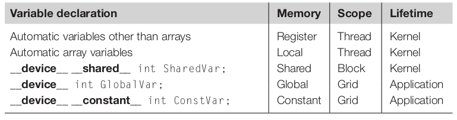

# 4 Memory and Data Locality

*In this chapter, we will study how one can organize and position the data for efficient access by a massive number of threads.*

*Although the scope we have covered is a very good start, the CUDA kernels that we have learned thus far will likely achieve only a tiny fraction of the potential speed of the underlying hardware. The poor performance is attributable to the long access latencies (hundreds of clock cycles) and finite access bandwidth of global memory, which is typically implemented with Dynamic Random Access Memory (DRAM).*

*In this chapter we will learn to use different memory types to boost the execution efficiency of CUDA kernels.*

## 4.1 Importance of Memory Access Efficiency

The most important part of the kernel in the bluring example (seen in the previous chapter - chapter 3) in terms of execution time is the nested *for-loop* that perfors pixel value accumulation with the blurring patch as seen below.


```C
for(int blurRow = -BLUR_SIZE; blurRow < BLUR_SIZE + 1; ++blurRow) {
    for(int blurCol = -BLUR_SIZE; blurCol < BLUR_SIZE + 1; ++blurCol) {

        int curRow = Row + blurRow;
        int curCol = Col + blurCol;

        // Verify we have a valid image pixpixelel
        if(curRow > -1 && curRow < h && curCol > 1 && curCol < w) {
            pixVal += in[curRow * w + curCol];
            ++pixels; // Keep track of the number of pixels in the avg
        }
    }
}
```

In every iteration of the inner loop, one global memory access for one floating-point addition. The global memory access fetches the value of the *in[]* array element and accumulates the value into the *pixVal*.

Thus, the ratio of floating-point calculation to global memory access operation is 1 to 1, or 1.0. This ratio is referred as *compute-to-global-memory-access ratio*, defined as the number of floating-point operations per global memory access within a region of a program.

The compute-to-global-memory-access ratio has major implications on the performance of a CUDA kernel. In a high-end device today the global memory bandwidth is around 1000 GB/s. With four bytes in each single-precision floating-point value, no more than 1000 / 4 = 250 GB/s can be expected to load.

While 250 GFLOPS is a respectable number, it is only a fraction (2%) of the peak single-precision performance of 12 TFLOPS or higher for these high-end devices. This programs are referred as memory-bound programs.

In order to achieve higher performance for a kernel, we need to reduce the number of global memory accesses ratio.


## 4.2 Matrix Multiplication

[Matrix–matrix multiplication](https://en.wikipedia.org/wiki/Matrix_multiplication) between an i × j (i rows by j columns) matrix M and a j × k matrix N produces an i × k matrix P. Matrix multiplication presents opportunities for reduction of global memory accesses that can be captured with relatively simple techniques. The execution speed of matrix multiplication functions can vary by orders of magnitude, depending on the level of reduction of global memory accesses. Therefore, matrix multiplication provides an excellent initial example for such techniques.

When performing a matrix multiplication, each element of the output matrix P is an inner product of a row of M and a column of N. As shown below, P<sub>Row,Col</sub> (the small square in P) is the inner product of the vector formed from the Row<sup>th</sup> row of M (shown as a horizontal strip in M) and the vector formed from the Col<sup>th</sup> column of N (shown as a vertical strip in N)


In our initial matrix multiplication implementation, we map threads to elements of P with the same approach that we used for *colorToGreyscaleConversion*; i.e., each thread is responsible for calculating one P element. The row and column indexes for the P element to be calculated by each thread are as follows:

$Row=blockIdx.y*blockDim.y+threadIdx.y$

and

$Col=blockIdx.x*blockDim.x+threadIdx.x$

With this one-to-one mapping, the Row and Col thread indexes are also the row and column indexes for output array. Below is the source code of the kernel based on this thread-to-data mapping.

```C
// Assuming square matrices of size Width x Width
__global__ 
void MatrixMulKernel(float* M, float* N, float* P, int Width) {
    // Calculate the row index of the P element and M
    int Row = blockIdx.y*blockDim.y+threadIdx.y;
    // Calculate the column index of P and N
    int Col = blockIdx.x*blockDim.x+threadIdx.x;

    if ((Row >= Width) || (Col >= Width)) return;

    float Pvalue = 0;
    // each thread computes one element of the block sub-matrix
    for (int k = 0; k < Width; ++k)
        Pvalue += M[Row*Width+k]*N[k*Width+Col];

    P[Row*Width+Col] = Pvalue;
}
```

Before entering the loop, we initialize a local variable *Pvalue* to 0. Each iteration of the loop accesses an element from the Row<sup>th</sup> row of M and one from the Col<sup>th</sup> column of N, multiplies the two elements together, and accumulates the product into *Pvalue*.

Within the *for-loop* the M and N matrices are accessed.

- The M matrix is linearized into an equivalent 1D array where the rows of M are placed one after another in the memory space, starting with the 0<sup>th</sup> row. In general, the Row<sup>th</sup> row of M is *M[Row\*Width]* and the k<sup>th</sup> element in the Row<sup>th</sup> row is at *M[Row\*Width+k]*.

- In the N matrix the beginning element of the Col<sup>th</sup> column is the Col<sup>th</sup> element of the 0<sup>th</sup> row, which is *N[Col]*. Accessing each additional element in Col<sup>th</sup> column requires skipping over entire rows. Therefore, the k<sup>th</sup> element of the Col<sup>th</sup> column is *N[k\*Width+Col]*.

After the execution exits the *for-loop*, all threads have their *P* element values in the *Pvalue* variables. Each thread then uses the one-dimensional equivalent index expression *Row*Width+Col* to write its *P* element. Again, this index pattern is similar to that used in the *colorToGreyscaleConversion* kernel.

We can estimate the effect of memory access efficiency by calculating the expected performance level of the matrix multiplication kernel code. The dominating part of the kernel in terms of execution time is the *for-loop* that performs inner product calculation:

```C
for(int k = 0;k < Width; ++k)
Pvalue += M[Row * Width + k] * N[k * Width + Col];
```

One global memory access fetches an *M* element, and the other fetches an *N* element. One floating-point operation multiplies the *M* and *N* elements fetched, and the other accumulates the product into *Pvalue*. Thus, the compute-to-global-memory-access ratio of the loop is 1.0.

This ratio will likely result in less than 2% utilization of the peak execution speed of the modern GPUs. We need to increase the ratio by at least an order of magnitude for the computation throughput of modern devices to achieve good utilization.

## 4.3 CUDA Memory Types

A CUDA device contains several types of memory that can help programmers improve compute-to-global-memory-access ratio and thus achieve high execution speed. Below are the types of CUDA device memories.


Global memory and constant memory appear at the bottom of the picture. These types of memory can be written (W) and read (R) by the host by calling API functions. The global memory can be written and read by the device. The constant memory supports short-latency, high-bandwidth read-only access by the device.

Registers and shared memory are on-chip memories. Variables that reside in these types of memory can be accessed in very high-speed in a highly parallel manner.

- Registers are allocated to individual threads; each thread can only access its own registers.

- Shared memory is allocated to thread blocks; all threads in a block can access shared memory variables allocated to the block. Shared memory is an efficient means for threads to cooperate by sharing their input data and intermediate results.

By declaring a CUDA variable in one of the CUDA memory types, a CUDA programmer dictates the visibility and access speed of the varible.

This architecture is based on the [Von Neumann](https://en.wikipedia.org/wiki/Von_Neumann_architecture) model.

A subtler point is that each access to registers involves fewer instructions than an access to the global memory. Arithmetic instructions in most modern processors have “built-in” register operands. 

- When an operand of an arithmetic instruction is in a register, no additional instruction is required to make the operand value available to the arithmetic and logic unit ([ALU](https://en.wikipedia.org/wiki/Arithmetic_logic_unit)), where the arithmetic calculation is performed.

- Meanwhile, if an operand value is in the global memory, the processor needs to perform a memory load operation to make the operand value available to the ALU. Since the processor can only fetch and execute a limited number of instructions per clock cycle, the version with an additional load will likely take more time to process than the one without an additional load.

Thus, placing the operands in registers can improve execution speed.

Below a SM is illustrated showing the shared memory and registers in a CUDA device.


Shared memory is designed as part of the memory space that resides on the processor chip. When the processor accesses data that reside in the shared memory, it needs to perform a memory load operation, similar to accessing data in the global memory. However, because shared memory resides on-chip, it can be accessed with much lower latency and much higher throughput than the global memory. Shared memory has longer latency and lower bandwidth than registers because of the need to perform a load operation.

Shared memory is accessible by all threads in a thread block, whereas register data are private to a thread.

The table below shows the memory types of a CUDA device.



## 4.4 Tiling for Reduced Memory Traffic

