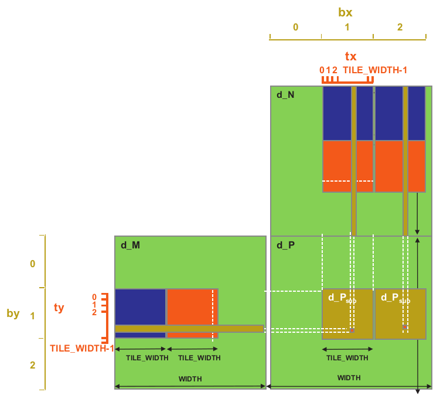

## Matrix-Matrix Multiplication Using Rectangular Tiles

*This program implements a matrix-matrix multiplication kernel using rectangular tiles for even more redused global memory usage.*

---

The host code:

- Allocates memory for the input and output matrices on host and initializes the memory.
- Allocates memory for the input and output matrices on device and copys the input matrices to the device.
- Launches the kernel.
- Copys the output matrix from the device to the host.
- Frees the memory on the device and host.

In the device code

We allocate shared memory for the tiles.

The shared memory allocated for the M matrix tiles is *TILE_WIDTH \* TILE_WIDTH*

The shared memory allocated for the N matrix tiles is *TILE_WIDTH \* TILE_WIDTH \* 2*

```
__shared__ float ds_M[TILE_WIDTH][TILE_WIDTH    ];
__shared__ float ds_N[TILE_WIDTH][TILE_WIDTH * 2];
```

This means that the shared memory tile for the N matrix will have twice as many columns as the shared memory tile for the M matrix.

This will allow the kernel to partially accumulate two output values for the P matrix while loading the M shared memory tile only once.

Next the row and col values are computed.

```
int row = by * TILE_WIDTH     + ty;
int col = bx * TILE_WIDTH * 2 + tx;
```

The col value jumps twice the elements of the *TILE_WIDTH* value as the N matrix is using twice the columns as the M matrix.

The number of phases are the same because the number of phases are depended on the number of rows the N matrix has and the tile of the N matrix is extended in the col dimension.

Inside the for loop we load the M and N tiles.

The first two loads are the same as the simple tiled matrix multiplication with square tiles.

However, another third load will take place to load the element of the N matrix that is TILE_WIDTH positions away of the first element of the N tile.

We still need to check for boundary conditions and assing 0 to the shared memory if the index is out of bounds.

After the needed elements are loaded we can perform the dot product.

```
for (int k = 0; k < TILE_WIDTH; k++){
    Pvalue1 += ds_M[ty][k] * ds_N[k][tx];
    Pvalue2 += ds_M[ty][k] * ds_N[k][TILE_WIDTH + tx];
}
```

Again the code is the same as the simple tiled matrix multiplication with square tiles but we also accumulate the extra value.

After all the phases are completed we assign the computed values to the output matrix checking first for boundary conditions.

The second output value is again *TILE_WIDTH* elements away from the first element of the output matrix.

---

<br>

