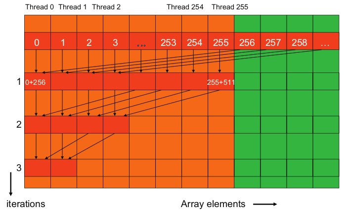

## Array Summation Using Reduction

*This program implements reduction to accumulate the values of an array.*

[An interesting discussion for reduction](https://developer.download.nvidia.com/assets/cuda/files/reduction.pdf)

---

The host code:

- Allocates an array of size n.
- Initializes the array with random values.
- Allocates device memory and copies the array to the device.
- Computes the sum of the array elements.
- Copies the result from the device to the host.
- Frees the device and host memory.

The host code uses a loop to repeatedly invoke the kernel. The loop computes the number of blocks which is equal to the number of elements of the input array divided by the (number of threads * 2). That is because the kernel code computes the sum for twice as much elements as the number of threads.

---

The kernel code allocates shared memory for each block of size equal to the number of threads in the block.

Each thread first performs the initial sum of two elements loading them from the global memory into the shared memory.

Then the kernel performs the partial reduction of the input array using the elements in the shared memory.

The for-loop performs addition on elements that are *stride* away from each other. Performing reduction in this way eliminates divergence for the first iterations.

When the number of elements fall below the warp size, divergence will still occur.

Finally each block will save the results in the lower part of the output array according to their id.

---

