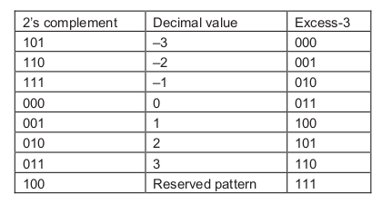
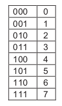
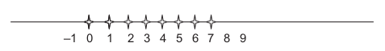
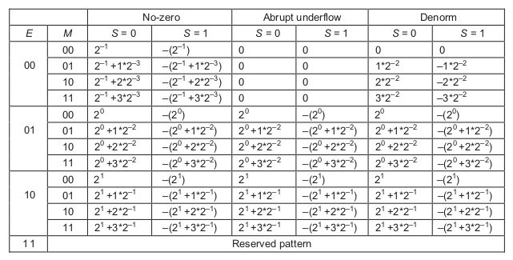
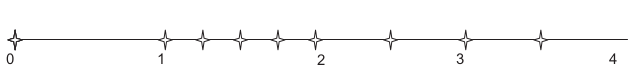
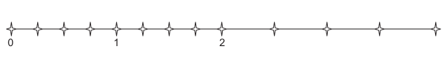
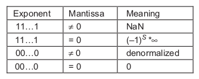

# 6. Numerical Considerations

*Floating-point representation allows for larger dynamic range of representable data values and more precise representation of tiny data values. These desirable properties make floating-point preferred data representative for modeling the physical and artificial phenomena, such as combustion, aerodynamics, light illumination, and financial risks. Large scale evaluation of these models has been driving the need for parallel computing. As a result, it is important for application programmers to understand the nature of floating-point arithmetic in developing their parallel applications. In particular, we will focus on the accuracy of floating-point arithmetic operations, the precision of floating-point number representation, the stability of numerical algorithms and how they should be taken into consideration in parallel programming.*

---

## 6.1 Floating-Point Data Representation

A floating-point number system starts with the representation of a numerical value as bit patterns. In the IEEE Floating-Point Standard, a numerical value is represented in three groups of bits: sign (S), exponent (E), and mantissa (M). With some exceptions that will be detailed later, each (S, E, M) pattern uniquely identifies a numeric value according to the following formula:

$Value = -1^S *1.M*2^{E-bias}$

The interpretation of S is simple: 0 means a positive number while 1 means a negative number.

The interpretation of M and E bits are much more complex.

Assume for the sake of simplicity that each floating number is represented by 6 bits. 1 bit sign (S), 3 bit exponent (E), and the remaining 2 bits are used to represent the mantissa (M).

As we discuss numeric representations we need to distinguish between *decimal* values and the *binary* values. We will use the D subscript to denote decimal values and the B subscript to denote binary values.

### Normalized Represantation of M

The above formula requires that all values are derived by treating the mantissa value as $1.M$, which makes the mantissa bit pattern for each floating-point number unique. For example, under this interpretation of the M bits, the only mantissa bit pattern allowed for 0.5D is the one where all bits that represent M are 0s:

$0.5_D = 1.0_B*2^{-1}$

Other potential candidates would be

$0.5_D = 0.1_B*2^{0}$

and

$0.5_D = 10.0_B*2^{-2}$

but neither fits the form of $1.M$. The numbers that satisfy this restriction will be referred to as normalized numbers.

Because all mantissa values that satisfy the restriction are of the form $1.XX$, we can omit the $1.$ part from the normalized representation. Therefore, the mantissa value of 0.5 in a 2-bit mantissa represantation is 00, which is derived by ommiting $1.$ from $1.00$. This makes a 2-bit mantissa effectively a 3-bit mantissa. In general, with IEEE format, an m-bit mantissa is effectively an (m+1)-bit mantissa.

### Excess Encoding of E

The IEEE standard adopts an excess or biased encoding convention for E. If e bits are used to represent the exponent E, (2e−1–1) is added to the two’s complement representation for the exponent to form its excess representation. A two’s complement representation is a system where the negative value of a number can be derived by first complementing every bit of the value and adding one to the result. In our 3-bit exponent representation, there are three bits in the exponent (e = 3). Therefore, the value 23–1−1 = 011 will be added to the 2’s complement representation of the exponent value. The excess-3 encoding is is shown below.

The advantage of excess representation is that an unsigned comparator can be used to compare signed numbers. This is a desirable property for hardware implementation since unsigned comparators are smaller and faster than signed comparators.

The above picture also shows that the pattern of all 1’s in the excess representation is a reserved pattern. Note that a 0 value and an equal number of positive and negative values result in an odd number of patterns. Having the pattern 111 as either an even number or odd number would result in an unbalanced number of positive and negative numbers. The IEEE standard uses this special bit pattern in special ways.

Now we are ready to represent 0.5D with our 6-bit format:

0.5D = 001000, where S = 0, E = 010, M = (1.)00

In general, with normalized mantissa and excess-coded exponent, the value of a number with an n-bit exponent is:

$(-1)^S*1.M*2^{E-(2^{n-1} - 1)}$

---

## 6.2 Representable Numbers

The representable numbers of a representation format are the numbers that can be exactly represented in the format. For example, if one uses a 3-bit unsigned integer format, the representable numbers are shown below.

    

    

### No-Zero

Below, we show all the representable numbers of what we have so far and two variations. We use a 5-bit format to keep the size of the table manageable. The format consists of 1-bit S, 2-bit E (excess-1 coded), and 2-bit M (with “1.” part omitted). The no-zero column gives the representable numbers of the format we discussed thus far. Note that with this format, 0 is not one of the representable numbers.

A quick look at how these representable numbers populate the number line, as shown below, provides further insights about these representable numbers. We show only the positive representable numbers. The negative numbers are symmetric to their positive counterparts on the other side of 0.

    

We can make five observations:

- First, the exponent bits define the major intervals of representable numbers. In the picture above, there are three major intervals (2-1 = 0.5D, 20 = 1.0D, 21 = 2.0D) on each side of 0 because there are two exponent bits (the pattern will all 1's is reserved). Basically, the major intervals are between powers of 2s.

- The second observation is that the mantissa (M) bits define the number of representable numbers in each interval. With 2 mantissa bits we have 4 (22) representable numbers in each interval. In general, with N mantissa bits, we have (2N) representable numbers in each interval. If a value to be represented falls within one of the intervals, it will be rounded to one of these representable numbers. Therefore, the number of mantissa bits determines the precision of the representation.

- The third observation is that 0 is not representable in this format (no-zero column of the picture). Because 0 is one of the most important numbers, not being able tto represent it is a serious deficiency.

- The fourth observation is that each interval the size of the previous interval as we move towards 0. Since every interval has the same representable numbers (four in this case), the representable numbers become closer to each other as we move towards 0. This is a desirable property because the distance between representable numbers determines the maximal rounding error for a value that falls into the interval. For example, if you have 1 billion dollars in your bank account, you may not even notice that there is a 1 dollar rounding error in calculating your balance. However, if the total balance is 10 dollars, having a 1 dollar rounding error would be much more noticeable!

- The fifth observation is that the trend of increasing density, and thus increasing precision, does not hold for the very vicinity of 0. This is because the range of normalized mantissa precludes 0. The representation introduces significantly larger ($2^N*$ in general) errors when representing numbers between 0 and 0.5 compared to the errors for the larger numbers between 0.5 and 1.0.

### Abrupt Underflow

One method that can accommodate 0 is the abrupt underflow convention. Whenever E is 0, the number is interpreted as 0. In the 5-bit example format, this method takes away eight representable numbers (four positive, four negative) in the vicinity of 0 and makes them all 0. Although this method makes 0 a representable number, it creates an even larger gap between representable numbers in 0’s vicinity.

    

### Denormalization

The IEEE standard adopted denormalization. Whenever E = 0, the mantissa (M) is no longer assumed to be $0=1.XX$. Rather, it is assumed to be $1.XX$. Additionally, the value of the exponent is assumed to be the same as the previous interval (0 instead of -1). The representation now has uniformly spaced representable numbers in the close vicinity of 0.

    

Note that the distances between representable numbers in the last two intervals are identical. In general if the n-bit exponent is 0, the value is equal to:

$0.M*2^{-2^{n-1} + 2}$

---

All CUDA devices of compute capability 1.3 and up support denormalized double-precision operands, and all devices of compute capability 2.0 and up support denormalized single-precision operands.

In summary, the precision of a floating-point representation is measured by the maximal error that we can introduce to a floating-point number by representing that number as one of the representable numbers. The smaller the error is, the higher the precision. The precision of a floating-point representation can be improved by adding more bits to mantissa. Adding one bit to the representation of the mantissa improves the precision by reducing the maximal error by half. Thus, a number system has higher precision when it uses more bits for mantissa. This is reflected in double precision versus single precision numbers in the IEEE standard.

---

## 6.3 Special Bit Patterns And Precision In IEEE Format

All special bit patterns of the IEEE floating-point format are described below:

All other numbers are normalized floating-point numbers. 

- Single precision numbers have 1-bit S, 8-bit E, and 23-bit M. 

- Double precision numbers have 1-bit S, 11-bit E, and 52-bit M. 

Since a double precision number has 29 more bits for mantissa, the largest error for representing a number is reduced to $1/2^{29}$ of that of the single precision format! With the additional three bits of exponent, the double precision format also extends the number of intervals of representable numbers. This extends the range of representable numbers to very large as well as very small values.

---

## 6.4 Arithmetic Accuracy And Rounding

While the precision is determined by the number of mantissa bits used in a floating-point number format, the accuracy is determined by the operations performed on a floating number. The accuracy of a floating-point arithmetic operation is measured by the maximal error introduced by the operation. The smaller the error is, the higher the accuracy.

The most common source of error in floating-point arithmetic is when the operation generates a result that cannot be exactly represented and thus requires rounding. Rounding occurs if the mantissa of the result value needs too many bits to be represented exactly.

For example, adding two floating-point numbers can be done by adding their mantissa values together if the two floating-point values have identical exponents. When two input operands to a floating-point addition have different exponents, the mantissa of the one with the smaller exponent is repeatedly divided by 2 or right-shifted (i.e., all the mantissa bits are shifted to the right by one bit position) until the exponents are equal. As a result, the final result can have more bits than the format can accommodate.

---

Assume that we need to add $1.00_B*2^{−2}$(0, 00, 01) to $1.00_B*2^1$ (0, 10, 00), i.e., we need to perform $1.00_B*2^1$ + $1.00_B*2^{−2}$.

Due to the difference in exponent values, the mantissa value of the second number needs to be right-shifted by 3-bit positions before it is added to the first mantissa value. That is, the addition becomes $1.00_B*2^1 + 0.001_B*2^1$. The addition can now be performed by adding the mantissa values together. The ideal result would be $1.001_B*2^1$. However, we can see that this ideal result is not a representable number in a 5-bit representation. It would have required three bits of mantissa and there are only two mantissa bits in the format. Thus, the best one can do is to generate one of the closest repre- sentable numbers, which is either $1.01_B*2^1$ or $1.00_B*2^1$.

---

## 6.5 Algorithm Considerations

Numerical algorithms often need to sum up a large number of values. 

For example, the dot product in matrix multiplication needs to sum up pair-wise products of input matrix elements. Ideally, the order of summing these values should not affect the final total since addition is an associative operation. However, with finite precision, the order of summing these values can affect the accuracy of the final result. For example, if we need to perform a sum reduction on four numbers in our 5-bit representation:

$1.00_B * 2^0 + 1.00_B * 2^0 + 1.00_B * 2^{−2} + 1.00_B * 2^{−2}$

If we add up the number is strict sequential order, we have the following sequence of operations:

$1.00_B * 2^0 + 1.00_B * 2^0 + 1.00 B * 2^{−2} + 1.00_B * 2^{−2} =$

$1.00_B * 2^1 + 1.00_B * 2^{-2} + 1.00_B * 2^{-2} =$

$1.00_B * 2^1 + 1.00_B * 2^{-2} =$

$1.00_B * 2^1$

Note that in the second step and third step, the smaller operand simply disappears because it is too small compared to the larger operand.

Now, let us consider a parallel algorithm where the first two values are added and the second two operands are added in parallel.

$(1.00_B * 2^0 + 1.00_B * 2^0) + (1.00 B *2^{−2} + 1.00_B * 2^{−2}) =$

$1.00_B * 2^1 + 1.00_B * 2^{-1} =$

$1.01_B * 2^1$

Note that the results are different from the sequential result!

A common technique to maximize floating-point arithmetic accuracy is to pre-sort data before a reduction computation. In our sum reduction example, if we pre-sort the data according to ascending numerical order, we will have the following:

$1.00 B * 2^{−2} + 1.00_B * 2^{−2} + 1.00_B * 2^0 + 1.00_B * 2^0$

When we divide up the numbers into groups in a parallel algorithm, say the first pair in one group and the second pair in another group, numbers with numerical values close to each other are in the same group. Obviously, the sign of the numbers needs to be taken into account during the presorting process. Therefore, when we perform addition in these groups, we will likely have accurate results.

---

## 6.6 Linear Solvers And Numerical Stability

While the order of operations may cause variation in the numerical outcome of reduction operations, it may have even more serious implications on some types of computation such as solvers for linear systems of equations. In these solvers, different numerical values of input may require different ordering of operations in order to find a solution. If an algorithm fails to follow a desired order of operations for an input, it may fail to find a solution even though the solution exists. Algorithms that can always find an appropriate operation order, thus finding a solution to the problem as long as it exists for any given input values, are called *numerically stable*. Algorithms that fall short are referred to as *numerically unstable*.

In some cases, numerical stability considerations can make it more difficult to find efficient parallel algorithms for a computational problem. We can illustrate thi phenomenon with a solver that is based on [Gaussian Elimination](http://www.it.uom.gr/teaching/linearalgebra/chapt6.pdf).

Unfortunately, the simple Gaussian elimination algorithm can suffer from numerical instability. This can be illustrated with the example:

$5Y + 2Z = 16$

$2X + 3Y + Z = 11$

$X + 2Y + 2Z = 11$

We will encounter a problem when we perform step 1 of the algorithm. The coefficient for the X variable in the 1st equation is zero.

We will not be able to divide the 1st equation by the coefficient for variable X and eliminate the X variable from the 2nd equation and the 3rd equation by subtracting the 1st equation from the 2nd equation and the 3nd equation. 

Therefore, the algorithm is numerically unstable. It can fail to generate a solution for certain input values even though the solution exists(X=1, Y=2, Z=3).

---