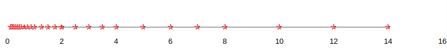

*1. Draw the equivalent of*

<p align="center">
    
</p>

*for a 6-bit format (1-bit sign, 3-bit mantissa, 2-bit exponent). Use your result to explain what each additional mantissa bit does to the set of representable numbers on the number line.*

<p align="center">
    
</p>

```
Adding one more bit to the mantissa (M) increases the number of representable numbers in each interval by a factor of 2.
```

---

*2. Draw the equivalent of*

<p align="center">
    
</p>

*for another 6-bit format (1-bit sign, 2-bit mantissa, 3-bit exponent). Use your result to explain what each additional exponent bit does to the set of representable numbers on the number line.*

<p align="center">
    
</p>

```
Adding one more bit to the exponent (E) increases the range of representable numbers by a factor of 4.
```

---

*3. Assume that in a new processor design, due to technical difficulty, the floating-point arithmetic unit that performs addition can only do “round to zero” (rounding by truncating the value toward 0). The hardware maintains sufficient number of bits that the only error introduced is due to rounding. What is the maximal ulp error value for add operations on this machine?*

```
Let's assume that we have 5 bits for this example (1-bit sign, 2-bit mantissa, 2-bit exponent).

The maximal ulp error is introduced in the following example:

All the mantissa (M) bits are equal to 1 and the exponent (E) bits are equal to 0 for one operand and the exponent(E) bits for the second operand are all equal to 1 except for the last one(all 1 is a special bit pattern). 

01000(0 S, 00 M, 10 E) + 00011(0 S, 11 M, 00 E) = 
1.00 * 2^1 + 1.11 * 2^-1 = 
1.00 * 2^1 + 0.0111 * 2^1 =
1.0111 * 2^1 = 
1.01 * 2^1 (The last two bits are truncated due to rounding)

Therefore the maximal ulp error is almost 1 ulp (depends on the number of mantissa (M) and exponent (E) bits in the representation).
```

---

*4. A graduate student wrote a CUDA kernel to reduce a large floating-point array to the sum of all its elements. The array will always be sorted with the smallest values to the largest values. To avoid branch divergence, he decided to implement the modified reduce algorithm as seen in chapter 5. Explain why this can reduce the accuracy of his results.*

```
The revised kernel will add values that are half section away from each other and having a sorted array will result in possible consecutive trancuations due to rounding in all iterations. This is because elements that are half section away from each other may have a large difference in their values.
```

---

*5. Assume that in an arithmetic unit design, the hardware implements an iterative approximation algorithm that generates two additional accurate mantissa bits of the result for the sin() function in each clock cycle. The architect decided to allow the arithmetic function to iterate 9 clock cycles. Assume that the hardware fills in all remaining mantissa bits as 0’s. What would be the maximal ulp error of the hardware implementation of the sin() function in this design for the IEEE single-precision numbers? Assume that the omitted “1.” mantissa bit must also be generated by the arithmetic unit.*

```
Every clock cycle 2 additional mantissa bits are generated and the number of iterations is 9. In total 18 mantissa (M) bits will be generated.

IEEE single-precision floating numbers have 23 bits mantissa.

From those 23 bits 17 bits(1 more for the omitted "1.") are generated by the arithmetic unit and the remaining 6 bits are filled with 0's.

Therefore the maximal ulp error is 2^6 - 1 = 63 ulp.
```