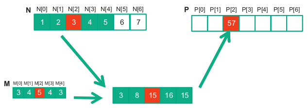
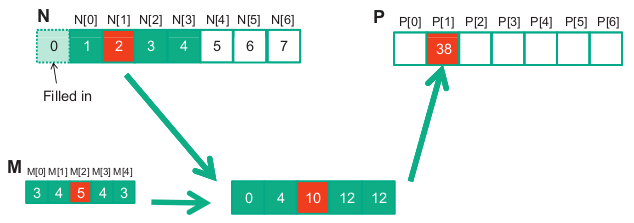
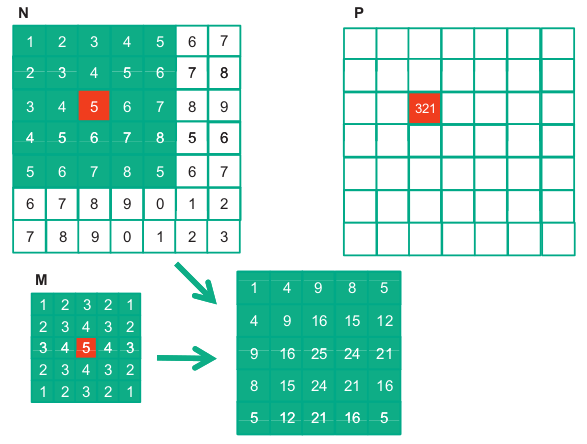

# 7. Parallel Patterns: Convolution - An Introduction to Stencil Computation

*We will study convolution, which is a popular array operation that is used in various forms in signal processing, digital recording, image processing, video processing, and computer vision. In these application areas, convolution is often performed as a filter that transforms signals and pixels into more desirable values.*

*In high-performance computing, the convolution pattern is often referred to as stencil computation. Convolution typically involves a significant number of arithmetic operations on each data element. Each output data element can be calculated independently of each other, a desirable trait for parallel computing. On the other hand, there is substantial level of input data sharing among output data elements with somewhat challenging boundary conditions. This makes convolution an important use case of sophisticated tiling methods and input data staging methods.*

---

## 7.1 Background

Convolution is an array operation where each output data element is a weighted sum of a collection of neighboring input elements. The weights used in the weighted sum calculation are defined by an input mask array, commonly referred to as the convolution kernel. We will refer to these mask arrays as convolution masks. The same convolution mask is typically used for all elements of the array.

Below is shown a convolution example for 1D data where a 5-element convolution mask array M is applied to a 7-element input array N.

The fact that we use a 5-element mask M means that each P element is generated by a weighted sum of the N element at the corresponding position, two N elements to the left and two N elements to the right.

For example, the value of $P[2]$ is generated as the weighted sum of $N[0]$ through $N[4]$:

$P[2] = N[0]*M[0] + N[1]*M[1] + N[2]*M[2] + N[3]*M[3] + N[4]*M[4]$

$ = 1*3 + 2*4 + 3*5 + 4*4 + 5*3$

$= 57$

Because convolution is defined in terms of neighboring elements, boundary conditions naturally arise for output elements that are close to the ends of an array. As shown below, when we calculate $P[1]$, there is only one N element to the left of $N[1]$. That is, there are not enough N elements to calculate $P[1]$ according to our definition of convolution. A typical approach to handling such boundary condition is to define a default value to these missing N elements. For most applications, the default value is 0.

In this case, the calculation of $P[1]$ is as follows:

$P[1] = 0 * M[0] + N[0]*M[1] + N[1]*M[2] + N[2]*M[3] + N[3]*M[4]$

$= 0 * 3 + 1*4 + 2*5 + 3*4 + 4*3$

$= 38$

The missing elements are typically referred to as “ghost cells” or “halo cells” in literature. There are also other types of ghost cells due to the use of tiling in parallel computation. These ghost cells can have significant impact on the effectiveness and/or efficiency of tiling.

---

For image processing and computer vision, input data are typically two-dimensional arrays, with pixels in an x-y space. Image convolutions are therefore 2D convolutions. The mask does not have to be a square array.

To generate an output element, we take the subarray whose center is at the corresponding location in the input array N. We then perform pairwise multiplication between elements of the mask array and those of the image array. Like 1D convolution, 2D convolution must also deal with boundary conditions.

---

## 7.2 1D Parallel Convolution - A Basic Algorithm